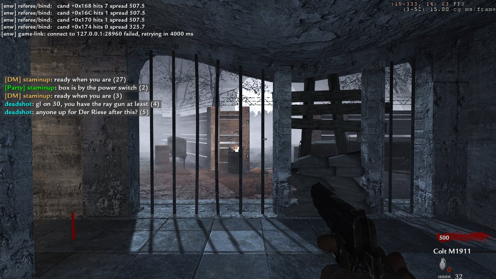
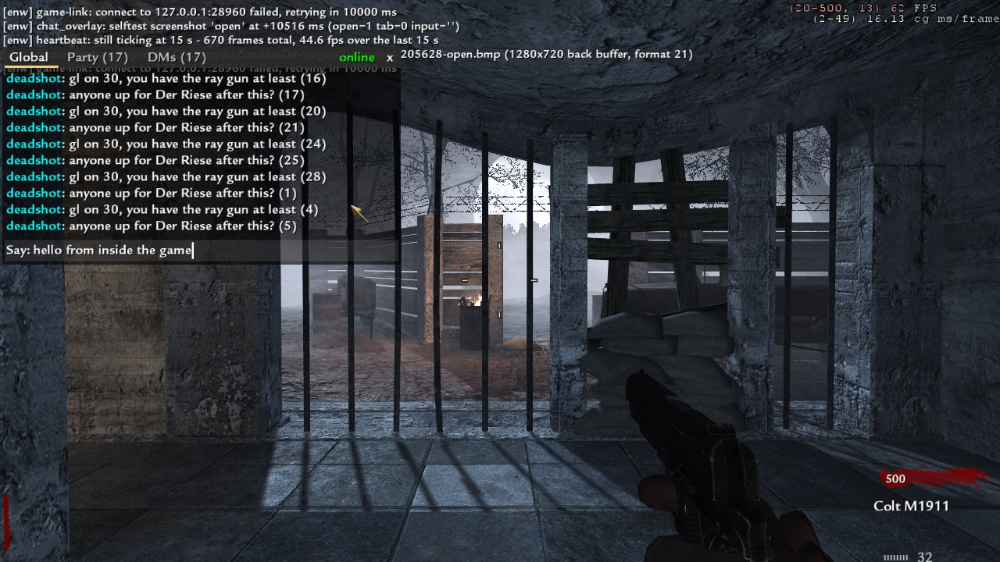
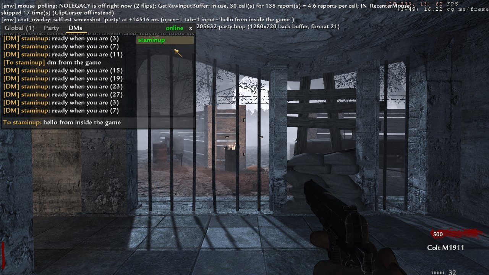

# The in-game chat overlay

> **Status: BUILT, 2026-09-22 (evening).** `client-dll/components/chat_overlay.cpp`, proven in the
> running game in windowed and borderless mode at four resolutions, end to end with a site and
> with a dedicated server pausing on it. **§9 is the results section and supersedes §1-§3 and §5
> wherever they disagree** (the draw hook was found, the input is B's spec rather than the plan's,
> and the channel is the site over HTTP, not the game link). Exclusive fullscreen is **not yet
> seen** (§9.8). §0-§8 are kept as written: the plan, then the server lane's contract.

B's ask, in his words in substance: *later an in-game overlay where T opens chat, pauses the game
if solo, and lets you type, replacing the game's own chat.*

---

## 0. The one fact that makes this easy, and it is verified

**World at War's single-player / co-op game has no in-game text chat to replace.** There is
nothing to take away, no key already bound, and no existing chat HUD our overlay would have to
fight or hide. So "replacing the game's own chat" is, in the SP exe, simply *providing* it.

The evidence is already written down and is a retraction, which is the strongest kind we keep:

* `docs/re/t4-sp-map.md`, *Chat — CORRECTED*: **"T4 co-op has no classic `say`→`G_Say`"**. The
  function the referee originally bound as `G_Say` (`0x473F10`) fires at ~60 Hz with empty text
  while the game sits idle — it is a per-frame HUD/notify formatter, and its only caller
  (`0x4388A0`, once taken for `ClientCommand`) is on the frame path. Both are **RETRACTED** in
  the address table.
* What T4 has instead is the **party/lobby reliable-command system**: the client sends
  `0clientchat %s` (`0x655C80`), the host relays `0hostchat %s %s` (`0x65B630`). That is lobby
  chat, not in-game chat, and it is the multiplayer lobby's.
* `board.md` 02:40 (re) is where both of those were established.

And the exe we run is the single-player one. `docs/kickstart/README.md` hard rule 2:
**`CoDWaWmp.exe` is never launched.** So the multiplayer chat UI is not merely unused — it is in
a binary this project does not start. The overlay has the screen and the keyboard to itself.

**What this does NOT mean.** It does not mean T is free — `T` is `+talk` in the stock key
bindings and the exe may still consume it somewhere. The overlay must swallow the key rather than
assume nothing is listening, which it has to do anyway (§3).

---

## 1. The four pieces

| Piece | Where | State |
|---|---|---|
| A 2D draw hook, to put a box on the screen | `client-dll/components/chat_overlay.cpp`, new | **found and built 2026-09-22 (§9.1)** — it was the "withdrawn" 0x6F5F10 all along |
| Input capture while typing | the existing WndProc subclass in `mouse_polling.cpp` | mapped, extend it |
| Solo pause | `server/components/pause/pause.cpp` | **server side built 2026-09-22** (§4); the client sets one userinfo key (§8) |
| The channel | `game_link` `say` / `chat`, to the site's ring | **built and live tonight** |

Three of the four exist. The estimate is almost entirely the first one.

---

## 2. The draw hook — the whole risk, and the trap to avoid

**Do not use `SV_GameSendServerCommand` (`0x648490`) or `SV_SendServerCommand` (`0x6F5F10`) as a
text renderer.** They were bound for exactly that, reported green because the call returned, and
then killed a capture ~3 s after the second injected message while a bare launch survived 210 s
(`ac4e884`, *"chat injection withdrawn as proven and suspected harmful"*). Reading their prologues
afterwards showed a **HUD/debug coloured-text pair** that resolves an RGBA via `0x47A450`, passes
four floats, and `strlen`s into a ring buffer at `0x3DCB4C0`. The addresses in the table are
annotated with this. It is the reason `t4-sp-map.md` carries the sentence about two independent
signals.

So the plan is to find the real one, and the rule is **two independent signals before binding**:

1. **A call-graph signal.** `tools/re/t4map.py` over the decrypted dump, from the frame path
   (`Com_Frame` → `SV_Frame` / the client frame) down to whatever runs once per rendered frame and
   takes material + rect + text.
2. **A behavioural signal.** A candidate is bound behind a dvar, called with a fixed string at a
   fixed rect, and the *game is looked at*. A call returning without error is not evidence — that
   is exactly the mistake above.

Two starting points worth trying first, in this order:

* **The console.** The game already draws text over everything with its own font when the console
  is open. Whatever the console's draw function calls IS a 2D text renderer with a working font
  handle, a colour and a rect, and it is reachable from a code path we can trigger on demand (open
  the console, breakpoint, walk up). This is much cheaper than a cold search and gives the
  behavioural signal for free: the thing you are looking at is text on the screen.
* **`R_AddCmdDrawText`-family by material.** T4 draws 2D through the render-command list, so the
  other end is a `Material_RegisterHandle` for a font and a command that takes it.

Note in passing: `CoDWaW.exe` imports **no** `ExtTextOut`/`TextOut`/`DrawText` (`t4-sp-map.md`).
Text on the game surface is the engine's own, not GDI's — there is no OS shortcut here.

**If the draw hook cannot be found in the budget**, there is a degraded mode that is honest and
useful: draw nothing, and let the overlay be **input + pause + the link**, with the conversation
shown by the launcher's own window over the game rather than inside it. B sees his friends' lines
and can type; what he does not get is them on the game surface. That is worth shipping and it is
worth saying out loud that it is the fallback, because a half-found draw hook is how the last
chat attempt cost three days.

---

## 3. Input capture — mapped, and one rule

Everything needed is already in `client.md` §3's address list, added by this lane and `[V]` from
our own dump: the game WndProc `0x606BE0`, `Sys_QueEvent` `0x5FEB30`, `Sys_GetEvent` `0x5FEC60`,
`Com_EventLoop` `0x5FEDE0` `[C]`.

**The rule, and it is a hard one: `mouse_polling` already subclasses that WndProc. A second
consumer extends the one subclass; it does not add another.** This is hard rule 9 in
`README.md` wearing different clothes — one hook per target address, and the loser finds out from
a log line.

The behaviour:

* Closed, the overlay consumes nothing at all and costs one branch per message.
* `T` (the open key, dvar `enw_chat_key`, default `T`) opens it and from that instant every
  `WM_KEYDOWN`/`WM_CHAR` is **swallowed** — not forwarded, not also forwarded. A chat box that
  lets `W` through walks the player into a horde while they type.
* `Enter` sends and closes, `Escape` closes without sending, `Backspace` edits. Nothing else is
  bound in v0.
* The mouse is left exactly alone. Capturing it would fight `mouse_polling`'s raw-input path for
  no gain, and a chat box does not need a pointer.

---

## 4. Solo pause — built on the server side 2026-09-22; the client half is §8

**Correction (2026-09-22 evening, referee/dedi lane).** Until tonight `pause.cpp` was a stub: it
set a flag and wrote a script variable that `t4_bind` cannot write. "Built and working" was the
plan, not the code. It is now real on the dedicated server (`dedi.md` §18, `referee.md` §15):

* the freeze is engine-side and total — the one `call G_RunFrame` inside the server frame
  (0x635D54) is gated, and while frozen `svs.time` is held and snapshots keep flowing. AI, the
  script VM (every `wait`: bleedout, powerups, box, `round_spawn_failsafe`), physics — all stop,
  so nothing has to be pushed forward and nothing expires on resume. `timescale` is never touched;
* **the server decides, from what each client reports** (§8). The overlay does not send `pause` /
  `resume` on the game link — the game link is server↔host only, the client never speaks it.
  The overlay sets one userinfo key and the server applies B's rule:
  * **solo**: paused while the Esc menu is open, and while typing if the player's *"pause when
    using global chat"* setting is on;
  * **co-op**: paused only when **every** connected player is in the Esc menu. **Typing never
    pauses a co-op game, however many people type.** (This is the griefing point the old §4 made,
    and it is now enforced by the server rather than trusted to the client.)
  * a disconnect counts as unpaused; no ceiling on a co-op pause (B), every pause is logged.

One thing this still does not solve, and the overlay should know it: **nobody has yet seen what a
remote client draws while the server is frozen.** The world stops; the stock "Connection
Interrupted" banner may flicker. The server says `pause_state` on the game link, so the site and
the launcher can draw PAUSED — the overlay draws its own PAUSED from §8's rule.

---

## 5. The channel — built and live as of tonight

Nothing new is needed. The overlay is the fourth client of a channel that already has three:

```
  game DLL  ──chat──▶  host agent  ──POST /api/gs/chat──▶  site ring (chat_network)
     ▲                                                          │
     └────say───── host agent ◀──GET /api/gs/chat-feed──────────┘
                                                                │
                            the website / the launcher ◀──socket 'chat'
```

A line typed in the overlay is a `chat` message on the game link, exactly as if the player had
typed it in a game that had chat. A line from anywhere else arrives as `say` and is drawn. The
site composes the system lines ("*mule_kicker just went down on round 30 on Verrückt*") from the
new `player_down` event and the roster events (`docs/protocol/game-link-v0.md`), so the overlay
gets those for free — it draws whatever the ring hands it.

**The `say`/`tell` INJECTION path is the one thing not to build on.** `game-link-v0` lists `say`
and `tell` host→game, and `server/components/chat/chat.cpp` implements them against
`SV_SendServerCommand` — which is the withdrawn pair from §2. Until a real renderer is bound,
**`say` arriving at the game is unproven and suspected harmful**, and the overlay must draw
incoming lines itself rather than hand them to that path. Fixing `say` and building the overlay
are the same piece of work: both need the draw hook, and once it exists `chat.cpp` is rebound to
it and both are true at once.

---

## 6. Estimate, honestly

| | |
|---|---|
| Find and verify the 2D text draw (two signals, console route first) | **1–3 days**, and it is the whole risk. It could be an afternoon if the console route lands; it could be a week if T4's 2D path is built the way the withdrawn pair suggests |
| Draw the box (background, history, input line, caret, wrap) | 0.5 day once something draws at all |
| Input capture, extending the one WndProc subclass | 0.5 day |
| Solo pause + the co-op refusal | 0.5 day, it is two link messages and a player count |
| Wire the link both ways, rebind `chat.cpp`'s `say` to the found renderer | 0.5 day |
| Prove it: a real game, two players, a line each way, no crash over a 300 s run on the harness | 0.5 day |

**Total 3.5–5.5 days, with the spread living entirely in the first row.** The fallback of §2 —
input + pause + link, launcher window instead of a game-surface box — is **1.5 days** and has no
unknowns in it at all.

What would make the estimate worse: the draw path turning out to be per-frame render-command
construction with no stable seam, which would push us to a D3D9 `EndScene` hook instead. That is a
different and larger job, it fights `borderless.cpp`'s window handling, and it is the point at
which to stop and ask B whether the launcher-window fallback is enough.

---

## 7. What is decided and what is not

**Decided**: T opens it (rebindable); solo pauses and co-op does not; input is swallowed whole
while open; one global channel, the same ring the site uses; the overlay draws incoming lines
itself and does not depend on `say`.

**Not decided**: where the box sits and how many lines it keeps; whether a system line looks
different in game the way it does on the site; whether the key is swallowed on the way in or on
the way out of the event queue; whether the overlay is on for Verified games at all, which is a
referee question and not a client one — a chat box is an input path into a recorded run.

---

## 8. Client → server: the pause contract *(defined 2026-09-22 by the referee/dedi lane; server side built)*

No contract existed in this file when the server side was written, so this is it. Change it here,
in `server/components/pause/pause_policy.hpp`, and in `docs/protocol/game-link-v0.md` together.

**The channel is userinfo — no new client command, no new server hook.** A client DLL registers two
string dvars with the USERINFO flag (`0x2`, `docs/re/t4-sp-map.md` → `Dvar_RegisterVariant`, type 7)
and sets them through the engine's own dvar setter, so the dvar is marked modified and the engine
sends its normal `userinfo "…"` reliable command. The server's `SV_UpdateUserinfo_f` (0x6307E0) stores
it in `svs.clients[i].userinfo`, and `pause.cpp` reads that at 20 Hz. `userinfo` is an engine client
command (a ucmd), so it is not subject to the game's chat flood protection.

| key | values | meaning |
|---|---|---|
| `enw_ui` | `paused` | the Esc / pause menu is open |
| | `typing` | the chat overlay is open and has the keyboard |
| | `clear` (or empty, or absent) | neither |
| `enw_pchat` | `1` (default when absent) / `0` | the player's setting *"pause when using global chat"*. Only ever consulted when the player is alone. |

Values are exact and lower case; anything else reads as `clear`. Menu wins over typing: if both are
open, send `paused`. Send `clear` the moment the menu or the box closes — the server resumes on it.

**The server's rule** (`pause_policy.hpp`, unit-tested in `server/tests/pause_policy_test.cpp`):

* nobody connected → running (a disconnect counts as unpaused);
* one client → paused on `paused`, or on `typing` with `enw_pchat 1`;
* two or more → paused only if **every** connected client is `paused`; `typing` never counts;
* the host may hold the game paused on its own (crash grace, everyone-AFK, operator); the players
  cannot release that hold.

**What the client should draw.** The server tells the host (`pause_state`), not the clients — there
is no proven server→client text path yet (`say` injection is off by default, §5). So the overlay
decides "PAUSED" itself from the same rule: it knows its own state, and in co-op it cannot know the
others', so in co-op it should say *"waiting for everyone to pause"* rather than PAUSED until the
world visibly stops. When a server→client channel is proven, the server should push `pause_state`
to clients and this paragraph goes.

**What is NOT proven** (2026-09-22): a real client changing `enw_ui` mid-game and the server seeing
it. The engine re-sending userinfo on a USERINFO dvar change is Q3-lineage behaviour
(`CL_CheckUserinfo`) and `name_pin` depends on the same thing, but `referee.md` §14.4 records that
nobody has yet *measured* a mid-game userinfo command arriving. The first client build that sets
`enw_ui` is also that measurement: the server logs `pause: slot N ui=paused pchat=1`.

---

## 9. Built — results, 2026-09-22 (evening, client lane)

B's spec for the build, in substance: *T toggles an overlay; the mouse leaves the game and can
click it; it looks like World at War's own chat (same font, similar place); tabs Global / Party /
DMs; Enter sends, Esc/T closes; solid in borderless, exclusive fullscreen and windowed, always in
the right place; solo verified games pause while it is open if "pause when using global chat" is on
(default on); multiplayer never pauses for typing.*

### 9.1 The draw hook — found, and it was the "withdrawn" function

Two independent signals, as §2 demands.

**Static.** The console route landed in minutes. CL_InitRenderer (`0x644BE0`) registers `"white"`,
`"console"` and `"fonts/consoleFont"` into `cls` (`0x4DA8F4C` / `50` / `54`). Every console text draw
builds render command **0xD** in the frontend command buffer (`[0x3DCB4C4]`), and the one
non-inlined builder of command 0xD with many callers (11) is **`0x6F5F10` — `R_AddCmdDrawText`**
(`text, maxChars, font, x, y, xScale, yScale, rotation, style`; colour in ECX). **That is the
function the withdrawn chat injection called as "SV_SendServerCommand".** It never was a server
command; it is the text renderer, and calling it from the server frame with a
`(client, type, string)` argument list is exactly what corrupted the command buffer at `0x3DCB4C0`
and killed that capture (`ac4e884`). The retraction was right to stop using it and wrong about what
it was. Above it:

| Function | Addr | Evidence |
|---|---|---|
| `UI_DrawText` | `0x5B5FB0` | 55 callers; `scale*48/font->pixelHeight`; places via `ScrPlace_ApplyRect` `0x47A450` (ECX horzAlign, EAX vertAlign; jump tables `0x47A620`/`0x47A640`); calls `0x6F5F10`. Caller cleans 9 args. |
| `CG_DrawChat` | `0x436900` | **World at War's own HUD chat, still in the SP exe**: reads `cg_hudChatPosition` (`0x3466098`, default **5,200**), `cg_chatHeight` (`0x3466540`, 5), `cg_chatTime` (`0x3688B34`, 12000 ms), picks its font by the UI's thresholds, scale 1/3, draws with `UI_DrawText` on `scrPlaceView` `0x957318`. Its ring: text `0x3467618` (stride 0x97), times `0x3467AD0`, head/tail `0x3467AF0/AF4`; writer `0x459730` (`CG_AddToTeamChat`, [C]). |
| `CG_Draw2D` | `0x4388A0` | calls `CG_DrawChat` at `0x438A21`. **The map's retracted "ClientCommand".** |
| `CG_DrawActiveFrame` | `0x4621E0` | `call CG_Draw2D` at **`0x4628AB`**, EAX = localClientNum. **The map's retracted "SV_ExecuteClientCommand".** |
| `Con_DrawSay` | `0x473F10` | draws the `EXE_SAY`/`EXE_SAYTEAM` "Say:" field when keyCatchers bit 0x20 is set. **The map's retracted "G_Say"** — it "fired 60 Hz with empty text" because it is a draw call. |
| `R_AddCmdDrawStretchPic` | `0x6F58E0` | 18 callers, plain cdecl, 10 args |
| `R_TextWidth` | `0x6E8DA0` | 32 callers; EAX text, stack (maxChars, font) |
| sharedUiInfo fonts | `0x20A10E8` big, `EC` small, `F0` console, `F4` bold, `F8` normal, `FC` extrabig; cursor `0x20A10D4` | registered by name at `0x5D10C0..0x5D11E4` |
| `dx.device` | `0x3BF3B08` | out-pointer of `CreateDevice` at `0x6D605A` |

**Behavioural.** The overlay was drawn and the game was looked at — pictures below, taken from the
back buffer (§9.6).

**The seam.** One rel32: `0x4628AB` now calls a naked thunk that calls the real `CG_Draw2D` and then
draws. Inside the client frame, on the main thread, in the same render-command window CG itself
fills; never from any other thread or frame. No MinHook address is taken. Every function is
byte-checked at startup and the component turns itself off (logged) on any mismatch.

### 9.2 What it looks like

* **Closed:** WaW's chat, by WaW's own numbers — bottom-anchored on `cg_hudChatPosition` (5,200 by
  default; a config that moves the stock chat moves ours), newest `cg_chatHeight` lines younger than
  `cg_chatTime`, a dark box behind each line (rgb 0.25, alpha 0.6), alpha ramping out over the last
  200 ms. Font chosen by `CG_DrawChat`'s own UI thresholds. Names in colour by channel (Global cyan,
  Party green `[Party]`, DMs gold `[DM]` / `[To name]`), system lines yellow. Whole messages only: a
  wrapped message that does not fit is left out rather than shown as an orphaned tail.
* **Open:** a panel on the same anchor with tabs **Global / Party (n) / DMs (n)** (unread counts),
  `online`/`offline`, a close `x`, ten history lines (mouse wheel / PgUp / PgDn scroll), a DM contact
  column (friends and party members; party members green), and WaW's "Say:" line (`Party:` /
  `To <name>:`), caret, Ctrl+V. WaW's own UI cursor (`sharedUiInfo.assets.cursor`) is drawn by the
  engine at the pointer, so the pointer exists even where no OS cursor would (exclusive fullscreen).
* **Size, after B saw it at 2560x1440** (*"very beautiful; the font maybe needs to be slightly
  smaller"*): one size down from `CG_DrawChat`'s 1/3 to **0.28** with a 14-unit line step. The face
  is still chosen by WaW's own thresholds, so it stays the crispest one for the real pixel size.

 


### 9.3 Input (B's spec, amending §3)

Through the ONE subclass `mouse_polling` owns, via the new `client-dll/components/input_gate.hpp`:
a filter that runs first, and a **captured** state in which no motion and no button reaches the
engine (raw or legacy), NOLEGACY is off so the OS cursor moves, and nothing recentres. Entering
capture forces every tracked button up in the engine's differ; leaving it resyncs from the OS. With
`ENW_RAW_MOUSE=0` mouse_polling now installs the subclass and the `IN_MouseMove` retarget in a
**passthrough** mode so the gate still has somewhere to run (proven, 21:01 run).

* **T** (or `ENW_CHAT_KEY`) opens it only in a map (CG drew in the last 500 ms) with no console,
  menu or stock message field owning the keys (keyCatchers `& 0x31 == 0`). The key and the `t`
  `WM_CHAR` it generates are swallowed.
* Open: every `WM_KEYDOWN`/`WM_CHAR` is ours. `WM_KEYUP` goes to the engine on purpose (a key-up for a
  key it thinks is up is a no-op). On open, keys the engine believes are held get a synthetic key-up
  — **only if this window really has the keyboard**, and never Alt/F10 (a synthetic `WM_SYSKEYUP`
  reaches DefWindowProc as a menu keystroke and can activate the window).
* **Enter** sends and closes (WaW's behaviour); Enter on an empty line closes. **Esc** closes.
  **T closes only when the input line does not have focus** — it has focus from the moment T opens
  it, so typing "thanks" types a t; click the history to unfocus and T toggles it shut. A literal "T
  always closes" would make every message starting with t close the box. **Tab** cycles tabs.
  Alt+Tab / Alt+F4 still work (sys keys go to DefWindowProc, never the engine).
* Mouse: clicks hit tabs, contacts, `x`, the input line. Borderless and exclusive fullscreen keep
  the pointer on the game's monitor while open (`ClipCursor` once on open, released once on close
  and on focus loss); a plain window is left unclipped. **Nothing here runs per frame, and nothing
  in the overlay calls SetForegroundWindow, ShowWindow or SetWindowPos.**

### 9.4 The channel — the site, directly (amending §5)

The client talks to the site over WinHTTP; the engine's net path and the box are never used.

* **The chat pass.** The launcher asks the site for it at every launch
  (`POST /api/launcher/chat-token`, session auth) and hands it to the game on the **same one-shot
  pipe as the invite token** (`launch.js` `serveToken`, line `{"v":0,"token"?,"chat":{"base","bearer"}}`;
  `auth_token.cpp` reads it; a Play Local game has no invite and still gets chat). It is an HMAC
  over `{steamid, expiry}` keyed off the site's session secret, **good for `/api/game-chat/*` only,
  for 12 h**, checked against site bans on every use. The game never holds the session.
  Dev fallback: `ENW_CHAT_BASE` + `ENW_CHAT_BEARER`.
* **`web/server/routes/gamechat.js`** (gate-exempt like `/api/gs`, refuses everything without a
  pass): `GET /api/game-chat/me` (name, party, DM contacts, `pause_on_chat`),
  `GET /api/game-chat/feed?g=&p=&wait=20` (long-poll over both rings), `POST /api/game-chat/send
  {channel: global|party|dm, to?, text}`. Global lines go into **the same ring** (`chat_network`,
  origin `game`) the dock and every box read. **Party lines and DMs live in a separate table**
  (`chat_private`, `lib/gameChat.js`) so a DM is never one filter away from the global ring's
  box drain and browser emit. Party = the player's party now; DMs only to friends or party
  members; 5 lines / 10 s per player. Private lines are also emitted as `chat-private` to the
  recipients' own socket rooms, for the site's own tabs later. Tests: `web/test/game-chat.js`
  19/0 (pass forgery/expiry/ban, ring isolation, DM rules, long-poll wake, the real router over
  HTTP); `npm run check` runs it.
* Threads: one long-poll, one sender; the main thread only touches a mutex-guarded inbox.

### 9.5 Pause — the client half of §8, built and measured

The overlay sets exactly §8's keys with the engine's own `setu` (Cbuf), only on change:
`enw_ui typing` while open, `paused` while the Esc menu is up in a map (CG has drawn for 2 s without
a gap, and keyCatchers has 0x10), `clear` otherwise; `enw_pchat` from `/api/game-chat/me`'s
`pause_on_chat` (new account setting, default `true`; `PUT /api/me/settings {pause_on_chat:false}`).
**No new client command.** A first cut sent `enwchat 1 1` as a reliable command and the stock game
printed **"Unknown cmd enwchat"** on the player's HUD — seen in the first capture — so it went.

**Measured on a dedicated server** (`jointest -Tag chatpause1`, local `d2` + `c1`, 20:59-21:01,
`ZombiesDev\logs\dedi\chatpause1.*`): every open is `pause: slot 0 ui=typing pchat=1` →
`PAUSED (solo_chat, 1 player(s))` within ~20 ms of the client's `setu`, and every close is
`ui=clear` → `RESUMED after 9547 ms ... level.time held at 29300 ... +50 ms: no catch-up`. Five
typing pauses in the run. **That closes §8's "what is NOT proven": a mid-game userinfo change does
arrive and the server acts on it.** The same run found the load screen holding keyCatchers 0x10 on
the first CG frame, which briefly reported `paused` (a 62 ms `solo_menu` pause); fixed with the 2 s
rule and re-checked in the 21:01 run (first report `clear`). In a Play Local game the server's
pause component is off by design (`pause: not a dedicated server; the engine's own SP pause
applies`), so typing does not freeze a local game; the Esc menu still does, natively.

### 9.6 Evidence: what was run, and what it showed

All runs: `waw-c2` (or `c1`+`d2`), `nazi_zombie_prototype`, off-screen at -4000,-4000 unless noted,
`ENW_CHAT_SELFTEST=2`: the DLL posts T, types, clicks tabs and a contact, sends on all three
channels, opens the Esc menu, and saves the back buffer after each step. Pictures come from
`client-dll/components/frame_capture.cpp` (off unless `ENW_FRAME_CAPTURE=1`/`ENW_CHAT_SELFTEST`):
the engine's own `screenshotJPEG` refuses with *"game window is partially off-screen"*, so the
swap chain's `Present` (a vtable slot, not a code patch) copies the back buffer to a .bmp before
presenting — the exact frame that goes to the screen, in any window mode. A private site on
**3399** (temp data dir, invented accounts `overlay_tester`/`staminup`/`deadshot`; `web/data`
untouched; stopped afterwards) fed Global/Party/DM lines every 2.5 s.

| run | mode | back buffer | result |
|---|---|---|---|
| 20:28 | windowed | 800x600 | first draw from inside CG_Draw2D; typing via the pump's TranslateMessage; tabs by click; 75 s, no fault |
| 20:46 | windowed | 800x600 | **end to end**: site lines drawn in game; `hello from inside the game` in `/api/chat` (origin `game`), the party line in the friend's feed, the DM `-> staminup` |
| 20:48 | **borderless** (`ENW_BORDERLESS=1`) | 1280x720 in a 2560x1440 client | style strip read back; layout identical; pointer mapping client → back buffer correct. **This run covered B's monitor — see §9.8** |
| 20:50 | windowed | **2560x1440** | same layout at B's native size (`ui/chat-overlay-dm-2560x1440.jpg`, before the font change) |
| 20:53, 20:56 | windowed | 1280x720 | the smaller font; activation counts logged |
| 20:59 | **dedicated + client** | 800x600 | §9.5's pause measurement |
| 21:01 | windowed, `ENW_RAW_MOUSE=0` | **1024x768** (4:3) | passthrough subclass works; no `paused` blip at load |
| 21:04, 21:05 | windowed | 800x600 | final binary; three lines sent on three channels |

`scrPlaceView` read back per run: scale 1.25 (800x600), 1.5 (1280x720), 1.6 (1024x768), 3.0
(2560x1440), origin (0,0) — the panel lands in the same place relative to the HUD in every one,
because the HUD is placed the same way. Pictures: `ui/chat-overlay-*.jpg`.

### 9.7 Switches

`ENW_CHAT_OVERLAY=0` off (and with `ENW_RAW_MOUSE=0`, no subclass at all) · `ENW_CHAT_KEY=<letter|VK>`
· `ENW_CHAT_NOTIFY=0` never touch `enw_ui`/`enw_pchat` · `ENW_CHAT_SELFTEST=1|2` demo lines /
scripted session with captures · `ENW_FRAME_CAPTURE=1` + `ENW_FRAME_CAPTURE_DIR` the back-buffer
instrument alone · `ENW_CHAT_BASE`/`ENW_CHAT_BEARER` dev credentials.

### 9.8 What is NOT proven, and what went wrong

* **Exclusive fullscreen has not been looked at.** It cannot be tested off-screen, and B was at the
  PC all evening; an exclusive-mode window takes the display. By construction it should hold (same
  virtual placement, engine-drawn cursor, pointer clipped to the monitor while open), but that is an
  argument. **The proof is one run** with the lock and nobody at the PC:
  `$env:ENW_CHAT_SELFTEST='2'; $env:ENW_BORDERLESS='0'; tools\dev\launch.ps1 c2 -Visible -TestSeconds 60 -GameArgs '+set r_fullscreen 1 +set r_mode 2560x1440 +map nazi_zombie_prototype'`;
  the captures land in `ZombiesDev\logs\c2\enwshot-*.bmp`.
* **Real-hardware typing** was only exercised by accident (B pressed T and Esc on the 20:48 window
  and the overlay opened and closed; a 50-character party line was typed into it). A deliberate
  one-minute check by a person is still owed: T, type, Tab, click a tab, Enter, Esc.
* **Not on the live site**: the web half (`/api/game-chat/*`, the pass, `pause_on_chat`) needs a site
  deploy, and the launcher half (the pass on the pipe) needs a launcher release. Until both, a
  shipped DLL shows "offline" in the panel and still does everything else, including the pause
  keys (with `enw_pchat 1`). The site's /settings page has no toggle for `pause_on_chat` yet.
* **Two-player pause** (co-op: typing must NOT pause) is the server's rule and unit-tested there; not
  run with two real clients.
* **What went wrong tonight.** The 20:48 borderless run used `borderless.cpp`'s default
  *cover the monitor* behaviour, which moved the test window onto B's 2560x1440 screen, and
  `launch.ps1` re-parks every 700 ms — the two fought, and B saw the window flicker in and out and
  pressed keys into it. The 20:50 run at **2560x1440 windowed** also ended up on his screen (a
  desktop-sized window, the same park loop). The engine itself activates its window once at
  startup (`ShowWindow(hwnd, SW_SHOW)` in R_Init, `0x6D68ED`). The overlay's own code has no
  activation call; the activation counter it now logs saw 0-5 activations per run, including ones
  while it was closed and before it ever opened. Rules taken from it: test only at sizes smaller
  than the desktop, always with `ENW_BORDERLESS_COVER=0`, and never exclusive fullscreen while B is
  at the PC.
