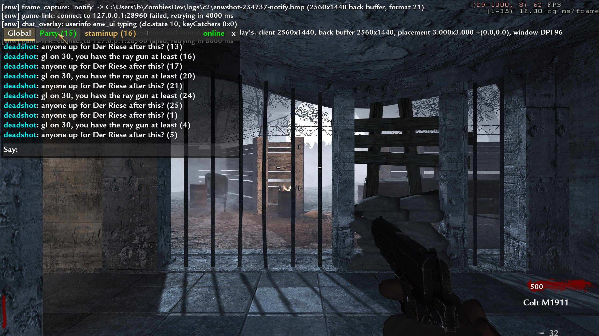
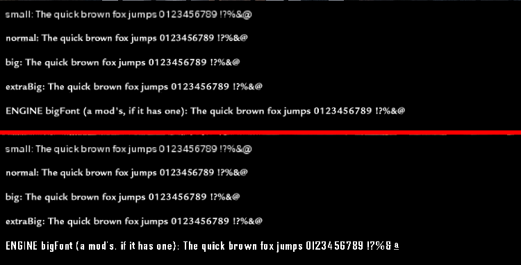

# The in-game chat overlay

> **Status: BUILT, 2026-09-22 (evening).** `client-dll/components/chat_overlay.cpp`, proven in the
> running game in windowed and borderless mode at four resolutions, end to end with a site and
> with a dedicated server pausing on it. **§9 is the results section and supersedes §1-§3 and §5
> wherever they disagree** (the draw hook was found, the input is B's spec rather than the plan's,
> and the channel is the site over HTTP, not the game link). Exclusive fullscreen is **not yet
> seen** (§9.8). §0-§8 are kept as written: the plan, then the server lane's contract.
> **§10 (round 2, after B used 0.2.12):** clicks fixed (the cursor was drawn off its hot spot),
> a real text box, selectable history, a tab per DM conversation, `/w` and `/r`.
> **§11 (round 3):** Esc works on a box and pauses it; the client clock holds while the server is frozen.
> **§12 (round 4):** the overlay and the Esc menu always draw with WaW's stock font, whatever a mod loads.
> **§14 (lane 12):** the window starts with the backlog (`history=1`, never on the HUD); the site's `notice` lines ("Your record has been uploaded.").

B's ask, in his words in substance: *later an in-game overlay where T opens chat, pauses the game
if solo, and lets you type, replacing the game's own chat.*

---

## 0. The one fact that makes this easy, and it is verified

**World at War's single-player / co-op game has no in-game text chat to replace.** There is
nothing to take away, no key already bound, and no existing chat HUD our overlay would have to
fight or hide. So "replacing the game's own chat" is, in the SP exe, simply *providing* it.

The evidence is already written down and is a retraction, which is the strongest kind we keep:

* `docs/re/t4-sp-map.md`, *Chat — CORRECTED*: **"T4 co-op has no classic `say`→`G_Say`"**. The
  function the referee originally bound as `G_Say` (`0x473F10`) fires at ~60 Hz with empty text
  while the game sits idle — it is a per-frame HUD/notify formatter, and its only caller
  (`0x4388A0`, once taken for `ClientCommand`) is on the frame path. Both are **RETRACTED** in
  the address table.
* What T4 has instead is the **party/lobby reliable-command system**: the client sends
  `0clientchat %s` (`0x655C80`), the host relays `0hostchat %s %s` (`0x65B630`). That is lobby
  chat, not in-game chat, and it is the multiplayer lobby's.
* `board.md` 02:40 (re) is where both of those were established.

And the exe we run is the single-player one. `docs/kickstart/README.md` hard rule 2:
**`CoDWaWmp.exe` is never launched.** So the multiplayer chat UI is not merely unused — it is in
a binary this project does not start. The overlay has the screen and the keyboard to itself.

**What this does NOT mean.** It does not mean T is free — `T` is `+talk` in the stock key
bindings and the exe may still consume it somewhere. The overlay must swallow the key rather than
assume nothing is listening, which it has to do anyway (§3).

---

## 1. The four pieces

| Piece | Where | State |
|---|---|---|
| A 2D draw hook, to put a box on the screen | `client-dll/components/chat_overlay.cpp`, new | **found and built 2026-09-22 (§9.1)** — it was the "withdrawn" 0x6F5F10 all along |
| Input capture while typing | the existing WndProc subclass in `mouse_polling.cpp` | mapped, extend it |
| Solo pause | `server/components/pause/pause.cpp` | **server side built 2026-09-22** (§4); the client sets one userinfo key (§8) |
| The channel | `game_link` `say` / `chat`, to the site's ring | **built and live tonight** |

Three of the four exist. The estimate is almost entirely the first one.

---

## 2. The draw hook — the whole risk, and the trap to avoid

**Do not use `SV_GameSendServerCommand` (`0x648490`) or `SV_SendServerCommand` (`0x6F5F10`) as a
text renderer.** They were bound for exactly that, reported green because the call returned, and
then killed a capture ~3 s after the second injected message while a bare launch survived 210 s
(`ac4e884`, *"chat injection withdrawn as proven and suspected harmful"*). Reading their prologues
afterwards showed a **HUD/debug coloured-text pair** that resolves an RGBA via `0x47A450`, passes
four floats, and `strlen`s into a ring buffer at `0x3DCB4C0`. The addresses in the table are
annotated with this. It is the reason `t4-sp-map.md` carries the sentence about two independent
signals.

So the plan is to find the real one, and the rule is **two independent signals before binding**:

1. **A call-graph signal.** `tools/re/t4map.py` over the decrypted dump, from the frame path
   (`Com_Frame` → `SV_Frame` / the client frame) down to whatever runs once per rendered frame and
   takes material + rect + text.
2. **A behavioural signal.** A candidate is bound behind a dvar, called with a fixed string at a
   fixed rect, and the *game is looked at*. A call returning without error is not evidence — that
   is exactly the mistake above.

Two starting points worth trying first, in this order:

* **The console.** The game already draws text over everything with its own font when the console
  is open. Whatever the console's draw function calls IS a 2D text renderer with a working font
  handle, a colour and a rect, and it is reachable from a code path we can trigger on demand (open
  the console, breakpoint, walk up). This is much cheaper than a cold search and gives the
  behavioural signal for free: the thing you are looking at is text on the screen.
* **`R_AddCmdDrawText`-family by material.** T4 draws 2D through the render-command list, so the
  other end is a `Material_RegisterHandle` for a font and a command that takes it.

Note in passing: `CoDWaW.exe` imports **no** `ExtTextOut`/`TextOut`/`DrawText` (`t4-sp-map.md`).
Text on the game surface is the engine's own, not GDI's — there is no OS shortcut here.

**If the draw hook cannot be found in the budget**, there is a degraded mode that is honest and
useful: draw nothing, and let the overlay be **input + pause + the link**, with the conversation
shown by the launcher's own window over the game rather than inside it. B sees his friends' lines
and can type; what he does not get is them on the game surface. That is worth shipping and it is
worth saying out loud that it is the fallback, because a half-found draw hook is how the last
chat attempt cost three days.

---

## 3. Input capture — mapped, and one rule

Everything needed is already in `client.md` §3's address list, added by this lane and `[V]` from
our own dump: the game WndProc `0x606BE0`, `Sys_QueEvent` `0x5FEB30`, `Sys_GetEvent` `0x5FEC60`,
`Com_EventLoop` `0x5FEDE0` `[C]`.

**The rule, and it is a hard one: `mouse_polling` already subclasses that WndProc. A second
consumer extends the one subclass; it does not add another.** This is hard rule 9 in
`README.md` wearing different clothes — one hook per target address, and the loser finds out from
a log line.

The behaviour:

* Closed, the overlay consumes nothing at all and costs one branch per message.
* `T` (the open key, dvar `enw_chat_key`, default `T`) opens it and from that instant every
  `WM_KEYDOWN`/`WM_CHAR` is **swallowed** — not forwarded, not also forwarded. A chat box that
  lets `W` through walks the player into a horde while they type.
* `Enter` sends and closes, `Escape` closes without sending, `Backspace` edits. Nothing else is
  bound in v0.
* The mouse is left exactly alone. Capturing it would fight `mouse_polling`'s raw-input path for
  no gain, and a chat box does not need a pointer.

---

## 4. Solo pause — built on the server side 2026-09-22; the client half is §8

**Correction (2026-09-22 evening, referee/dedi lane).** Until tonight `pause.cpp` was a stub: it
set a flag and wrote a script variable that `t4_bind` cannot write. "Built and working" was the
plan, not the code. It is now real on the dedicated server (`dedi.md` §18, `referee.md` §15):

* the freeze is engine-side and total — the one `call G_RunFrame` inside the server frame
  (0x635D54) is gated, and while frozen `svs.time` is held and snapshots keep flowing. AI, the
  script VM (every `wait`: bleedout, powerups, box, `round_spawn_failsafe`), physics — all stop,
  so nothing has to be pushed forward and nothing expires on resume. `timescale` is never touched;
* **the server decides, from what each client reports** (§8). The overlay does not send `pause` /
  `resume` on the game link — the game link is server↔host only, the client never speaks it.
  The overlay sets one userinfo key and the server applies B's rule:
  * **solo**: paused while the Esc menu is open, and while typing if the player's *"pause when
    using global chat"* setting is on;
  * **co-op**: paused only when **every** connected player is in the Esc menu. **Typing never
    pauses a co-op game, however many people type.** (This is the griefing point the old §4 made,
    and it is now enforced by the server rather than trusted to the client.)
  * a disconnect counts as unpaused; no ceiling on a co-op pause (B), every pause is logged.

One thing this still does not solve, and the overlay should know it: **nobody has yet seen what a
remote client draws while the server is frozen.** The world stops; the stock "Connection
Interrupted" banner may flicker. The server says `pause_state` on the game link, so the site and
the launcher can draw PAUSED — the overlay draws its own PAUSED from §8's rule.

---

## 5. The channel — built and live as of tonight

Nothing new is needed. The overlay is the fourth client of a channel that already has three:

```
  game DLL  ──chat──▶  host agent  ──POST /api/gs/chat──▶  site ring (chat_network)
     ▲                                                          │
     └────say───── host agent ◀──GET /api/gs/chat-feed──────────┘
                                                                │
                            the website / the launcher ◀──socket 'chat'
```

A line typed in the overlay is a `chat` message on the game link, exactly as if the player had
typed it in a game that had chat. A line from anywhere else arrives as `say` and is drawn. The
site composes the system lines ("*mule_kicker just went down on round 30 on Verrückt*") from the
new `player_down` event and the roster events (`docs/protocol/game-link-v0.md`), so the overlay
gets those for free — it draws whatever the ring hands it.

**The `say`/`tell` INJECTION path is the one thing not to build on.** `game-link-v0` lists `say`
and `tell` host→game, and `server/components/chat/chat.cpp` implements them against
`SV_SendServerCommand` — which is the withdrawn pair from §2. Until a real renderer is bound,
**`say` arriving at the game is unproven and suspected harmful**, and the overlay must draw
incoming lines itself rather than hand them to that path. Fixing `say` and building the overlay
are the same piece of work: both need the draw hook, and once it exists `chat.cpp` is rebound to
it and both are true at once.

---

## 6. Estimate, honestly

| | |
|---|---|
| Find and verify the 2D text draw (two signals, console route first) | **1–3 days**, and it is the whole risk. It could be an afternoon if the console route lands; it could be a week if T4's 2D path is built the way the withdrawn pair suggests |
| Draw the box (background, history, input line, caret, wrap) | 0.5 day once something draws at all |
| Input capture, extending the one WndProc subclass | 0.5 day |
| Solo pause + the co-op refusal | 0.5 day, it is two link messages and a player count |
| Wire the link both ways, rebind `chat.cpp`'s `say` to the found renderer | 0.5 day |
| Prove it: a real game, two players, a line each way, no crash over a 300 s run on the harness | 0.5 day |

**Total 3.5–5.5 days, with the spread living entirely in the first row.** The fallback of §2 —
input + pause + link, launcher window instead of a game-surface box — is **1.5 days** and has no
unknowns in it at all.

What would make the estimate worse: the draw path turning out to be per-frame render-command
construction with no stable seam, which would push us to a D3D9 `EndScene` hook instead. That is a
different and larger job, it fights `borderless.cpp`'s window handling, and it is the point at
which to stop and ask B whether the launcher-window fallback is enough.

---

## 7. What is decided and what is not

**Decided**: T opens it (rebindable); solo pauses and co-op does not; input is swallowed whole
while open; one global channel, the same ring the site uses; the overlay draws incoming lines
itself and does not depend on `say`.

**Not decided**: where the box sits and how many lines it keeps; whether a system line looks
different in game the way it does on the site; whether the key is swallowed on the way in or on
the way out of the event queue; whether the overlay is on for Verified games at all, which is a
referee question and not a client one — a chat box is an input path into a recorded run.

---

## 8. Client → server: the pause contract *(defined 2026-09-22 by the referee/dedi lane; server side built)*

No contract existed in this file when the server side was written, so this is it. Change it here,
in `server/components/pause/pause_policy.hpp`, and in `docs/protocol/game-link-v0.md` together.

**The channel is userinfo — no new client command, no new server hook.** A client DLL registers two
string dvars with the USERINFO flag (`0x2`, `docs/re/t4-sp-map.md` → `Dvar_RegisterVariant`, type 7)
and sets them through the engine's own dvar setter, so the dvar is marked modified and the engine
sends its normal `userinfo "…"` reliable command. The server's `SV_UpdateUserinfo_f` (0x6307E0) stores
it in `svs.clients[i].userinfo`, and `pause.cpp` reads that at 20 Hz. `userinfo` is an engine client
command (a ucmd), so it is not subject to the game's chat flood protection.

| key | values | meaning |
|---|---|---|
| `enw_ui` | `paused` | the Esc / pause menu is open |
| | `typing` | the chat overlay is open and has the keyboard |
| | `clear` (or empty, or absent) | neither |
| `enw_pchat` | `1` (default when absent) / `0` | the player's setting *"pause when using global chat"*. Only ever consulted when the player is alone. |

Values are exact and lower case; anything else reads as `clear`. Menu wins over typing: if both are
open, send `paused`. Send `clear` the moment the menu or the box closes — the server resumes on it.

**The server's rule** (`pause_policy.hpp`, unit-tested in `server/tests/pause_policy_test.cpp`):

* nobody connected → running (a disconnect counts as unpaused);
* one client → paused on `paused`, or on `typing` with `enw_pchat 1`;
* two or more → paused only if **every** connected client is `paused`; `typing` never counts;
* the host may hold the game paused on its own (crash grace, everyone-AFK, operator); the players
  cannot release that hold.

**What the client should draw.** The server tells the host (`pause_state`), not the clients — there
is no proven server→client text path yet (`say` injection is off by default, §5). So the overlay
decides "PAUSED" itself from the same rule: it knows its own state, and in co-op it cannot know the
others', so in co-op it should say *"waiting for everyone to pause"* rather than PAUSED until the
world visibly stops. When a server→client channel is proven, the server should push `pause_state`
to clients and this paragraph goes.

**What is NOT proven** (2026-09-22): a real client changing `enw_ui` mid-game and the server seeing
it. The engine re-sending userinfo on a USERINFO dvar change is Q3-lineage behaviour
(`CL_CheckUserinfo`) and `name_pin` depends on the same thing, but `referee.md` §14.4 records that
nobody has yet *measured* a mid-game userinfo command arriving. The first client build that sets
`enw_ui` is also that measurement: the server logs `pause: slot N ui=paused pchat=1`.

---

## 9. Built — results, 2026-09-22 (evening, client lane)

B's spec for the build, in substance: *T toggles an overlay; the mouse leaves the game and can
click it; it looks like World at War's own chat (same font, similar place); tabs Global / Party /
DMs; Enter sends, Esc/T closes; solid in borderless, exclusive fullscreen and windowed, always in
the right place; solo verified games pause while it is open if "pause when using global chat" is on
(default on); multiplayer never pauses for typing.*

### 9.1 The draw hook — found, and it was the "withdrawn" function

Two independent signals, as §2 demands.

**Static.** The console route landed in minutes. CL_InitRenderer (`0x644BE0`) registers `"white"`,
`"console"` and `"fonts/consoleFont"` into `cls` (`0x4DA8F4C` / `50` / `54`). Every console text draw
builds render command **0xD** in the frontend command buffer (`[0x3DCB4C4]`), and the one
non-inlined builder of command 0xD with many callers (11) is **`0x6F5F10` — `R_AddCmdDrawText`**
(`text, maxChars, font, x, y, xScale, yScale, rotation, style`; colour in ECX). **That is the
function the withdrawn chat injection called as "SV_SendServerCommand".** It never was a server
command; it is the text renderer, and calling it from the server frame with a
`(client, type, string)` argument list is exactly what corrupted the command buffer at `0x3DCB4C0`
and killed that capture (`ac4e884`). The retraction was right to stop using it and wrong about what
it was. Above it:

| Function | Addr | Evidence |
|---|---|---|
| `UI_DrawText` | `0x5B5FB0` | 55 callers; `scale*48/font->pixelHeight`; places via `ScrPlace_ApplyRect` `0x47A450` (ECX horzAlign, EAX vertAlign; jump tables `0x47A620`/`0x47A640`); calls `0x6F5F10`. Caller cleans 9 args. |
| `CG_DrawChat` | `0x436900` | **World at War's own HUD chat, still in the SP exe**: reads `cg_hudChatPosition` (`0x3466098`, default **5,200**), `cg_chatHeight` (`0x3466540`, 5), `cg_chatTime` (`0x3688B34`, 12000 ms), picks its font by the UI's thresholds, scale 1/3, draws with `UI_DrawText` on `scrPlaceView` `0x957318`. Its ring: text `0x3467618` (stride 0x97), times `0x3467AD0`, head/tail `0x3467AF0/AF4`; writer `0x459730` (`CG_AddToTeamChat`, [C]). |
| `CG_Draw2D` | `0x4388A0` | calls `CG_DrawChat` at `0x438A21`. **The map's retracted "ClientCommand".** |
| `CG_DrawActiveFrame` | `0x4621E0` | `call CG_Draw2D` at **`0x4628AB`**, EAX = localClientNum. **The map's retracted "SV_ExecuteClientCommand".** |
| `Con_DrawSay` | `0x473F10` | draws the `EXE_SAY`/`EXE_SAYTEAM` "Say:" field when keyCatchers bit 0x20 is set. **The map's retracted "G_Say"** — it "fired 60 Hz with empty text" because it is a draw call. |
| `R_AddCmdDrawStretchPic` | `0x6F58E0` | 18 callers, plain cdecl, 10 args |
| `R_TextWidth` | `0x6E8DA0` | 32 callers; EAX text, stack (maxChars, font) |
| sharedUiInfo fonts | `0x20A10E8` big, `EC` small, `F0` console, `F4` bold, `F8` normal, `FC` extrabig; cursor `0x20A10D4` | registered by name at `0x5D10C0..0x5D11E4` |
| `dx.device` | `0x3BF3B08` | out-pointer of `CreateDevice` at `0x6D605A` |

**Behavioural.** The overlay was drawn and the game was looked at — pictures below, taken from the
back buffer (§9.6).

**The seam.** One rel32: `0x4628AB` now calls a naked thunk that calls the real `CG_Draw2D` and then
draws. Inside the client frame, on the main thread, in the same render-command window CG itself
fills; never from any other thread or frame. No MinHook address is taken. Every function is
byte-checked at startup and the component turns itself off (logged) on any mismatch.

### 9.2 What it looks like

* **Closed:** WaW's chat, by WaW's own numbers — bottom-anchored on `cg_hudChatPosition` (5,200 by
  default; a config that moves the stock chat moves ours), newest `cg_chatHeight` lines younger than
  `cg_chatTime`, a dark box behind each line (rgb 0.25, alpha 0.6), alpha ramping out over the last
  200 ms. Font chosen by `CG_DrawChat`'s own UI thresholds. Names in colour by channel (Global cyan,
  Party green `[Party]`, DMs gold `[DM]` / `[To name]`), system lines yellow. Whole messages only: a
  wrapped message that does not fit is left out rather than shown as an orphaned tail.
* **Open:** a panel on the same anchor with tabs **Global / Party (n) / DMs (n)** (unread counts),
  `online`/`offline`, a close `x`, ten history lines (mouse wheel / PgUp / PgDn scroll), a DM contact
  column (friends and party members; party members green), and WaW's "Say:" line (`Party:` /
  `To <name>:`), caret, Ctrl+V. WaW's own UI cursor (`sharedUiInfo.assets.cursor`) is drawn by the
  engine at the pointer, so the pointer exists even where no OS cursor would (exclusive fullscreen).
* **Size, after B saw it at 2560x1440** (*"very beautiful; the font maybe needs to be slightly
  smaller"*): one size down from `CG_DrawChat`'s 1/3 to **0.28** with a 14-unit line step. The face
  is still chosen by WaW's own thresholds, so it stays the crispest one for the real pixel size.

 


### 9.3 Input (B's spec, amending §3)

Through the ONE subclass `mouse_polling` owns, via the new `client-dll/components/input_gate.hpp`:
a filter that runs first, and a **captured** state in which no motion and no button reaches the
engine (raw or legacy), NOLEGACY is off so the OS cursor moves, and nothing recentres. Entering
capture forces every tracked button up in the engine's differ; leaving it resyncs from the OS. With
`ENW_RAW_MOUSE=0` mouse_polling now installs the subclass and the `IN_MouseMove` retarget in a
**passthrough** mode so the gate still has somewhere to run (proven, 21:01 run).

* **T** (or `ENW_CHAT_KEY`) opens it only in a map (CG drew in the last 500 ms) with no console,
  menu or stock message field owning the keys (keyCatchers `& 0x31 == 0`). The key and the `t`
  `WM_CHAR` it generates are swallowed.
* Open: every `WM_KEYDOWN`/`WM_CHAR` is ours. `WM_KEYUP` goes to the engine on purpose (a key-up for a
  key it thinks is up is a no-op). On open, keys the engine believes are held get a synthetic key-up
  — **only if this window really has the keyboard**, and never Alt/F10 (a synthetic `WM_SYSKEYUP`
  reaches DefWindowProc as a menu keystroke and can activate the window).
* **Enter** sends and closes (WaW's behaviour); Enter on an empty line closes. **Esc** closes.
  **T closes only when the input line does not have focus** — it has focus from the moment T opens
  it, so typing "thanks" types a t; click the history to unfocus and T toggles it shut. A literal "T
  always closes" would make every message starting with t close the box. **Tab** cycles tabs.
  Alt+Tab / Alt+F4 still work (sys keys go to DefWindowProc, never the engine).
* Mouse: clicks hit tabs, contacts, `x`, the input line. Borderless and exclusive fullscreen keep
  the pointer on the game's monitor while open (`ClipCursor` once on open, released once on close
  and on focus loss); a plain window is left unclipped. **Nothing here runs per frame, and nothing
  in the overlay calls SetForegroundWindow, ShowWindow or SetWindowPos.**

### 9.4 The channel — the site, directly (amending §5)

The client talks to the site over WinHTTP; the engine's net path and the box are never used.

* **The chat pass.** The launcher asks the site for it at every launch
  (`POST /api/launcher/chat-token`, session auth) and hands it to the game on the **same one-shot
  pipe as the invite token** (`launch.js` `serveToken`, line `{"v":0,"token"?,"chat":{"base","bearer"}}`;
  `auth_token.cpp` reads it; a Play Local game has no invite and still gets chat). It is an HMAC
  over `{steamid, expiry}` keyed off the site's session secret, **good for `/api/game-chat/*` only,
  for 12 h**, checked against site bans on every use. The game never holds the session.
  Dev fallback: `ENW_CHAT_BASE` + `ENW_CHAT_BEARER`.
* **`web/server/routes/gamechat.js`** (gate-exempt like `/api/gs`, refuses everything without a
  pass): `GET /api/game-chat/me` (name, party, DM contacts, `pause_on_chat`),
  `GET /api/game-chat/feed?g=&p=&wait=20` (long-poll over both rings), `POST /api/game-chat/send
  {channel: global|party|dm, to?, text}`. Global lines go into **the same ring** (`chat_network`,
  origin `game`) the dock and every box read. **Party lines and DMs live in a separate table**
  (`chat_private`, `lib/gameChat.js`) so a DM is never one filter away from the global ring's
  box drain and browser emit. Party = the player's party now; DMs only to friends or party
  members; 5 lines / 10 s per player. Private lines are also emitted as `chat-private` to the
  recipients' own socket rooms, for the site's own tabs later. Tests: `web/test/game-chat.js`
  19/0 (pass forgery/expiry/ban, ring isolation, DM rules, long-poll wake, the real router over
  HTTP); `npm run check` runs it.
* Threads: one long-poll, one sender; the main thread only touches a mutex-guarded inbox.

### 9.5 Pause — the client half of §8, built and measured

The overlay sets exactly §8's keys with the engine's own `setu` (Cbuf), only on change:
`enw_ui typing` while open, `paused` while the Esc menu is up in a map (CG has drawn for 2 s without
a gap, and keyCatchers has 0x10), `clear` otherwise; `enw_pchat` from `/api/game-chat/me`'s
`pause_on_chat` (new account setting, default `true`; `PUT /api/me/settings {pause_on_chat:false}`).
**No new client command.** A first cut sent `enwchat 1 1` as a reliable command and the stock game
printed **"Unknown cmd enwchat"** on the player's HUD — seen in the first capture — so it went.

**Measured on a dedicated server** (`jointest -Tag chatpause1`, local `d2` + `c1`, 20:59-21:01,
`ZombiesDev\logs\dedi\chatpause1.*`): every open is `pause: slot 0 ui=typing pchat=1` →
`PAUSED (solo_chat, 1 player(s))` within ~20 ms of the client's `setu`, and every close is
`ui=clear` → `RESUMED after 9547 ms ... level.time held at 29300 ... +50 ms: no catch-up`. Five
typing pauses in the run. **That closes §8's "what is NOT proven": a mid-game userinfo change does
arrive and the server acts on it.** The same run found the load screen holding keyCatchers 0x10 on
the first CG frame, which briefly reported `paused` (a 62 ms `solo_menu` pause); fixed with the 2 s
rule and re-checked in the 21:01 run (first report `clear`). In a Play Local game the server's
pause component is off by design (`pause: not a dedicated server; the engine's own SP pause
applies`), so typing does not freeze a local game; the Esc menu still does, natively.

### 9.6 Evidence: what was run, and what it showed

All runs: `waw-c2` (or `c1`+`d2`), `nazi_zombie_prototype`, off-screen at -4000,-4000 unless noted,
`ENW_CHAT_SELFTEST=2`: the DLL posts T, types, clicks tabs and a contact, sends on all three
channels, opens the Esc menu, and saves the back buffer after each step. Pictures come from
`client-dll/components/frame_capture.cpp` (off unless `ENW_FRAME_CAPTURE=1`/`ENW_CHAT_SELFTEST`):
the engine's own `screenshotJPEG` refuses with *"game window is partially off-screen"*, so the
swap chain's `Present` (a vtable slot, not a code patch) copies the back buffer to a .bmp before
presenting — the exact frame that goes to the screen, in any window mode. A private site on
**3399** (temp data dir, invented accounts `overlay_tester`/`staminup`/`deadshot`; `web/data`
untouched; stopped afterwards) fed Global/Party/DM lines every 2.5 s.

| run | mode | back buffer | result |
|---|---|---|---|
| 20:28 | windowed | 800x600 | first draw from inside CG_Draw2D; typing via the pump's TranslateMessage; tabs by click; 75 s, no fault |
| 20:46 | windowed | 800x600 | **end to end**: site lines drawn in game; `hello from inside the game` in `/api/chat` (origin `game`), the party line in the friend's feed, the DM `-> staminup` |
| 20:48 | **borderless** (`ENW_BORDERLESS=1`) | 1280x720 in a 2560x1440 client | style strip read back; layout identical; pointer mapping client → back buffer correct. **This run covered B's monitor — see §9.8** |
| 20:50 | windowed | **2560x1440** | same layout at B's native size (`ui/chat-overlay-dm-2560x1440.jpg`, before the font change) |
| 20:53, 20:56 | windowed | 1280x720 | the smaller font; activation counts logged |
| 20:59 | **dedicated + client** | 800x600 | §9.5's pause measurement |
| 21:01 | windowed, `ENW_RAW_MOUSE=0` | **1024x768** (4:3) | passthrough subclass works; no `paused` blip at load |
| 21:04, 21:05 | windowed | 800x600 | final binary; three lines sent on three channels |

`scrPlaceView` read back per run: scale 1.25 (800x600), 1.5 (1280x720), 1.6 (1024x768), 3.0
(2560x1440), origin (0,0) — the panel lands in the same place relative to the HUD in every one,
because the HUD is placed the same way. Pictures: `ui/chat-overlay-*.jpg`.

### 9.7 Switches

`ENW_CHAT_OVERLAY=0` off (and with `ENW_RAW_MOUSE=0`, no subclass at all) · `ENW_CHAT_KEY=<letter|VK>`
· `ENW_CHAT_NOTIFY=0` never touch `enw_ui`/`enw_pchat` · `ENW_CHAT_SELFTEST=1|2` demo lines /
scripted session with captures · `ENW_FRAME_CAPTURE=1` + `ENW_FRAME_CAPTURE_DIR` the back-buffer
instrument alone · `ENW_CHAT_BASE`/`ENW_CHAT_BEARER` dev credentials.

### 9.8 What is NOT proven, and what went wrong

* **Exclusive fullscreen has not been looked at.** It cannot be tested off-screen, and B was at the
  PC all evening; an exclusive-mode window takes the display. By construction it should hold (same
  virtual placement, engine-drawn cursor, pointer clipped to the monitor while open), but that is an
  argument. **The proof is one run** with the lock and nobody at the PC:
  `$env:ENW_CHAT_SELFTEST='2'; $env:ENW_BORDERLESS='0'; tools\dev\launch.ps1 c2 -Visible -TestSeconds 60 -GameArgs '+set r_fullscreen 1 +set r_mode 2560x1440 +map nazi_zombie_prototype'`;
  the captures land in `ZombiesDev\logs\c2\enwshot-*.bmp`.
* **Real-hardware typing** was only exercised by accident (B pressed T and Esc on the 20:48 window
  and the overlay opened and closed; a 50-character party line was typed into it). A deliberate
  one-minute check by a person is still owed: T, type, Tab, click a tab, Enter, Esc.
* **Not on the live site**: the web half (`/api/game-chat/*`, the pass, `pause_on_chat`) needs a site
  deploy, and the launcher half (the pass on the pipe) needs a launcher release. Until both, a
  shipped DLL shows "offline" in the panel and still does everything else, including the pause
  keys (with `enw_pchat 1`). The site's /settings page has no toggle for `pause_on_chat` yet.
* **Two-player pause** (co-op: typing must NOT pause) is the server's rule and unit-tested there; not
  run with two real clients.
* **What went wrong tonight.** The 20:48 borderless run used `borderless.cpp`'s default
  *cover the monitor* behaviour, which moved the test window onto B's 2560x1440 screen, and
  `launch.ps1` re-parks every 700 ms — the two fought, and B saw the window flicker in and out and
  pressed keys into it. The 20:50 run at **2560x1440 windowed** also ended up on his screen (a
  desktop-sized window, the same park loop). The engine itself activates its window once at
  startup (`ShowWindow(hwnd, SW_SHOW)` in R_Init, `0x6D68ED`). The overlay's own code has no
  activation call; the activation counter it now logs saw 0-5 activations per run, including ones
  while it was closed and before it ever opened. Rules taken from it: test only at sizes smaller
  than the desktop, always with `ENW_BORDERLESS_COVER=0`, and never exclusive fullscreen while B is
  at the PC.

---

## 10. Round 2 — clicks, a real text box, tabs per conversation (2026-09-22, late)

B tested 0.2.12 for real: *"When you press T you can move your mouse but you can't click on the
tabs for party and stuff. I really like how it looks, but make it more functional: you can select
things, it's intuitive, you can click stuff properly, use tabs properly, Ctrl+A and copy and paste."*

### 10.1 Why clicks missed — the cursor was drawn in the wrong place

Not the input gate, not raw input, not DPI: the clicks arrived and were hit-tested correctly. **The
picture of the pointer was wrong.** WaW's UI draws its cursor **centred** on the pointer —
`0x5B6970`: `x - size*0.5`, size 32 from `[0x84BC9C]`, material `sharedUiInfo.assets.cursor` — so
the arrow's tip is the middle of the 32x32 image. Round 1 drew the image from its top-left at the
pointer, putting the visible tip **16 virtual units below-right** of where a click lands: 48 px at
2560x1440, while the tab strip is 18 units (54 px) tall. B aimed the tip at "Party" and the click
landed above the strip. The selftest never saw it because it clicks by coordinates, not by looking.
Fixed by drawing the cursor exactly as the UI does. The proof is the capture with the pointer
posted to the centre of the Party tab — the tip is on the tab — followed by the logged click:



Every click now logs its whole path (client → back buffer → virtual → target), and every open logs
the client rect, back buffer, placement and window DPI:

| run | mode | click (client) | virtual | target |
|---|---|---|---|---|
| 23:46 | windowed 1280x720 | (124,73) of 1280x720 | (82.7,48.7) | tab 1 'Party' |
| 23:46 | | (103,321), twice | (68.7,214.0) | input, double-click → selection 'click' |
| 23:46 | | (42,289) | (28.0,192.7) | history → the name `deadshot` → DM tab 3 |
| 23:46 | | (382,73) | (254.7,48.7) | tab 4 '+' |
| 23:47 | **borderless 2560x1440** (client 2560x1440, DPI 96) | (248,147) of 2560x1440 | (82.7,49.0) | tab 1 'Party' |
| 23:47 | | (207,642), twice | (69.0,214.0) | input, double-click → 'click' |
| 23:47 | | (85,579) | (28.3,193.0) | history → name → DM tab |
| 23:47 | | (765,147) | (255.0,49.0) | tab 4 '+' |
| 23:47 | | (72,246) | (24.0,82.0) | contact 'staminup' → its DM tab |

Raw input on (the default, B's), NOLEGACY armed: while the overlay is open mouse_polling puts the
legacy messages back, so a physical button is a real `WM_LBUTTONDOWN` through the gate's filter —
which is the path the posted clicks take too. **Not proven:** a physical click on B's own mouse
(`SendInput` is discarded on this box, `client.md` §1e); his one-minute check is below.

### 10.2 What it does now

* **Tabs:** Global, Party, **one tab per DM conversation**, and **+** (a picker: friends, party
  members, anyone seen in chat — click one to open their tab). Click a tab; **Tab / Shift+Tab /
  Ctrl+Tab** cycle them; right- or middle-click a DM tab closes it. The active tab has a gold fill
  and underline, hover lights a tab, unread counts on the others. A DM from someone opens their tab.
* **Names are links:** click a sender's name in any line (hover underlines it) → their DM tab.
  **`/w name text`** (also `/msg`, `/tell`) opens the tab and sends; `/w name` just opens it; **`/r
  text`** replies to the last person who messaged you. Friends and party are matched first, then
  anyone seen in chat; the server still only delivers DMs to friends and party.
* **The input line is a text box:** caret (blinks, resets on edit), Left/Right, Ctrl+Left/Right by
  word, Home/End, **Shift+any of those selects**, mouse drag selects, **double-click selects a
  word**, triple-click the line, **Ctrl+A** all, **Ctrl+C / Ctrl+X / Ctrl+V** through the Windows
  clipboard (`CF_UNICODETEXT` on the game window, Latin-1 both ways; a paste becomes one line —
  newlines and tabs to spaces, runs collapsed, `^` colour codes removed — capped at 150), Backspace
  / Delete (Ctrl = a word) and typing replace a selection, Up/Down recall what you sent, the line
  scrolls sideways to keep the caret in view. Selection is WaW's gold as a tinted box behind the
  game font.
* **History is selectable:** drag across lines (dragging past the top or bottom scrolls), double-
  click a word, triple-click a row, Shift+click extends; **Ctrl+C** copies it (rows of one message
  joined by spaces, messages by newlines); Ctrl+A selects the tab's whole history when the history
  has focus (click it). The mouse wheel and PgUp/PgDn scroll; a `^` marks "more below".
* **Hover:** tabs, the row under the pointer, names, picker rows and the close box.
* Look and font size unchanged.

Pictures: `ui/chat-overlay-r2-*.jpg` (shift-select, double-click word, history selection at
2560x1440, a name opening a DM tab, the tab after `/w`, the picker).

### 10.3 Runs, and the lock

Both runs: `waw-c2`, `nazi_zombie_prototype`, the private site on 3399 feeding Global/Party/DM lines,
`ENW_CHAT_SELFTEST=2` (the DLL posts keys, chars, clicks, a drag, a double-click and wheel notches
into its own queue and captures the back buffer). **No window was ever activated:** the new harness
switch `ENW_TEST_NO_ACTIVATE=1` (`components/test_no_activate.cpp`, never set by the launcher) makes
the engine's windows `WS_EX_NOACTIVATE` and neutralises its startup `ShowWindow(SW_SHOW)` and
`SetFocus`; a watcher sampled the window every 500 ms: **foreground 0 of 129 samples** in each run,
and the overlay logged 0 activations. The selftest also never touches the Windows clipboard (a
private buffer stands in for it, logged). One thing remains visible for about a second per launch:
the engine creates its window at the centre of the screen before `launch.ps1` parks it.

| lock held | run | result |
|---|---|---|
| 23:44:11 – 23:45:19 | windowed 1280x720 | all features; a posted Ctrl+C typed a stray "c" (fixed: a Ctrl+letter now also eats its plain-letter `WM_CHAR`) |
| 23:46:06 – 23:47:14 | windowed 1280x720 | clean: copy "world", paste → `hello selection worldworld`, double-click → `click`, history copy 183 chars, name → DM tab, `/w staminup hi from a whisper` delivered to staminup on the site |
| 23:47:26 – 23:48:34 | **borderless 2560x1440**, off-screen, `ENW_BORDERLESS_COVER=0` | the same, every click at 3.0 scale landing on its target (table above) |

### 10.4 Still not proven

* **B's own hand.** One minute: T, move onto "Party" and click, Tab/Shift+Tab, type, Shift+Left,
  Ctrl+C, Ctrl+V, double-click a word, drag over two history lines and Ctrl+C into Notepad, click a
  name, `/w name hi`, Esc. The DLL log shows every `click #n ... -> tab n` line.
* The real Windows clipboard path (the selftest deliberately does not touch it).
* Exclusive fullscreen (§9.8 still stands).

---

## 11. Round 3 — pause from the client's side (2026-09-23, early)

B, a real box game on 0.2.13 (client `enw-38756.log`, box `waw-inst-01/enw-1024.log`): *"When you
press T and you're paused, one of the numbers in the top-right FPS meter spikes and the zombies
twitch a little once or twice, then it goes normal"* and *"Escape to pause the game doesn't work."*
The box log agrees on both: every T was `ui=typing` → `PAUSED (solo_chat)`; no Esc ever produced
`ui=paused`, and the client never reported it.

### 11.1 Esc did nothing at all: a refused video left its name behind

`connect_local` refuses the map's load video for a launcher join (§7 of `client.md`). The engine
stores the video's **name** (`0x3DB3D40`) before opening it; the open fails, nothing plays, so the
engine's cinematic stop (`0x6EBE20`, the only thing that clears the name) never runs. For the rest of
the game:

* CL_KeyEvent's Esc (`0x478450..0x47846A`): "a cinematic is up and `cg_cinematicFullscreen` is on"
  → **Esc is ignored**, `UI_SetActiveMenu(2)` never runs, no pause menu;
* CG (`0x437F12`) sends every frame through the fullscreen-cinematic drawer.

Measured (local dedi + client join, `hold-off`, 00:56): Esc in the map with `0x3DB3D40 = 'n'`
(`nazi_zombie_prototype_load`), keyCatchers still `0x0` 300 ms later. A Play Local game (`+map`)
never refuses a video, which is why its Esc always worked. **Fix** (`connect_local.cpp`): once the map
is live, if nothing is playing and the pending name is the one we refused, call the engine's own stop
(byte-checked). Next run (`hold-on`, 01:00): `cleared the cinematic name 'nazi_zombie_prototype_load'`,
then Esc → keyCatchers `0x10`, `cl_paused 1`, `enw_ui paused`.

### 11.2 …and then the menu paused only the client

`UI_SetActiveMenu(2)` (`0x5D6D74`) sets `cl_paused 1` — single-player's way of pausing, which assumes
the server is in this process. Connected to a box it pauses only the client, which then stops
sending: in `hold-on` the client set `enw_ui paused` and the server never heard it (no `ui=paused`,
no `solo_menu`). With no local server (`sv_running 0`) the overlay now puts `cl_paused` back to 0
through the engine's own `Dvar_SetIntByName` (`0x5EF930`, byte-checked), so the client keeps talking,
the server freezes the game on `paused`, and §11.3 keeps the picture still. Next run (`hold-on2`, 01:05): Esc → the stock "PAUSED / Resume Carnage" menu
(`ui/pause-r3-escmenu-remote.jpg`), the client logged `set it back to 0`, and the **server logged
`slot 0 ui=paused` → `PAUSED (solo_menu)`, then `RESUMED after 3985 ms ... level.time held at 27950`**
on the second Esc. This fix lives in `chat_overlay.cpp`'s frame tick, so `ENW_CHAT_OVERLAY=0` turns
it off too.

### 11.3 The twitch: the client clock runs on while the server stands still

Read out of `CL_SetCGameTime` (`0x63C6C0`) and `CL_AdjustTimeDelta` (`0x63C400`): the frozen server
keeps sending snapshots, all stamped with the held serverTime S. The client clock is `cls.realtime +
cl.serverTimeDelta`, never allowed backwards (`0x63C76B`), so at the freeze it runs past S —
extrapolating the zombies forward — while each snapshot pulls the delta down (`<FAST>` over 100 ms;
`<RESET>`, which writes the clock straight back to S, over 1000 ms). Over the internet the gaps are
larger and noisier than on a LAN, which is where B's spike and twitch come from; on the local join
the stock client stayed within 0–17 ms steps (`hold-off`), so the local numbers below prove the
mechanism, not B's exact symptom.

**Fix** (`chat_overlay.cpp`, `pause_hold`): the freeze is read off the snapshots — a new snapshot
(`cl.snap.messageNum` 0x305853C moved) with an unchanged `cl.snap.serverTime` (0x3058538). A live
server does that too for single snapshots (measured: 16–63 ms "freezes" in `hold-off`), so it takes
two in a row, or one when this client has just reported `typing`/`paused`. While frozen,
`cl.serverTimeDelta` (0x305A62C) is pinned each frame 50 ms under the clock at detection, so the
engine's own clamp holds the clock exactly still and the adjust never sees a big gap. On resume the
delta is set once so the clock continues from where it stood at real-time rate. Off:
`ENW_PAUSE_HOLD=0`. It holds for any freeze (typing, Esc, co-op all-in-menu, the host), because it
reads the server, not the keys.

| run (local d2 + c1, `ENW_CHAT_SELFTEST=3`) | freeze | clock during it | first 2 s after resume |
|---|---|---|---|
| `hold-off` (00:56, `ENW_PAUSE_HOLD=0`) | typing 5.47 s | steps 0..16 ms (kept moving) | 0..17 ms |
| `hold-on` (01:00) | typing 5.47 s | **0..0 ms, stood at S−5** | 0..17 ms, no negative step |
| `hold-on2` (01:05) | typing 5.49 s | 0..0 ms, stood at S+8 | 0..17 ms, no negative step |
| `hold-on2` (01:05) | **Esc menu 4.0 s** (`solo_menu`) | 0..0 ms, stood at S−7 | 0..17 ms, no negative step |

17 ms is one frame at the test's 60 fps: at the open and at the close the clock never stepped more than
one frame and never backwards, and while frozen it did not move at all. `cg_drawFPS` stayed flat
across both edges in the captures (`(13-19) 16.00 cg ms/frame`).

### 11.4 Lock holds

All local, `waw-d2` + `waw-c1`, `ENW_TEST_NO_ACTIVATE=1`, each checked free first (no lock, no
CoDWaW.exe): 00:56:21–00:57:49 (`hold-off`), 01:00:10–01:01:37 (`hold-on`), 01:05:36–01:07:03
(`hold-on2`). At 01:02 the lock was held by B's launcher; I waited until 01:05:14. The box was only
read (logs over ssh); no lease was taken.

**Not proven:** B's internet-latency case itself (the spike he saw is the extrapolate/adjust path
with real jitter, which a LAN join barely exercises); a co-op all-in-menu pause with two clients.

---

## 12. Round 4 — always World at War's own font (2026-09-23, early)

B on 0.2.17: *"The overlay must not use the font that comes from the map. It is currently changing
based on the mod pack. It needs to be static: the exact same World at War font every time, for
everything on the overlay."*

### 12.1 What a mod does to the font (measured, not assumed)

* **29 of the 78 archived mods** ship `fonts/*` fonts and the `fonts/gamefonts_pc` material and
  `gamefonts_pc` image in their `mod.ff` (listed with OAT's Unlinker). **`fear_mc_2` is not one of
  them**: its mod.ff, map, `_load`, `_patch` and gumball zones contain no font, and its IWDs no font
  image. The proof uses **`mw2rust`**, which replaces all of it.
* T4 overrides an asset **in place** (probe, `ENW_FONT_PROBE=1`, 01:58 on mw2rust): the font pool slot
  `sharedUiInfo` points at (`0x00AD1C9C`, bigFont) holds the mod's font (20 px, 190 glyphs); the
  stock header is moved to a spare slot of the same pool (`0x00AD1D2C`: 32 px, 191 glyphs, glyph
  table in the `code_post_gfx` zone, SHA-256 equal to a stock game's). Material slots work the same.
* **The atlas pixels are replaced even for the stock asset**: images are loaded from the IWDs by
  name, and mw2rust ships `images/gamefonts_pc.iwi` (1024×1024). Both `gamefonts_pc` image slots
  held the mod's texture. The stock pixels never enter the process.

### 12.2 The fix (`client-dll/components/stock_font.cpp`), nothing of Activision's shipped

Per `ip-posture.md` §0 everything of theirs must come from the player's own install at runtime, so
the DLL carries **hashes, not data**:

1. **Glyph tables**: the font pool slot named `fonts/X` whose glyph table's SHA-256 equals the stock
   value recorded from a stock game (small, normal, big, extraBig). The live slot when no mod
   overrides it, the moved original when one does.
2. **Material**: the `fonts/gamefonts_pc` (and `_glow`) pool slot whose name string lies in the stock
   zone (within 1.5 MB of that glyph table), copied into our memory (0x70) with its texture table.
3. **Atlas**: read from the player's own `main\*.iwd` — never a mod's folder — the stored
   `images/gamefonts_pc.iwi` (stock English: `localized_english_iw00.iwd`, IWi v6 DXT5 512×512, ten
   mips smallest first, checked against the stock size), made into a D3D texture **on the device's
   own thread** (`frame_capture::run_at_present`), wired into our own `GfxImage`.
4. Our own `Font_s` per face points at the stock glyph table and our material. The overlay
   (`chat_overlay.cpp pick_font`) and the Esc menu (`pause_menu.cpp font_for`, one line changed) ask
   `stock_font::pick(real scale)`, which uses WaW's thresholds at their **stock** values (0.25 / 0.4
   / 0.55, from the dvars' registration) rather than the dvars, which a mod can set.
5. Resolved once, on the first in-map frame, after every zone of the map has loaded, and never
   again: what it holds is our copies plus the `code_post_gfx` zone, which is never unloaded, so a
   map's `_load`/`_patch` fastfiles and anything loaded later cannot change it. If anything is
   missing (another language's glyph tables, a compressed atlas) it logs why once and falls back to
   the engine's fonts.

### 12.3 Proof

`ENW_CHAT_SELFTEST=4` draws an opaque card with the same sample in each face through
`stock_font::pick`, plus one line in the engine's *current* bigFont, and captures it (800×600,
`waw-c2`, Play Local, invisible window):

| run | map | log | card lines 1–4 (ours) | line 5 (engine's font) |
|---|---|---|---|---|
| 02:11:58 | Nacht (stock) | `READY ... stock atlas from ...\main\localized_english_iw00.iwd` | — | — |
| 02:10:51 | **mw2rust** (fs_game mods/mw2rust) | stock headers in the moved slots; materials `OVERRIDDEN by a mod`; `READY` | **pixel-identical to Nacht** | 5,022 px differ (the mod's font) |


`ui/stock-font-overlay-on-mw2rust.jpg`: the open overlay in stock WaW type while the engine's own
console print above it is in the mod's font.

**Lock holds (c2 only, invisible window, each checked free):** 01:52:46–01:53:39, 01:54:29–01:55:22,
01:56:00–01:56:38, 01:56:52–01:57:50, 01:58:01–01:59:04, 02:03:45–02:04:33, 02:04:51–02:05:24,
02:05:47–02:06:25, 02:06:41–02:07:34, 02:08:01–02:08:54, 02:10:51–02:11:44, 02:11:58–02:12:36.

**Not proven:** a box game (dedi + client) on a font-replacing map — the client-side mechanism is the
same, but the local dedi still cannot run most custom maps (weapon-index mismatch, `dedi.md`); the ENW
Esc menu (`pause_menu.cpp`) draws only in box games, so its switch to `stock_font::pick` is
built but not captured; a non-English install (it will fall back and say so). Harness note: with
`launch.ps1`'s new private LocalAppData default a copy needs a seeded `players\profiles` or `+map`
never runs; `c2` was seeded from `c1`'s. The first mw2rust mount ran without
`ENW_USE_PRIVATE_LOCALAPPDATA=1` and so also junctioned `mods\mw2rust` under B's real
`%LOCALAPPDATA%\Activision\CoDWaW\mods` (a junction onto the archive; nothing written into B's files).

### 12.4 2026-09-23 02:40 — B's hang on zm_nuked (0.2.18), and what changed

B's client (`enw-34580.log`) hung ~200 ms after its first in-game frame on `zm_nuked`. In that run
`stock_font` had searched on the MAIN thread for 110 ms and failed ("no stock material" — the moved
material slot was more than 512 slots away) and fell back to the engine's fonts; **its render-thread
texture job never ran** (it is only posted after a successful search), so the render-thread theory
does not fit this log. 0.2.17 → 0.2.18 changed nothing in the DLL but `stock_font`.

* **Reproduced B's path on the box** (fake-ID lease `m_3727222c`, local `c1`, 2560×1440 borderless,
  `r_multiGpu 1`, invisible window, 02:33): the identical log sequence (stock headers found, no
  stock material, fallback, first in-game frame, cinematic name cleared) and **no hang** — 90 s of
  heartbeats. The one thing not reproduced is sound: harness launches run `snd_menu_master 0`, so the
  boot lane's mute/restore went 0 → 0, where B's went 0 → 1 in the same 200 ms.
* **Changed anyway**: the search now runs on its own worker thread (only memory reads and one
  file); the main thread draws with the engine's fonts until it is done, posts the texture job, polls
  a flag, and never waits. Material search span 512 → 8192 slots. Timed: 156 ms on the worker on
  mw2rust, card still pixel-identical to Nacht.
* **`components/hang_watchdog.cpp`** (new, `ENW_HANG_WATCHDOG=0` off): if the frame tick is silent
  8 s in a map, it logs the main thread's 16 return addresses and writes
  `hang-<pid>-<time>.dmp` (MiniDumpWithIndirectlyReferencedMemory | ThreadInfo) into the log folder,
  once. Proven with `ENW_HANG_TEST=1` (a deliberate 12 s sleep): stack logged, 412 KB dump written,
  game resumed. Note for reading it: frames in `binkw32.dll+…` are OUR DLL (it is loaded under the
  proxy's name); the PDB is next to `build/client-lane/enw_t4.dll`.

---

## 13. 2026-09-23 ~04:00 — "Enter in chat crashed the game" was Discord's graphics hook (`overlay_guard.cpp`)

B, 03:42 UK, `nazi_zombie_fear_mc_2` on the box, launcher 0.2.20 (DLL `03b04bc3`): typed two
characters in the chat tab of the Esc menu, pressed Enter, the game died. **Enter was a
coincidence. The chat overlay and its send path are not at fault and are unchanged.**

### 13.1 Evidence (read-only, B's PC)

| Source | What it says |
|---|---|
| `logs\enw-23916.log` | 03:42:30.354 `queued a global line (2 chars)`; 03:42:33.5 `Com_Error TRAPPED ... "Unhandled exception caught"` from the engine's top-level filter (0x5FF510), **no fault address**; 03:42:38 the hang watchdog fires on the parked main thread (its minidump failed, 0x8007001F, because WER held the faulting thread) |
| Windows Event 1000, 03:42:30 | **faulting module `DiscordHook.dll` +0x1F7FD, c0000005** (`%LOCALAPPDATA%\Discord\app-1.0.9259\modules\discord_hook-1\...\DiscordHook.dll`) |
| `%LOCALAPPDATA%\CrashDumps\CoDWaW.exe.23916.dmp` (WER LocalDumps) | thread 2240 = the render thread inside `IDirect3DSwapChain9::Present` (engine → our `frame_capture` → `boot_direct` → d3d9 → Discord's detour at +0x51A0). Fault: `mov edx,[DiscordHook+0x1093D0]` / `lock cmpxchg [edx+45h],cl` with **edx = 0** (write to 0x45). In the dump that global is 0 and the capture-mode word beside it (+0x1093D8) is 2 |
| `%APPDATA%\discord\logs\discord_hook.log` | `Attach pid = 23916` at 03:42:29.378, *"process has been alive for 35980.7 ms"*, `Activating graphics capture with flags: 2`, `Hooked D3D9` 03:42:30.426, three shared textures — **and nothing after**. The line text was queued 70 ms before the hook went live |
| Same crash, no chat | agent copy `waw-nc` pid 4000 (net_fear test, fear_mc_2), 03:10:51, **identical offset**; Discord attached at 03:10:48.6, ~38 s after launch. Nobody typed |

### 13.2 Root cause (read out of DiscordHook.dll, hook build `1342ee47cf7536`, unchanged since 09-21)

"Activating graphics capture" runs a once-init that creates a named mapping of **52,428,872 bytes
(0x3200048)** — `CreateFileMappingA(INVALID_HANDLE_VALUE, …, PAGE_READWRITE, 0, 0x3200048, name)` —
and maps all of it with `MapViewOfFile`. Only if that succeeds is the object stored in the global
(`test eax,eax / je` at +0x1FDAF, store at +0x1FE35). The capture-mode word is set either way, and
the post-Present path it enables (+0x76C8 sets the gate, +0x7DB7 → +0x1F7F0) dereferences the global
without a NULL check. CoDWaW.exe is 32-bit without LARGE_ADDRESS_AWARE (2 GB, and LAA is not possible
for this exe). **On fear_mc_2 there is no 50 MB hole left**: measured in `ovg1`/`ovg2` below, the
client's largest free block a minute into the map was **39.1, 19.6, 19.6 and 12.3 MB** in four runs (at 800x600; B runs
2560x1440, which only needs more). So Discord maps nothing and faults on the very next Present.
Other maps and earlier sessions survived because the hole was still there when Discord attached
(~36 s after launch): since 09-22 Discord hooked a rendering CoDWaW 76 times (75 logged sessions
plus pid 4000, which died before its session line); 74 logged `InitOverlay: initialized`, the two
that did not are the two crashes, both on fear_mc_2.

### 13.3 Fix — `client-dll/components/overlay_guard.cpp` (client only; `ENW_OVERLAY_GUARD=0` off)

1. **`ntdll!LdrLoadDll` is detoured and a load of `DiscordHook.dll` is refused**
   (`STATUS_ACCESS_DENIED`). Discord logs a failed attach and the game carries on without Discord's
   in-game overlay / Go Live game capture / Clips. **`ENW_ALLOW_DISCORD_HOOK=1` lets it in.** Rule
   and name matching are pure (`overlay_guard_rules.hpp`).
2. **Every DLL loaded after engine start is logged** with its time since process start and the
   largest free address block at that moment (`LdrRegisterDllNotification`, queued and written from
   the frame tick, never under the loader lock), plus an address-space line once a minute. The next
   injector (Medal, RTSS, OBS, Steam overlay) shows up with the number that decides whether it fits.
3. **An unhandled exception is logged with module+offset**, thread and free address space before
   the engine's filter turns it into "Unhandled exception caught" with no address.

### 13.4 Proof

* Unit test `client-dll/tests/overlay_console_test.cpp` (x86 `cl`, see its header): **40 passed,
  0 failed** — B's exact Discord path refused, bare/upper-case/no-extension/64-bit/`/`-separated names
  refused, d3d9/binkw32/`DiscordHookHelper.exe`/`myDiscordHook.dll`/a directory named like the hook
  allowed, counted (non-NUL-terminated) names, the opt-in switch only on `1`, the address-space
  measure moving when half the largest block is reserved; and the console_tap format (§ client.md).
* Local dedi + client on **fear_mc_2** (`jointest`, `nd` + `nc`, build `overlayguard`,
  `ENW_TEST_NO_ACTIVATE=1`, `ENW_BORDERLESS_COVER=0`, `com_maxfps 125`, private LocalAppData,
  invisible 800x600 at -4000,-4000, `ENW_CHAT_SELFTEST=2`), logs `ZombiesDev\logs\nc\` and
  `logs\dedi\ovg*.txt`:

| run | lock held | result |
|---|---|---|
| `ovg1` | 04:16:01–04:18:07 | 105 s alive at 125 fps, no fault; guard armed; address space: 923 MB largest at engine start → **127.6 MB** at +4 s → **39.1 MB of 112 MB** at +64 s; `console-25180.log` 2.3 MB of engine lines. The overlay never opened: the stock `briefing` menu held keyCatchers 0x10 on the off-screen client |
| `ovg2` | 04:24:09–04:26:15 | same, **19.6 MB of 98 MB** at +65 s; `closemenu` did not run (`frame_capture_timer` also needs `ENW_FRAME_CAPTURE_AT`) |
| `ovg3` | 04:37:05–04:39:12 | same, 19.6 MB at +65 s; `closemenu briefing` ran but fear_mc_2's intro menu has another name, so T was still refused |
| **`ovg4`** | 04:59:54–05:02:01 | new selftest step (Esc at +7 s only while keyCatchers has 0x10, `84e6201`): `OPEN (key)` 05:00:27.6, typed, `/w staminup …`, **`CLOSED (Enter)` 05:00:42.758**, T again, `CLOSED (Esc)`; `opens=2 clicks=7`, **105 s alive at 125 fps, no fault**, guard armed; **12.3 MB of 79 MB** largest free at +65 s; `console-30112.log` 7,004 lines / 410 KB with the repeat limiter (`(suppressed 1243 more in 10s: "Failed to log on.")`) |

The ovg4 Enter ran with no site credentials (the harness has no launcher pipe), so the line went
into the offline path, not over WinHTTP as B's did; the send path is not implicated by any evidence
above, but that exact path on fear_mc_2 was not re-run. Discord did **not** attempt to attach to the ovg clients (nothing for their pids in
`discord_hook.log`), so the refusal path itself has only the unit test and the armed detour as
evidence — see §13.5.

### 13.5 NOT proven

* **A refusal against a real Discord attach.** Discord attached to dozens of harness clients on 09-22/23
  but not to ovg1/ovg2 (why it picks a process is Discord's). The first launcher game on B's PC with
  Discord running should log `overlay_guard: REFUSED 'C:\Users\b\AppData\Local\Discord\...\DiscordHook.dll'`
  at ~+36 s, and `discord_hook.log` should show a failed attach for that pid. Discord may retry; the
  count is in the per-minute line.
* **The crash reproduced on demand** with `ENW_ALLOW_DISCORD_HOOK=1`: not attempted — a crashing test
  copy puts the engine's "Unhandled exception" box on B's desktop. The mechanism rests on the dump,
  Discord's log, the disassembly and the measured address space.
* **The product trade.** Discord's overlay, Go Live game capture and Clips are now off inside the
  game for every player. The switch is an environment variable only; a launcher/site toggle and B's
  call on the default are open.
* The address-space number at 2560x1440 on B's PC (it will be in his next `enw-<pid>.log`).

### 13.6 Revision, 2026-09-23 ~11:00–12:00: gate the hook on address space, a setting, a chat line

The 04:00 guard refused `DiscordHook.dll` in every game, which took Discord's overlay, Go Live
capture and Clips away from every player, including on the maps where it works (74 of 76 attaches
since 09-22). Revised (`dd8ac00` DLL, `224f6ba` settings, merged with main in `5e15d75`):

* **`ENW_DISCORD_HOOK=auto|allow|refuse`** (unset, empty or unknown = auto; `on`/`1`, `off`/`0`
  accepted by hand). Replaces `ENW_ALLOW_DISCORD_HOOK`. Pure rule in `overlay_guard_rules.hpp`
  (`parse_mode`, `allow_discord`).
* **auto:** when Discord asks to load the hook, the detour measures the largest free address block
  there and then. **Allowed if it is at least `0x3210000` bytes (50.06 MB), refused otherwise.**
  That is "a 50 MB block", made exact: Discord's view is 52,428,872 bytes, rounded up to whole
  pages (0x3201000) and placed on a 64 KB boundary, and a free region can start up to 60 KB short of
  one. No margin is kept for the game's own later allocations (coordinator's call; see NOT proven).
  Once the hook has been let in, a later load of the same name passes, so a refusal never claims to
  have kept out a hook that is already mapped. The load-time measurement is the only gate: Discord
  maps ~1 s later on its own thread and there is no version-proof point to re-check.
* **Every decision is logged** (first 3 of each kind): `overlay_guard: ALLOWED|REFUSED '<path>'
  (mode auto, load #n, +ms after process start, thread) Largest free address block X MB of Y MB
  free …`; the per-minute line counts `refused N, allowed M`.
* **An auto refusal puts one yellow system line in the chat Global tab**, once per session:
  *"Discord overlay off: not enough memory on this map"* (`chat_notice::system_line` in
  chat_overlay.cpp, written from the frame tick). `refuse` is the player's choice and says nothing.
* **The setting:** "Discord overlay" Auto / On / Off (`discordOverlay`, values auto/allow/refuse,
  default auto) in the catalogue `web/client/src/data/wawSettings.js`, drawn on /settings → ENW →
  discord next to rich presence; site validator `web/server/lib/users.js`; launcher default +
  `GAME_KEYS` + validation (`launcher/src/main/settings.js`); `launch.js` passes
  `ENW_DISCORD_HOOK` only for allow/refuse, exactly like `ENW_RAW_MOUSE=0`. Not in the in-game
  Settings tab (`INGAME` `apply:false`: the DLL reads it once at start). **Reaches B only with the
  next launcher publish** (the DLL ships in the launcher).
* **Test-only probe:** `ENW_OVERLAY_GUARD_PROBE=<any 32-bit DLL named DiscordHook.dll>` +
  `ENW_OVERLAY_GUARD_PROBE_AT=<s after engine start>` make the main thread LoadLibrary it once, so
  the gate decides against a real map's address space without waiting for Discord to attach.

**Proof.** Unit test `client-dll/tests/overlay_console_test.cpp` **60 passed, 0 failed** (x86 `cl`,
before and after the merge): modes and aliases, threshold at 0x3210000 (one byte under refused,
exactly Discord's byte count and a flat 50 MiB refused, 12.3/39.1 MB refused, 64/127.6 MB allowed),
allow/refuse ignore the number. `settings_model_test` 55/0 (4 excluded), launcher
`waw-settings.js` 19/0, `discord-presence.js` 22/0, `modcompat.js` 6/0, web `run-all.js` 147/0
(launcher `run-all.js` 165/1: "this checkout must have a client DLL to ship", a worktree without a
staged DLL, unrelated).

Local run **`ovg5`** (DLL `build/overlayguard/enw_t4.dll` at `5e15d75`, sha256
`9acc16d9e4fb21cf916be73e2d75c6c6cee0e669cd77e0c02b2b070670092fa9`): `jointest` fear_mc_2, `nd`
server pid 29032 + `nc` client pid 17356, invisible, `ENW_TEST_NO_ACTIVATE=1`,
`ENW_BORDERLESS_COVER=0`, `com_maxfps 125`, private LocalAppData, `ENW_CHAT_SELFTEST=2`,
`ENW_DISCORD_HOOK` unset (auto), probe at +70 s. Lock taken 11:49:52 (after lane 17's mousebench
released it), released 11:51:59. Logs `ZombiesDev\logs\dedi\ovg5.*`, `ZombiesDev\logs\nc\enw-17356.log`.

| time | client log |
|---|---|
| 11:50:08.654 | `gate armed, mode auto … at least 50.06 MB` |
| 11:50:12.884 | +4 s: largest free **134.3 MB** of 337.3 MB (auto would allow here) |
| 11:50:24–44 | selftest chat: `OPEN (key)`, `CLOSED (Enter)` 11:50:39.396, `OPEN`, `CLOSED (Esc)` |
| 11:51:12.882 | +64 s: largest free **34.9 MB** of 107.8 MB |
| 11:51:19.200 | **`REFUSED '…\ovgprobe\DiscordHook.dll' (mode auto, load #1, +71145 ms …) Largest free address block 34.9 MB`**; LoadLibrary → error 5 |
| 11:51:58 | still running at 125 fps, killed by the harness (100 s watch), no fault |

**NOT proven (revision)**

* **The chat line on screen.** The refusal ran after the selftest's last capture, so no image
  shows "Discord overlay off: …", and `add_local` writes no log line. Code path only.
* **An ALLOWED decision in a game.** Only the unit test; the probe fired once, after the drop.
  With a real Discord, the attach at ~+36 s decides; ovg5 had 134 MB at +4 s and 34.9 MB at +64 s,
  so on fear_mc_2 it depends on when Discord comes.
* **No margin.** Where auto allows (≥ 50.06 MB free), Discord's 50 MB is gone from the game for the
  session. A map that later needs that block for itself would then fail in the engine instead of in
  Discord. The previous draft wanted 64 MB for this reason; the coordinator set 50 MB. Watch B's
  `enw-<pid>.log` per-minute lines after an ALLOWED.
* **A real Discord attach**, allowed or refused (as 13.5), and Discord's behaviour after a refusal.

*Lane P1 (2026-09-23 afternoon, `974c2e8d`, `next-session.md` "Local proofs 2026-09-23
afternoon") ran no overlay-guard probe, so every bullet above is **still unproven**. What P1 did
prove in this doc's area is §14's record notice on the 0.2.25 DLL (run `p1l4`, below).*

## 14. 2026-09-23 ~12:00–12:30 — the window's backlog (`history=1`) and the site's notices (lane 12)

Handed over by lane 8 (`web.md` "chat dedupe"): since the site stopped replaying the ring on a
first poll (the join duplicates), a fresh game's chat window started **empty**. The site already
answered `&history=1` with the backlog, each line `backfill: true`; the DLL never asked.

**Changed in `chat_overlay.cpp`** (every line marked `[history]` or `[notice]`, ~12 lines, localised
so lane 1's `overlay_guard` lines merge untouched):

* The first poll (`g=0&p=0`) adds `&history=1`. Later polls, and a re-poll after a 401, keep their
  cursors and never ask again.
* A `backfill` line is filed in the window (its tab) but dated long ago, so the HUD
  (`cg_chatTime`) never shows it as news, and it adds no unread count.
* A live line's HUD clock now starts when the HUD can draw it (`drain_inbox`, which runs inside
  CG_Draw2D), not when the poll thread received it: a line that lands while no map is drawn (a
  load) shows when the map appears.
* Private channel **`notice`** (new, the site's words to this player; `esc-menu.md` §10.3) is filed
  under Global as a system line (yellow), and posted to `notice_board.hpp` so the lockdown's end
  screen can repeat it.
* The poll thread logs `N backlog line(s) (history=1) into the window, none on the HUD` and each
  live system line (`system line: Your record has been uploaded.`).

**Site** (`web/server/lib/gameChat.js`): `notify(steamid, text)` writes a `notice` row to
`chat_private` addressed to one player; `privateFor` includes `notice` rows `to_sid = me`; they
project as `kind: 'system'`, `from: 'ENW'`. Nothing reads them but that player's feed (not the
global ring, not the web dock). `web/test/record-notice.js` 7/0.

**Proof** (`esc-menu.md` §10.4, runs `l12a`–`l12c`, local dedi + client, private site on 3399):
`3/4/5 backlog line(s) (history=1) into the window, none on the HUD` on each first poll (the seeded
lines plus earlier runs' notices); the record notice live on the HUD over the game-over scoreboard
(`ui/lockdown-record-uploaded-hud-800x600.jpg`). **Not proven:** the backlog as B sees it in the
window (no capture of the open panel was taken), and on the live site.
**Re-proven on the shipped 0.2.25 DLL `974c2e8d`** by lane P1, run `p1l4` (2026-09-23 14:28–14:31):
`3 backlog line(s) (history=1)`, `RESULT … HTTP 200 {"ok":true,"notified":1}` → `system line: Your
record has been uploaded.`, then the end screen repeating it after the server went silent
(`ZombiesDev\logs\p1\p1l4\enwshot-143131-lockdown-screen.png`). The backlog in the open window and
on the live site remain unproven.
