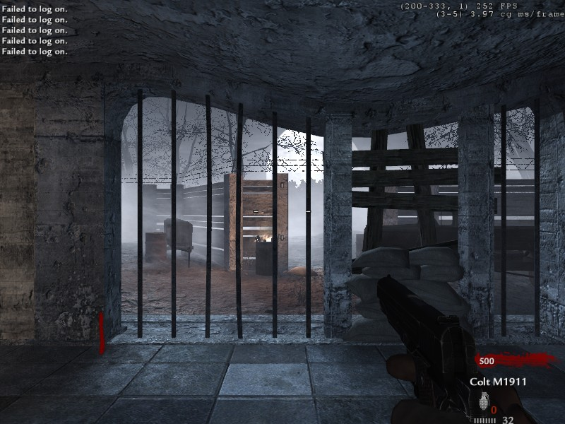
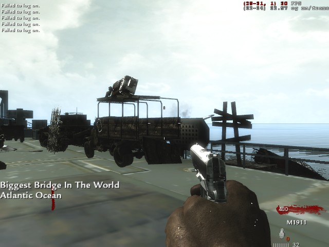

# The ENW Esc menu

> **Status: BUILT on branch `esc-menu`, 2026-09-23 ~00:50–01:40 UK. Not merged, not shipped.**
> **Superseded 2026-09-23 03:30 (handoff): merged to main (`c72190f`), shipped in launcher 0.2.17, the
> box runs `restart_request` since `c0986e5e` (now `6b1ccfc5`), and the site's `POST /api/party/quit`
> exists (`web/server/routes/site.js`, `web.md` "Quit vs crash"). §8's bullets about the missing route
> are history; the rest of §8 is still unproven.**
> Esc in a box game opens ours instead of World at War's. §7 is what was run and what it showed;
> §8 is what is not proven. The chat overlay's own doc (`chat-overlay.md`) is the base this
> stands on: the draw hook, the input gate, the chat pass and the pause contract are all its.

B's ask, in his words: *"Replace the escape menu with our custom menu: a Resume button, a Restart
game button that tells the dedicated server to restart the game, an Exit game button, the chat, and
invites from your friends and friends online with what maps they're on."*

And, added while it was being built: *"When you exit the game through the escape menu it needs to
close the game AND cancel the server, so the launcher doesn't keep booting you back into the game.
If you close by clicking Quit on purpose, it closes. If the game crashes or you Alt+F4, it should
be resumable from the server card in the launcher."* That is §5.


---

## 1. What it is, file by file

| File | Lane | What |
|---|---|---|
| `client-dll/components/pause_menu.cpp` + `.hpp` | client | **All of the menu.** Esc interception, the three buttons, the friends/invites panel, its site calls, the restart request, the exit sequence, the selftest. |
| `client-dll/components/chat_overlay.cpp` | client | **Nine hook lines, each marked `[esc-menu]`**, plus a 25-line `chat_embed` block at the end: the overlay calls `pause_menu::filter()` first and `pause_menu::draw()` first, reports `paused` while the menu is up, and can draw its panel at an anchor the menu chooses. Nothing else of it changed. |
| `server/components/dedicated/restart_request.cpp` | dedi | The server half of Restart: reads `enw_req` from userinfo, forwards to the host, or restarts a solo game itself when there is no host. |
| `infra/host-agent/lib/restart.js` + 6 lines in `host.js` | host | Who may restart, ending the run as abandoned, and the successor run on the same lease. |
| `web/server/routes/gamemenu.js` + 2 lines in `index.js` | web | `/api/game-chat/menu/*`: friends online, invites, Invite / Accept / Decline, behind the chat pass. |
| `web/server/lib/results.js` (+14 lines) | web | A restarted run attaches to its lease; an abandoned-by-restart run does not close the lease. |
| `web/test/game-menu.js`, `infra/host-agent/test/restart.js` | — | 9/0 and 12/0. `game-menu.js --serve <port>` is the private site the in-game runs used. |
| `tools/dev/authhost.mjs --restart` | dev | The dev link host answers `restart_request` like the real one, for the local d2+c1 round trip. |

**Why the menu has no hook of its own.** `input_gate.hpp` allows exactly one filter and README
hard rule 9 allows one detour per address. Both belong to the chat overlay. The menu is called from
inside them, first. The overlay lane was editing `chat_overlay.cpp`/`input_gate` in parallel, so
every line added there is marked `[esc-menu]` and the merge is those lines and nothing else.

## 2. Esc, and the stock menu never appearing

The key is taken in the game window's WndProc, through the gate, **before the engine's WndProc
(0x606BE0) sees the `WM_KEYDOWN`**. So the engine's menu stack never runs: nothing is opened and
closed, and nothing is drawn under ours. The `WM_CHAR 0x1B` that `TranslateMessage` makes from the
same key is eaten too.

It opens only when all of these hold:

* CG drew in the last 500 ms (we are in a map), `clc.state >= 9`;
* `keyCatchers & 0x31 == 0` — no console, no engine menu, no stock "Say:" field;
* the chat is not open on its own (then Esc is the chat's, and closes it);
* **a box game**: `clc.serverAddress.type` (`0x300FFF8`, `t4-sp-map.md`) is not `NA_LOOPBACK`.
  A Play Local game is its own listen server on loopback and keeps World at War's menu, as the brief
  asked. `ENW_ESC_MENU=all` takes ours there too (that is how the capture runs below were done:
  no second process needed); `ENW_ESC_MENU=0` turns it off. `ENW_CHAT_OVERLAY=0` turns it off
  as well, because the overlay carries it.

Esc again, or Resume, closes it. If the map goes away under an open menu (disconnect, a load, the
overlay switching itself off after draw faults), the menu closes itself after 1 s so `enw_ui`
can never be left at `paused`.

## 3. Restart game — the contract

**Client.** Two clicks (the second within 4 s: "Click again to restart"). Then `setu enw_req
restart.<n>` and the menu closes. **Userinfo, not a client command**: the stock game prints
"Unknown cmd" on the player's HUD for one (`chat-overlay.md` §9.5), and userinfo is the channel the
pause contract already proved arrives mid-game. The menu closing sends `enw_ui clear` in the same
frame, so a solo game is running again when the server acts.

**Dedicated DLL** (`restart_request.cpp`). Polls `svs.clients[i].userinfo` (through
`referee::client`) at 10 Hz. **Acts on a change only**: the value a client connects with is a
baseline, so a key left from an earlier game cannot restart anything. One restart per 15 s.

* **Host link up** → `{"t":"restart_request","ms","slot","name","req","players","level_time"}` to
  the host, and nothing else. The DLL cannot know who is verified; the host decides. A map_restart
  the host did not order would carry one run's clock into the next, so the DLL never does one here.
* **No link** (a bare dev server: no referee, no replay, no record) → solo: `map_restart` once
  `sv_paused` is 0 (the pause gate has let go; up to 5 s, else refused). Co-op: refused.
* Either way it logs that the map restarted — the connected clients drop back into the connect
  handshake — or that nothing happened within 15 s. **Not `level.time`: it keeps counting across a
  `map_restart` on this engine** (measured in `escmenu1`: 27650 at the request, 43000 fifteen
  seconds later; the first build watched it and wrongly reported "no restart").

**Host** (`lib/restart.js`).

1. **Who**: the slot's `identity` is `verified`, **or** only one player is connected. Anybody else:
   `restart_refused` goes into the replay and nothing happens.
2. The run is flagged `abandoned` + `player_restart` and the referee's own **`end`** is sent:
   `{"t":"end","reason":"player_restart","match":"<lease>"}`. The DLL's `do_end`
   (`referee.md` §10.3) reports **first** — `game_over` with its player rows, reason
   `player_restart`, then `match_end` — and only then queues `map_restart`, resets (per-match jti
   set, name locks, round 0, recording on) and re-announces `map_loaded`.
3. `game_over` ends this run exactly as any game over does: replay closed and signed with the
   game's final word in it, result posted with `end_reason: "player_restart"`.
4. At `match_end`, synchronously, the socket goes to a **successor run on the same instance and
   the same lease with its own id `<lease>.r<n>`** — a new replay file and a new result row. Its
   summary carries `lease_match_id`, `run_of_lease`, `restart_of`. It must be synchronous: the
   `end` reply, the new `map_loaded` and the players' fresh `player_connect`s are in the same TCP
   read and must not reach a finished run.
5. **The players never left.** Their tokens were spent on the first run (TokenGuard is single-use
   per boot), so each player the abandoned run **verified** is re-admitted **once** on the new run
   after a full signature / lease / steamid check with only the single-use set bypassed. Nobody else
   gains anything.
6. Failures end in a signed run and a torn-down instance: no `match_end` within 10 s → the run is
   finished from the host's own fold and the ordinary disposition runs (a game that said nothing
   is never reused); `end` refused, or no `map_loaded` within 60 s → the instance is retired.

**Site** (`results.js`). A result whose `match_id` is `<lease>.r<n>` and names `lease_match_id` is
attached to that lease's assignment (party, settings) — only when the posting box holds the lease.
A result with `end_reason: "player_restart"` does **not** close the assignment: the lease and the
party's `in-game` state go on under the next run. Without this the first result would free the box
and send the party back to forming under a game that is still being played.

**Records.** The abandoned run keeps whatever it reached — a round-12 run that was restarted
reached round 12 — and it is flagged `abandoned`. The new run starts at round 0 with its own clock,
its own replay and its own id. Nothing is merged, nothing is erased.

**Also changed for it**: `onAssignment` compares `leaseId || matchId`, so the site re-sending the
same lease does not read a restarted run as a stale instance to retire.

## 4. Friends and invites

`GET /api/game-chat/menu/state` when the menu opens and every 10 s while it is open (never while
it is closed), over the chat's own site and pass. It is **the rail's own server code** —
`roster.forViewer` (Online for an approved account, Friends otherwise, decided by the site),
`parties.invitesFor` — behind the chat pass instead of the session. Each row: a coloured pip (red in
a game, gold in a lobby, green online), the name, one line of where (`In game: Der Riese`,
`Lobby: Verruckt (1/4)`, `Online`), and **Invite** / **Accept** / `IN PARTY` / `INVITED`.
Invites to me are listed first with **Accept** and **x** (decline).

* **Invite** = `parties.invite` (the rail's `requireApproved`, applied to the pass's account).
* **Accept** = the rail's Accept: `parties.join` into the inviter's party.
* **What Accept does NOT do: connect you anywhere.** The launcher's party watcher follows a match
  for the party you are in **only when no game is running** (`main.js onPlay`, the `state.flow`
  guard). So the menu says exactly that: *"Accepted mule_kicker's invite. Exit the game and the
  launcher takes you there."*
* **Known gap (site lane):** inviting somebody into a party that is already in a game puts them in
  the party, but their launcher gets no invite token for the running lease (tokens are minted per
  whitelisted SteamID at lease time), so there is nothing for it to follow until the next Start.
  Late join is not this lane's to design.

## 5. Exit game — quit vs crash (the contract, for the site lane)

B: quitting on purpose must **end** the game and stop the launcher booting you back in; a crash or
Alt+F4 must leave the game **resumable** from the server card.

**What the launcher does today** (`launcher/src/main/main.js`, read, not changed): the party watcher
polls `/api/launcher/play` at 1 Hz whenever a site is connected, and when the game process exits
(`flow` ends, `state.flow = null`) the very next poll that still shows a `match` for your party in
`reserving|loading|ready|in-game` calls `startPlay({ follow: true })` — **it boots you straight back
into the same game.** Nothing distinguishes a quit from a crash today. So the distinction has to be
made on the site, before the process exits:

**Client (built):** Exit game (two clicks) →

1. `POST <site>/api/party/quit` with `Authorization: Bearer <chat pass>`, body
   `{"match_id": "<the invite token's m>", "reason": "esc_menu_exit"}`, **2 s cap**;
2. whatever the answer: `disconnect`, then `quit` 400 ms later. The process exits; the launcher
   sees the game end as it always has.

A crash or Alt+F4 sends nothing. **The absence of the call is the signal.**

**Site (NOT built — the site lane owns `parties.js`/`assignments.js`):** `POST /api/party/quit` *(built
the same night, `9d27958`, `lib/seats.js` + `routes/site.js`; `web.md` "Quit vs crash")*

* **auth**: accept the chat pass (`gameChat.verifyPass`), because the game holds nothing else; it
  must be reachable past the beta gate for a Bearer request (like `/api/game-chat`), or live under
  that prefix. Session auth too, for a site button later.
* `match_id` optional; if given and it is not the player's current lease, answer 200 with
  `{ok:true, stale:true}` and change nothing (a quit from an old game must not end a new one).
* **solo** (the player is the only member of the party on that lease): cancel the lease
  (`assignments` → ended, the box told to retire the instance, which ends the run on the host as
  it does for any teardown) and dissolve the party (or return it to `forming`).
* **party**: this player leaves the party (`parties.leave`); the lease and the game go on for the
  others.
* Then `/api/launcher/play` for this player shows no match, so the watcher has nothing to follow.
* Answer fast (the client waits at most 2 s, then quits anyway — and a quit whose call did not land
  is then indistinguishable from a crash, which is the safe direction: resumable, not lost).

The in-game runs below used a **stub** of this route on the private site (`web/test/game-menu.js
--serve`), which only logs the call.

## 6. The pause contract

While the menu is open the overlay reports `enw_ui paused` (menu wins over typing:
`report_ui_state`'s one changed line), exactly what the stock Esc menu reported. So a solo game
freezes (`pause.cpp`, `solo_menu`) and co-op freezes only when every player is in a menu. The menu's
subtitle says *"Co-op: the game pauses when everyone is in the menu"* when the site says your party
has more than one member, as `chat-overlay.md` §8 asks, since the client cannot see the others'
state.

## 7. Evidence

Every run: `nazi_zombie_prototype`, off-screen at -4000,-4000, `ENW_TEST_NO_ACTIVATE=1`,
`ENW_BORDERLESS_COVER=0`, a private site on **3399** (`node web/test/game-menu.js --serve 3399`:
temp DB, invented accounts `menu_tester`, `staminup`, `deadshot`, `juggernog`, `mule_kicker`,
`quickrevive`; `web/data` and 3200 untouched; stopped afterwards). Pictures are the back buffer
(`frame_capture.cpp`) at the instant named, converted to JPG.

| lock held | run | what it showed |
|---|---|---|
| 01:18:00–01:18:58 | `c2`, Play Local, **1280x720 windowed**, `ENW_ESC_MENU=all`, selftest 1 | Esc → `pause_menu: OPEN (Esc) -- the stock pause menu never saw the key` (keyCatchers 0x0: no engine menu), `enw_ui paused`; friends panel 4 online + the invite; Accept → HTTP 200 and "Accepted mule_kicker's invite. Exit the game and the launcher takes you there."; "gl everyone" typed into the embedded chat; Restart's first click → "Click again to restart"; Esc → CLOSED, `enw_ui clear`, the game with no menu over it |
| 01:23:13–01:24:55 | **`jointest escmenu1`**: local dedicated server `host2` + client `c2`, link to `authhost.mjs --restart`, invite token for `m_escmenu1` | **No `ENW_ESC_MENU=all`: the menu opened because the address type was 4 (a real server).** Menu open → server `pause: PAUSED (solo_menu)`, close → `RESUMED ... level.time held`. Restart (two clicks) → client `enw_req restart.1` → server `restart_request: slot 0 ('menu_tester') asked to restart` → host `RESTART REQUEST ... ACCEPTED` → `end {reason:player_restart, match:m_escmenu1}` → `game_over` (reason `player_restart`, the verified row) → `match_end` → `reply ok` → `map_restart` → `map_loaded` → the client re-entered, `player_connect` → re-admitted (`was verified before the restart`) → `identity VERIFIED` → `round 1` again. One defect: the DLL's own "did it restart" check watched `level.time` and said no (§3); fixed |
| 01:25:47–01:26:45 | `c2` borderless 2560x1440 | **harness fault, no picture**: the environment still held the join test's `ENW_CLIENT_CONNECT`, so the client dialled a server that was gone and never reached a map. The capture script now clears those variables |
| 01:28:49–01:29:47 | `c2`, **borderless 2560x1440** (client 2560x1440, placement 3.0) | the same menu at B's size; Invite deadshot → "Invited deadshot", the row turns INVITED; the restart confirm |
| 01:31:51–01:33:33 | **`jointest escmenu2` against the REAL host agent** (`infra/host-agent/host.js --local`, no site, the instance registered as `m_escmenu2`), fixed DLL | `restart_request ACCEPTED from slot 0 (alone, 1 connected): run m_escmenu2 ends as abandoned` → `game over: player_restart` → `match_end` → **`restart: run m_escmenu2 closed; run m_escmenu2.r2 (lease m_escmenu2, run 2) takes the link`** → first replay closed, `SUMMARY ... flags=[paused,abandoned,player_restart,self_reported]` → `map back; run m_escmenu2.r2 is recording` → a second replay file `m_escmenu2.r2.enwr` → the player admitted into run 2. DLL: `the map restarted 688 ms after the request went to the host`. `tools/verify.js m_escmenu2.enwr`: **VALID** (475 events, footer signed). Picture: the player back in the map, round 1, 500 points, 30 s after the start |
| 01:33:37–01:33:52 | `c2` 1280x720, selftest 3 (**Exit game, for real**) | two clicks → `POST /api/party/quit -> 200` (the stub logged `from 76561198000000201 body={"reason":"esc_menu_exit"}`) → `disconnect sent` → `quit` 400 ms later → the process ended on its own 13 s after launch |

Nothing else held the lock for this lane. Every run was started only after 4 s with no `CoDWaW.exe`
and no `game.lock` (another agent was running join tests on `d2`/`c1` all through; one of this
lane's starts lost that race at 01:30:06, was refused by `deploy.ps1` before taking anything, and
was re-queued).

Tests: `web/test/game-menu.js` **9/0**, `infra/host-agent/test/restart.js` **12/0**; unchanged:
web `run-all` 121/0, `game-chat` 19/0, host `run-all` 61/0.

Pictures (`ui/`): `esc-menu-open-1280x720`, `-hover-accept-1280x720`,
`-confirm-restart-accepted-1280x720`, `-resumed-1280x720`, `-confirm-exit-1280x720`,
`-open-2560x1440-borderless`, `-confirm-restart-invited-2560x1440-borderless`, and from the real
server join: `-box-game-accepted-800x600`, `-box-game-confirm-restart-800x600`,
`-box-game-back-in-map-after-restart-800x600`. (The 1280x720 and 2560x1440 pictures are from the
build before the 4:3 layout fix and the restart-detection fix; neither changes a 16:9 frame.)


## 8. Not proven

* **B's own hand.** Esc, move onto Invite and click, type in the chat, Restart twice, Esc; and a
  real Exit game. Every click here was posted into the game's own queue.
* **On the box, through the site.** The restart was proven against a local dedicated server with
  the real host agent in local mode (no site, no key, identity `claimed`) and with the dev link host
  (real token check, identity `verified`, carried across the restart). Not on the Hetzner box, not
  with the site ingesting two results for one lease: `results.js`'s two changes are read, not run.
  A fake-ID lease on the box was not attempted: a real game was live there tonight.
* **Co-op restart** (a second, unverified player refused; two verified players both carried): unit
  tests only.
* ~~**The quit route does not exist on the site yet** (§5).~~ It does since `9d27958` (handoff note). Until it does, Exit game quits after a
  404 and the launcher's watcher will boot the player straight back into a live lease — exactly
  B's complaint — so §5 is the site lane's next job.
* **The restarted run's site-side life**: presence, live frames and the box heartbeat carry the
  run id `<lease>.r<n>`, which nothing on the site has seen before. Read as harmless, not run.
* **Accept into a party already in a game** leaves the invitee with nothing to follow (§4).
* Exclusive fullscreen: not looked at (as for the overlay, `chat-overlay.md` §9.8).
* The second run's replay (`m_escmenu2.r2.enwr`) was not closed: the harness killed the host with
  the game. The first run's is signed and verifies.

---

## 9. 2026-09-23 ~04:00–06:00 — the Settings tab (branch `worktree-agent-ab4af766591d2bb5c`, not merged)

B: *the Esc menu needs a SETTINGS tab that carries every setting the ENW Movement client offers,
plus World at War's own video/audio/control settings, all through our menu, and it must sync
perfectly.*

### 9.1 What it is

A fourth button, **Settings**, under Resume. It swaps the right side of the menu (friends and the
chat panel) for a settings panel drawn with the menu's own engine calls and the stock WaW font
(`stock_font::pick`, chat-overlay.md §12). **The tabs, groups, names and values are the site's
`/settings`**: Display, Graphics, Audio, Controls, Game. Toggles click, lists have `<` `>`, sliders
click/drag, a bind row captures the next key or mouse button (Esc cancels, Delete or right-click
clears; with two keys already both are released, as WaW's Controls menu does). Changes apply at
once; the foot of the panel says what happened, or the hint / reason for the row under the pointer.
Esc goes back to the friends view; Esc again resumes.

| File | What |
|---|---|
| `web/client/src/data/wawSettings.js` | **`INGAME`**: per catalogue item, `apply` (`live`, `vid_restart`, `next_launch`, `site`, `false` = never in game, with why) and `verified` (still shown in a Verified game). The one place policy lives. |
| `tools/settings/gen-ingame-schema.mjs` → `shared/settings/ingame-settings.json` | The catalogue + `settingsLayout.js` + `INGAME`, joined. CMake embeds it into the DLL as bytes. **The DLL has no list of its own.** |
| `client-dll/components/settings_model.hpp` | Pure model: load, forbidden dvars, visibility, the console text a change becomes, sliders/lists/binds. |
| `client-dll/components/settings_tab.cpp` + `.hpp` | The panel, the engine reads/writes, the write-through check, Apply. |
| `client-dll/components/pause_menu.cpp` | The button and the view; lines marked `[settings]`. The menu is not auto-closed while the tab's `vid_restart` runs. Selftests `ENW_ESC_MENU_SELFTEST=5` (drive it) / `=6` (read after relaunch). |
| `mouse_polling.cpp`, `stock_font.cpp`, `frame_capture.cpp` | Survive `vid_restart` (§9.4). |
| `launcher/src/main/wawcfg.js`, `launch.js` | Raw input in the config round trip; the read-back commits its snapshot; a catch-up read-back before each launch's merge (§9.3). |
| `tools/dev/settings-proof.ps1`, `settings-roundtrip.mjs` | The proof harness (§9.5). |

### 9.2 The list, and the dvar behind each row

81 items (every catalogue item that `/settings` places, minus two). Engine reads use the engine's
own `Dvar_ValueToString` (`0x5ECAB0`, ECX = dvar, the 16-byte value by value; the console's dvar
hint calls it for current `+0x10`, latched `+0x20` and reset `+0x30`; byte-checked).

| Tab / group | Rows (dvar) | apply | Verified |
|---|---|---|---|
| Display / screen | display mode (`r_fullscreen` + the DLL's borderless, read-only), monitor (`r_monitor`, read-only), resolution (`r_mode`, read-only when borderless), refresh rate (`r_displayRefresh`), aspect ratio (`r_aspectRatio`) | site / vid_restart | resolution, refresh, aspect hidden |
| Display / picture | field of view (`cg_fov` 65–120), brightness (`r_gamma` 0.5–3), max fps (`com_maxfps` 60/85/125/250), vsync (`r_vsync`), show fps (`cg_drawFPS` Off/Simple) | live; vsync vid_restart | max fps and vsync hidden (records rule: com_maxfps unchanged mid-game) |
| Graphics / quality | anti-aliasing (`r_aaSamples`), shadows (`sm_enable`), specular (`r_specular`), glow (`r_glow_allowed`), depth of field (`r_dof_enable`), dual video cards (`r_multiGpu`) | live; AA, multiGpu vid_restart | all hidden |
| Graphics / world | bullet impacts (`fx_marks`), dynamic foliage, ocean simulation (`r_gfxopt_*`) | live | hidden |
| Graphics / textures | anisotropy (`r_texFilterAnisoMin`), mipmaps (`r_texFilterMipMode`), texture quality (`r_picmip_manual`), texture/normal/specular detail (`r_picmip`, `_bump`, `_spec`) | aniso, mipmaps live; the rest vid_restart | aniso, mipmaps shown |
| Audio / volume | master, music, effects, voice, cinematics (`snd_menu_master`, `snd_menu_music`, `snd_menu_sfx`, `snd_menu_voice`, `snd_cinematicVolumeScale`, 0–1). **Not `snd_volume`: this exe has no such dvar** (client.md §10b) | live | shown |
| Audio / sound | line of sight occlusion (`snd_losOcclusion`) | live | hidden (hearing through walls) |
| Controls / mouse | sensitivity (`sensitivity` 1–30), invert (`ui_mousePitch` + `m_pitch` ±0.022, as the menu's uiScript), smooth mouse (`m_filter`), free look (`cl_freelook`), raw input (`enw_rawmouse`, ENW's own archived dvar) | live; raw input next launch | shown |
| Controls / move, combat, interact, look | the 41 key rows of WaW's Controls menus (`bind KEY "cmd"`), incl. aim down sights hold (`+speed_throw`) | live | shown |
| Game | mature content (`cg_mature`, + `cg_blood 1` on Unrestricted), subtitles (`cg_subtitles`), hud (`hud_enable`), crosshair (`cg_drawCrosshair`) | live | shown |

**Not in game, on purpose:** `monkeytoy` (mod-owned: a map's anti-cheat quits on it,
mod-compat.md §3) and `ai_corpseCount` (an `ai_` dvar: the server runs the AI in a box game).
`settings::forbidden_dvar` also refuses `con_external`, `sv_cheats`, `developer*`, `cg_fovscale`,
`timescale`, `name`, our userinfo keys and every `ai_ g_ sv_ player_ bg_ perk_ scr_` dvar, whatever
a schema says (a forged schema item is dropped at load; unit-tested). A dvar the running map sets
itself (its `.enw-installed.json` `modDvars.owned`, launcher `modcompat.js`) is shown read-only,
"set by this map".

**Verified game** = the invite token is present (`auth::token()`), or `ENW_SETTINGS_RESTRICTED=1`.
*(Superseded by §11.3, lane C1: every row is shown in every game; a Verified game locks only max
fps.)* Only `verified: true` rows are drawn at all (sensitivity, invert, volumes, FOV ≤ 120, brightness,
show fps, crosshair, hud, subtitles, mature, anisotropy/mipmaps, raw input, every bind); nothing that
restarts the renderer, not `com_maxfps`.

**What Movement's settings page has, and why none of it is a row here.** Its list
(`CSGO-Matchmaker/movement-client/src/pages/Settings.jsx`, stored per mode in
`server/lib/playerSettings.js`, applied by the game-server plugin): HUD presets per mode, hide
players, sounds, hints, PB alerts, menu on reload, viewmodel FOV (1–120), weapon armed/hidden, name
colour (VIP), distbug/jump analysis, Steam-bot notifications, profile privacy. Every one is a CS:GO
movement-server plugin feature with no World at War equivalent; the nearest, viewmodel FOV, would be
`cg_fovscale`, which the records rules multiply into the FOV cap, so it is refused. **Movement has
no key binds and no mouse settings.** What was reused from it is the *shape*: settings stored as
key/value per account, changed in game, written back so the site shows the in-game value.
**ADS sensitivity multiplier: does not exist in this exe** (no `ads`/`zoom` sensitivity dvar in the
1.7 image; WaW scales ADS by FOV). It would be code in `mouse_polling`, not a setting; not built.

### 9.3 The sync path (the existing round trip, extended — no new channel)

1. **Apply** = the engine's own console text through `Cbuf_AddText`: `seta <dvar> "<v>"` (plus the
   menu script's companion dvars), `bind KEY "cmd"` / `unbind KEY`. Values are one quoted token; `;`,
   quotes and control characters are stripped (unit-tested).
2. **Write-through, by the engine.** `Com_Frame` (`0x59DCF0`) calls `Com_WriteConfiguration`
   (`0x59D8F0`) at the top of every frame; when `dvar_modifiedFlags` (`0x21ACF30`) has the archive bit
   it rewrites `players\profiles\<profile>\config.cfg` (the profile string at `[0x1F55284]`, the one
   `players\active.txt` names) under the redirected LocalAppData — our private profile, never B's
   `Activision\CoDWaW`. `seta` archives. A bind changes no dvar, so the tab raises the archive bit
   two frames after the bind has executed. The tab re-reads the file after every change and logs
   `WRITE-THROUGH: ... N ms after the change`. So a change is on disk within a frame or two: nothing
   is lost to a crash, to Exit game, or to a game over (none of them needs a save step).
3. **The launcher** reads the file after the game exits — crash, kill or quit — with the existing
   `readBackAccount` (client.md §8) and saves the difference to the account, which `/settings`
   shows. Extended: **raw input** travels as `seta enw_rawmouse` (the account block writes it, the
   read-back returns `rawMouse`); the read-back **commits** its snapshot, so the same file is never
   claimed twice; and **before each launch's merge** a catch-up read-back runs, so a change the game
   saved while the launcher was closed or dead is kept and saved, not overwritten by the older
   account value.

### 9.4 vid_restart

Rows marked vid_restart are set as WaW's Graphics menu sets them (the engine latches them; the row
shows the latched value with a gold `*`), and an **Apply (restart video)** button appears. It runs
`vid_restart`, as WaW's Apply does. The engine refuses it under a listen server
(`CL_Vid_Restart_f` `0x6420F0`, "Listen server cannot video restart.", sv_running `[0x1F552DC]`), so
in Play Local those rows say "applies next launch" and there is no Apply. A restart destroys the
window and the D3D device, which broke three things that are fixed here:

* **the input gate** — mouse_polling installed its subclass (and raw input, `hwndTarget`) once, on
  the first window; after a restart the chat overlay and the Esc menu would have had no input at
  all. It now re-installs on the new window.
* **the stock font** — its atlas texture belonged to the old device, and its glyph pointers to
  zones the restart reloads. It now forgets everything when the device or window changes (and from
  the moment Apply is pressed) and finds the font again; the engine's fonts are used in between.
* **frame_capture** cached the device for the swap chain's Present; it now asks the swap chain.

The menu is **not** closed during the restart (pause_menu's 1 s no-draw rule waits for it), so the
game stays paused and the menu, on the Settings tab, is back with the picture.

### 9.5 Proof

(filled in from the run below)

### 9.6 Not proven

(filled in below)

> **§9.5 note from lane 12 (2026-09-23 12:25):** the Settings tab's **FOV row could not change FOV
> in a box game** — measured, not inferred: `seta cg_fov "100"` answered *"cg_fov is cheat
> protected."* in the client console (`l12a.client.console.log`), because cg_fov carries DVAR_CHEAT
> (flags `0x81`) and a server's `sv_cheats` is 0. Fixed for the tab and the console alike in §10.2.

---

## 10. 2026-09-23 ~11:55–12:30 — lockdown: no stock main menu, no stock console, the ENW console, "Your record has been uploaded" (lane 12, branch `worktree-agent-a3c4fdfc2d163a895`)

B (04:00): *players must never reach World at War's stock main menu or the stock console; our own
restricted console (sensitivity, FOV, harmless dvars only); a chat line "your record has been
uploaded"*; plus lane 8's hand-over: the in-game chat window starts empty until the DLL asks the
feed with `history=1` (that one is `chat-overlay.md` §14).

| File | What |
|---|---|
| `client-dll/components/menu_lockdown.cpp` + `.hpp`, `menu_lockdown_model.hpp` | §10.1. The end screen over the main menu, the silent-server rule, the quit |
| `client-dll/components/restricted_console.cpp` + `.hpp`, `console_model.hpp` | §10.2. The two locks on the stock console, the ENW console, the cg_fov unlock + cap |
| `settings_tab.cpp/.hpp` (`[console]`) | `console_get/set/reset/list/names`: the console writes only through the tab's own `apply_value` |
| `pause_menu.cpp` (`[console]`, 8 lines) | calls the lockdown's input swallow and the console first in its filter and draw, and hands the console its drawing calls |
| `join_retry.cpp` (`[lockdown]`) | binds its SCR_DrawScreenField seam in **every** client process now (was: launcher joins only) and calls `menu_lockdown::draw_over()` last |
| `net_probe_client.cpp` (`[lockdown]`) | exports the time of the last in-band datagram |
| `notice_board.hpp`, `chat_overlay.cpp` (`[notice]`/`[history]`, ~12 lines) | §10.3 and `chat-overlay.md` §14 |
| `web/server/lib/gameChat.js` (`notify`, channel `notice`), `lib/results.js` (`noticeSeated`) | §10.3, the site half |
| `tools/tests/lockdown_test.cpp` (**73/0**), `web/test/record-notice.js` (**7/0**, in `npm run check`) | tests |
| `tools/dev/lockdown-proof.ps1`, `authhost.mjs --result`, `web/test/game-menu.js` `/dev/result` | the local proof harness |

### 10.1 The main menu is never shown

The boot already skips it (`client.md` §10). This is the other end of a session. When a game that
had connected (clc.state ≥ 4 seen) falls back to clc.state 2/0 — the menu — **our cover is drawn
from its first frame**: a full-screen black pic after `SCR_DrawScreenField` (the call that draws the
main menu, the console and the connect screen; `join_retry.cpp` owns that call site and calls
`draw_over()` last, so the cover is on top of everything the engine drew). After 1.5 s at the menu
(a map change passes through the same state for a frame or two and must not end a game) it says why
(`com_errorMessage` made readable: *"The server closed the game."*, *"Lost the connection to the
server."*, *"The game has ended."*, …), repeats the site's newest notice (§10.3), counts *"Back to the
launcher in 4"* down and sends `quit`. The launcher is our menu; its follow gate does not boot the
player back in, and a live game stays resumable from the server card (§5). While the screen is up
the menu under it gets no keys and no clicks (`swallow_input`, first in `pause_menu::filter`).
Covers every way to the menu: a kick or error drop, the Esc menu's Exit, Play Local's stock pause
menu *Quit*, a join that never got in.

**The silent server — measured, and the reason there are two triggers.** `l12b`: the server killed
after a game over (what the box does when it retires an instance: no disconnect is sent) left the
client **at clc.state 10 on the black game-over scoreboard for 60 s with `cl_timeout 10`** — this
engine never timed it out. So a map with no in-band datagram from the server for **20 s**
(`net_probe_client`'s recvfrom tap) is a session that has ended too: *"Lost the connection to the
server."*, same countdown, quit. The pause contract keeps snapshots flowing while frozen, and a map
change leaves state 10, so neither trips it.

Armed only where the ENW launcher (or the harness) started the game: `ENW_LOCALAPPDATA` set.
Switches: `ENW_MAIN_MENU=1` (stock behaviour), `ENW_LOCKDOWN_SILENCE_S` (0 = off), `ENW_LOCKDOWN_SHOW_MS`.

### 10.2 The stock console never opens; the ENW console does

**Two locks.** (1) The console key is the key under Esc **by scan code 0x29**, whatever the layout
(on B's UK keyboard it is `` ` ``/¬, not VK_OEM_3): its WM_KEYDOWN/KEYUP/CHAR are consumed first in
`pause_menu::filter`, before the engine's WndProc. (2) Any other way in (Backspace+Home, a
`toggleconsole` bind in a hand-edited config, an engine error) ends in keyCatchers bit 0x1 —
`Con_ToggleConsole` is `keyCatchers ^= 1` and the console is drawn only while it is set (IW3,
KisakCOD `cl_console.cpp`) — so a frame subscriber clears bit 0x1 the frame it is set, and logs it.
`ENW_STOCK_CONSOLE=1` turns both off (developers only). Note: SP's own `monkeytoy 1` also keeps the
stock console shut; the locks matter for every player whose config says `monkeytoy 0`.

**The ENW console** takes the same key, in a map, when no menu or chat is open: one input line, the
last lines of output, WaW's stock font. A line is a setting of the in-game catalogue — the Settings
tab's list, by dvar or catalogue id (`sensitivity 4`, `cg_fov 90`, `fov`, `set`/`seta`,
`list [prefix]`, `reset <x>`, `help`, `clear`, Tab completion, Up/Down history, Ctrl+V). A set runs
`settings_tab::console_set`: the same visibility (Verified game → only `verified` items; mod-owned →
read-only; `settings::forbidden_dvar` → *"sv_cheats is locked."*), the value checked against the
catalogue (slider range, list values, toggles take on/off), then the tab's own `seta` +
write-through. `;`, a second value, and anything that is not a setting are refused; **nothing typed
is ever handed to the engine as a command** (`quit`, `exec`, `bind`, `connect`, `map` … all *"not
available here"*). Binds and video stay in Esc > Settings. *(Superseded by §11, lane C1: `quit`,
`disconnect`, `restart`, `bind`, `unbind`, `apply` are console commands now, each on our own path,
and every setting has a short name.)*

**cg_fov was cheat-protected — found by the first run.** `l12a`: `seta cg_fov "100"` → *"cg_fov is
cheat protected."* (flags `0x81`: archive + DVAR_CHEAT; IW3's `Dvar_SetVariant` refuses an external
set of a cheat dvar while sv_cheats is 0). So neither this console nor the Settings tab's FOV row
could change FOV in a box game. Fixed: `restricted_console.cpp` clears **cg_fov's** 0x80 (never
cg_fovScale's) from its frame tick (again if the engine re-registers it), and because a
hand-edited bind could now set it too, **anything above 120 is set back to 120** (the records cap,
`verified-rules.md` §2.2; T4M and Plutonium unlock cg_fov the same way). A mid-game FOV is still
not reported to the host (`verified-rules.md` §8.5).

### 10.3 "Your record has been uploaded."

How the pieces learn it (`referee.md` §16, `host.md` §14): the dedicated DLL sends `game_over`, the
host finishes the run and POSTs the result to `/api/gs/result`, and the site's `results.ingest`
stores it — the POST's answer *is* the host's confirmation. The client DLL never hears the host
link, and the host's `say` into a game is not delivered to clients (`chat.cpp`'s injection is off,
`chat-overlay.md` §5). So the line goes the one way the game already listens: **the site, at ingest,
puts a private `notice` line in `chat_private` for each seated (verified) player of a box result**
(`gameChat.notify`; first arrival only — a retry is a repeat). Record-eligible Verified game:
*"Your record has been uploaded."*; anything else (Custom, late join, refused Verified run): *"Your
game has been saved. Not record-eligible."* The overlay's long-poll carries it (`kind: system`,
drawn yellow on the HUD and in the Global tab) and posts it to `notice_board`, so the end screen
repeats it if the server goes away before the player reads it. Local runs (not the box path) say
nothing in game; the launcher's own toast covers them.

### 10.4 Proof — local dedicated server + client, invisible, private LocalAppData, under the lock

Harness: `tools\dev\lockdown-proof.ps1` = `jointest.ps1` (`d2` server + `c1` client, off-screen,
`ENW_TEST_NO_ACTIVATE=1`, `ENW_BORDERLESS_COVER=0`, private LocalAppData) with an invite token for
the fake id `76561198000000201` (`authhost.mjs mint`), the link to `authhost.mjs serve --result`, and
the chat pass of a private site (`node web/test/game-menu.js --serve 3399`: temp DB; `web/data` and
3200 untouched). **What is simulated:** `authhost --result` builds the host's summary from the game's
own `game_over` rows and POSTs it to the private site's `/dev/result`, which runs the real
`results.ingest(..., {requireVerifiedIdentity:true})` — the host agent's `finish()` and the box auth
of `/api/gs/result` are not exercised. Everything else is the real DLL, engine, site code and feed.
Logs `ZombiesDev\logs\dedi\l12{a,b,c}.*`. DLL for l12c `89caa50c` (build `lane12`).

| run (lock held) | what it showed |
|---|---|
| `l12a` 12:08:34–12:11:57 | first poll `3 backlog line(s) (history=1) into the window, none on the HUD`; console OPEN on the key under Esc (*"World at War's console never saw the key"*); `sv_cheats 1` / `developer 1` → *locked*; `fov 130` → *takes 65 to 120*; `quit` → *not available here*; `cg_fov 90; sv_cheats 1` → *One setting at a time.*; `com_maxfps 125` → *locked in a Verified game*; **`cg_fov 100` → "cg_fov is cheat protected." (the finding above)**; the idle player dies, `game_over` → `RESULT ... HTTP 200 {"ok":true,"notified":1} (37 ms after game_over)` → client `system line: Your record has been uploaded.` over the long-poll; a timed `disconnect` at +175 s → `clc.state 10 -> 2` → covered from the first frame → *"The game has ended."* → `quit` 5.5 s after the fall, **295 covered frames, the client process ended on its own**. Two harness faults, both fixed: the selftest posted a WM_CHAR as well as the key (a stray `'` typed into the first line, so `sensitivity 7` failed), and with SP's own `monkeytoy 1` the engine-direct console key opened nothing, so the catcher was not exercised |
| `l12b` 12:17:41–12:21:15 | cg_fov unlocked (`flags 0x81 ... DVAR_CHEAT cleared`) → `sensitivity 7` and `cg_fov 100` both set, `engine: cg_fov is '100'`, **WRITE-THROUGH 203 ms** each; with `+set monkeytoy 0` the console key sent **straight to the engine's WndProc** opened the stock console and **`World at War's console was opened (keyCatchers 0x1) -- closed it the same frame`**; `set cg_fov 150` into the command buffer → `cg_fov was 150.0, above the records cap of 120 -- set back to 120`. The record line again. Server ended at +140 s (our PID) → **the client sat at clc.state 10 for 60 s and never timed out** → the silent-server rule |
| `l12c` 12:23:01–12:25:49 | everything in l12b again, plus: the HUD line on the game-over scoreboard (`ui/lockdown-record-uploaded-hud-800x600.jpg`); server ended at +130 s → `the server has sent nothing for 20000 ms while in the map` → end screen *"Lost the connection to the server." / "Your record has been uploaded." / "Back to the launcher in 3"* → `quit` → **the client ended on its own; jointest found both gone and released the lock** |


Also in `ui/`: `lockdown-end-screen-ended-800x600.jpg` (l12a), `lockdown-cover-800x600.jpg`.
In l12a the HUD capture 1.2 s after the line arrived did not show it; the overlay now starts a
line's HUD clock when the HUD can draw it (`chat-overlay.md` §14) and l12c shows it.

Tests: `lockdown_test` **73/0**, `settings_model_test` 55/0 unchanged, web `npm run check` all
twelve suites 0 failed (`record-notice` 7/0 new).

### 10.5 Not proven

* **On the box, through the real host agent and site.** The result POST was a dev stand-in (§10.4).
  The first real Verified game after this ships is the proof: the player's log should show
  `system line: Your record has been uploaded.` and, when the instance is retired, the end screen.
* **B's hand and B's keyboard**: the console key on a real UK keyboard (scan code 0x29 is the
  design; only posted messages were used), typing, paste; 2560x1440 borderless.
* **A real kick / Com_Error drop** (its `com_errorMessage` on the screen): only the empty-message
  paths (`disconnect`, silence) were run; `describe()` is unit-tested on the known keys.
* **Play Local's stock pause-menu Quit** → cover → quit: the same code path (clc.state 2 after a
  session) but not run.
* **The Esc menu's Exit** now meets the lockdown on its way out (disconnect → quit 400 ms later,
  before the 1.5 s debounce): read, not run.
* **Exclusive fullscreen**: not looked at.
* A server that is alive but silent for 20 s in a map (a stall that would recover) is now ended by
  us; no such stall has been seen, but it is a behaviour change.

---

## 11. 2026-09-23 ~13:25–14:30 — the console grows up, settings everywhere, no more paused starts (lane C1, branch `worktree-agent-afa2e08ce5b4d56e3`, not shipped)

B, 13:20, after playing 0.2.24: *`/quit` must work in our console, with or without the slash;
cut the verbose text; many more commands with aliases (`aniso 16`, `fov 90`, `shadows off` ...);
Tab completion and history; every setting changeable in the launcher must be changeable in the
Esc menu and the console in EVERY game, Verified included (he could not change shadows /
specular / glow / depth of field in a Verified game); and a game starts PAUSED under a blur until
he presses Esc.*

| File | What changed |
|---|---|
| `client-dll/components/console_model.hpp` | Rewritten: built-in commands with aliases, a short name + aliases for every catalogue setting, multi-word / quoted values, toggles take on/off/1/0/true/false/yes/no/enable/disable, list labels and values (`aa 4`, `aa 4x`, `aa off`, `refresh 144`, `aspect 16:9`), key names, Controls actions by alias / command / label, Tab completion of a whole line by position |
| `client-dll/components/restricted_console.cpp` | The new verbs; terse replies; Tab = `complete_line` (keeps a leading `/`, completes at the caret); `restart` asks twice; `quit` / `disconnect` close the console and take the Esc menu's path; the selftest now ends with aliases, a bind, a filter and (=2) a real `/quit` |
| `client-dll/components/settings_tab.cpp` + `.hpp` | `console_help/list/binds/bind/unbind/apply/schema`; binds read lazily when the tab was never shown; a console `apply` finishes its vid_restart from the frame tick; Apply allowed in Verified games |
| `client-dll/components/settings_model.hpp` | `visibility()`: Verified locks (read-only), never hides; `command_of`, `unbind_commands` |
| `client-dll/components/menu_lockdown_model.hpp` | `lockdown::start_menu` (§11.4) |
| `client-dll/components/pause_menu.cpp` + `.hpp`, `chat_overlay.cpp` (1 line) | the start-menu tick and its close; `map_start_menu()`; `request_exit(then_quit)`, `request_restart_game()` for the console |
| `web/client/src/data/wawSettings.js` → `shared/settings/ingame-settings.json` | INGAME: everything `verified: true` except `maxFps`; the two Discord switches in game (`enw_discord`, `enw_discordhook`, next launch). 83 items, 14 groups, **6 tabs** (ENW is new), 2 excluded (`ai_corpseCount`, `monkeytoy`) |
| `launcher/src/main/wawcfg.js` | the Discord switches ride config.cfg like `enw_rawmouse`: written at launch, read back after the game |
| `tools/dev/lockdown-proof.ps1` | `-ConsoleSelftest 2` |

### 11.1 The console: commands

A leading `/` or `\` is always dropped, so `/quit`, `\quit` and `quit` are the same line. `;` is
refused (one command at a time). Quotes are optional: `fov "90"`, `aspect "wide 16:9"` and
`aspect wide 16:9` all work.

| Command | Aliases | Does |
|---|---|---|
| `help [name]` | `?`, `commands`, `cmdlist` | four lines of usage; `help fov` = range, value, apply mode, other names |
| `list [filter]` | `ls`, `settings`, `cvarlist`, `dvarlist` | `fov 90` per setting; filter by short name, alias, dvar prefix or label words |
| `binds [filter]` | `bindlist`, `keys` | `use F, MOUSE4` per Controls action |
| `bind <key> [action]` | — | the tab's own bind path (WaW's two-key rule); no action = show the key |
| `unbind <key>` | `clearbind` | `unbind KEY` (key from the model's list only) |
| `reset <setting>` | `default` | back to the catalogue / ENW default; `<setting> default` does the same |
| `apply` | `vid_restart` | Esc > Settings > Apply: `vid_restart` for pending video changes (box games; Play Local says next launch) |
| `restart` | `map_restart`, `fast_restart` | the Esc menu's Restart game (`setu enw_req restart.<n>`), typed twice within 5 s; box games only |
| `disconnect` | `dc`, `leave` | the Esc menu's Exit (the site is told it is a quit on purpose), then `disconnect`; the lockdown's end screen quits |
| `quit` | `exit` | the Esc menu's Exit: site quit call, `disconnect`, `quit` |
| `clear` | `cls` | clears the output |
| `<setting> [value]`, `set/seta/sets <setting> <value>` | — | read or set a setting |

### 11.2 The console: settings by short name

Every console setting has a short name (unit-tested over the whole catalogue), then its aliases,
its dvar and its catalogue id; no name is taken twice (unit-tested).

| Short name | Also | dvar |
|---|---|---|
| `fov` | `fieldofview` | `cg_fov` |
| `sens` | `sensitivity`, `mousesens`, `m_sens` | `sensitivity` |
| `fps` | `maxfps`, `fpscap` | `com_maxfps` (locked in a Verified game) |
| `showfps` | `drawfps`, `fpscounter` | `cg_drawFPS` |
| `vsync` | `sync` | `r_vsync` (apply) |
| `brightness` | `gamma` | `r_gamma` |
| `resolution` | `res`, `vid_mode` | `r_mode` (apply) |
| `refresh` | `hz`, `refreshrate` | `r_displayRefresh` (apply) |
| `aspect` | `aspectratio` | `r_aspectRatio` (apply) |
| `displaymode`, `monitor` | `window` / — | read only: the launcher's |
| `aa` | `antialiasing`, `msaa` | `r_aaSamples` (apply) |
| `shadows` | `shadow` | `sm_enable` |
| `specular` | `spec` | `r_specular` |
| `glow` | `bloom`, `r_glow` | `r_glow_allowed` |
| `dof` | `depthoffield` | `r_dof_enable` |
| `multigpu` | `sli`, `dualgpu` | `r_multiGpu` (apply) |
| `impacts` | `marks`, `bulletimpacts` | `fx_marks` |
| `foliage` / `ocean` | — / `water` | `r_gfxopt_dynamic_foliage` / `r_gfxopt_water_simulation` |
| `aniso` | `anisotropic`, `anisotropy`, `af` | `r_texFilterAnisoMin` |
| `mipmaps` | `mip`, `mipmap` | `r_texFilterMipMode` |
| `texquality`, `texdetail`, `normaldetail`, `specdetail` | `texturequality`; `texture(s)`, `texturedetail`; `bumpdetail`, `normalmaps`; `speculardetail` | `r_picmip_manual`, `r_picmip`, `r_picmip_bump`, `r_picmip_spec` (apply) |
| `volume` | `vol`, `master`, `mastervolume` | `snd_menu_master` |
| `music` / `sfx` / `voice` / `cinematics` | `musicvolume` / `effects`, `sfxvolume` / `voicevolume`, `dialogue` / `cinematicvolume` | `snd_menu_music` / `_sfx` / `_voice` / `snd_cinematicVolumeScale` |
| `occlusion` | — | `snd_losOcclusion` |
| `invert` | `invertmouse`, `mouseinvert` | `ui_mousePitch` (+ `m_pitch`) |
| `smoothmouse` | `mousesmoothing`, `smoothing` | `m_filter` |
| `freelook` | — | `cl_freelook` |
| `rawinput` | `raw`, `rawmouse`, `m_rawinput` | `enw_rawmouse` (next launch) |
| `mature`, `subtitles`, `hud`, `crosshair` | `gore`, `blood`; `subs`; —; — | `cg_mature` (+ `cg_blood`), `cg_subtitles`, `hud_enable`, `cg_drawCrosshair` |
| `discord` | `richpresence`, `presence` | `enw_discord` (next launch) |
| `discordoverlay` | `overlay` | `enw_discordhook`: auto / on / off (next launch) |

Controls actions for `bind`: the command with or without its `+` (`+activate`, `activate`), the
/settings label (`reload weapon`), or `use fire shoot ads aim jump grenade special switch
nextweapon crouch back left right scoreboard inventory equipment satchel`. Keys: `A`–`Z`, `0`–`9`,
`F1`–`F12`, `KP_0`–`KP_9`, `SPACE SHIFT CTRL ALT TAB ENTER BACKSPACE`, the arrows (`up` works),
`INS DEL HOME END PGUP PGDN PAUSE CAPSLOCK SEMICOLON - = [ ] ' , . / \`, `MOUSE1`–`MOUSE5`
(`m4` works), `MWHEELUP MWHEELDOWN`. Never Esc or the console key.

**Replies** are one short line: `fov 90`, `shadows off`, `aa 4x -- apply`, `rawinput off -- next
launch`, `fov: 65-120`, `fps: locked in a Verified game`, `sv_cheats: locked`, `foo: unknown --
help`. The opening line is `ENW console  --  help`.

**Tab** completes the word at the caret by position: the first word over commands, aliases,
short names and dvars; after `bind`/`unbind` a key name; after `bind <key>` an action; after
`help` a command or setting; after `reset`/`set` a setting; after a toggle `on`/`off`; after a list
its one-word labels/values (`aa` → `off 2x 4x`). More than one match: the common prefix, and the
matches (at most 16) printed on one line. **Up/Down** walks the last 50 lines (unchanged).

**Still true:** nothing typed is handed to the engine as text. The engine lines the console can
cause are `seta <catalogue dvar> "<validated value>"` (+ the menu's companion dvars), `bind <key
from the list> "<catalogue action>"`, `unbind <key from the list>`, `vid_restart`, `setu enw_req
restart.<n>`, `disconnect`, `quit`. `forbidden_dvar` (sv_cheats, developer, cg_fovscale, ai_ / g_ /
sv_ / player_ / bg_ / perk_ / scr_ ...) and the FOV cap of 120 (§10.2) are unchanged.

### 11.3 Every setting in every game

`settings::visibility()` no longer hides anything in a Verified game. The catalogue's `verified`
flag now means "changeable in a Verified game"; `false` = shown but **locked** (read-only, "locked
in a Verified game"). Exactly one item is `false`: **max fps** (`com_maxfps`), the records rule of
`verified-rules.md` §4 (a mid-game change refuses the record; `fps_guard` still holds 20–250). FOV
stays ≤ 120 (the slider's max and the DLL's cap). vid_restart settings apply in a Verified game
through the same Apply button / `apply` command. So shadows, specular, glow, depth of field, AA,
texture detail, occlusion, aspect, resolution, refresh, vsync and dual video cards are all
changeable in B's Verified games now (next-session step 3a needs this). The launcher test's old
"nothing in Verified restarts the renderer" assertion is replaced by "only max fps is locked".

The Discord switches (the launcher's rich presence, the DLL's Discord-hook gate) were `apply:
false`. They are now `next_launch` items on a sixth in-game tab, **ENW**, carried like raw input:
the launcher writes `seta enw_discord` / `seta enw_discordhook` into config.cfg at launch, the game
writes a change through, and `readBackAccount` returns `discordPresence` / `discordOverlay`
(launcher `waw-settings` 20/0). **Needs a launcher release** for the read-back half; until then an
in-game change is written to config.cfg but not saved to the account.

### 11.4 The game that started paused — root cause and fix

**Evidence (B's own logs, read only).** `enw-29660.log` (13:20), `enw-23396.log` (13:15),
`enw-5840.log` (12:49), `enw-23916.log` (03:42), all fear_mc_2 on the box:

```
13:20:42.776 boot: FIRST IN-GAME FRAME ...
13:20:44.794 chat_overlay: userinfo enw_ui paused (clc.state 10, keyCatchers 0x10)
13:20:45.639 esc: Esc pressed (before the engine sees it): keyCatchers 0x10 ... enw_ui 'paused'
13:20:45.641 chat_overlay: userinfo enw_ui clear (clc.state 10, keyCatchers 0x0)
```

`paused` is sent **exactly 2.0 s after the first in-game frame in every run** (42.776 → 44.794,
01.797 → 03.814, 09.808 → 11.808, 04.588 → 06.595) with `keyCatchers 0x10` (an engine menu), and
nothing of ours acts at that moment. 2.0 s is the chat overlay's own rule (`esc_menu_open()`): *any
KEYCATCH_UI menu in a map that has drawn for 2 s is the player's Esc menu*. But the menu is **the
map's**: it holds 0x10 from the load (`mouse_polling: ... the menu/console owns the mouse now` at
the first in-map frame of `enw-5840`), and closing it runs the map's anti-cheat onClose (`mc_ac 1`,
`cl_paused 0`, `exec dvar_locker.cfg` in `console-29660.log` at 13:20:45.640). So the overlay told
the dedicated server the player was in a menu, the server paused the game (`solo_menu`, and
`pause_hold` froze the picture), and the player sat under the map's blurred menu until his Esc
closed it and `enw_ui clear` resumed the game. The lockdown (§10.1) is not involved: it logged only
the clc.state climb, and its cover draws only after a session falls to state 0/2. (A 02:24 run on
an older DLL, `enw-39816`, shows no paused start; the map's menu was not up 2 s in there.)

**Fix** (`lockdown::start_menu`, fed by `pause_menu`'s frame tick):

* a 0x10 menu that is up within **1.5 s** of the map's first frame (clc.state 10) is the map's
  start menu. It **never counts as a pause**: `esc_menu_open()` now also requires
  `!pause_menu::map_start_menu()`;
* in a **box game** it is **closed for the player 1.5 s in**, with Esc sent straight to the engine's
  WndProc (the player's own key, so the menu's onClose runs as it did for B), re-checked the same
  frame, at most 3 tries 1 s apart. Play Local keeps the stock behaviour (the menu stays; it still
  never pauses). `ENW_MAP_START_MENU=keep` leaves it up in a box game too;
* a menu that opens later (the player's, or a map's mid-game menu) is judged exactly as before;
  leaving the map (a restart, a map change) resets it.

Unit tests (`lockdown_test`, "start menu"): B's timeline never pauses and is closed once at
+1.5 s; a menu that ignores Esc gets 3 tries then is left alone; a load-screen 0x10 that clears,
then a map menu at +350 ms, is still the map's; a clean start plus the player's own menu at +5 s
counts as a pause and is never closed; a map restart is judged afresh.

### 11.5 Tests

`lockdown_test` **196/0** (was 73: the alias table, B's 35 example lines, 6 range refusals, keys,
actions, unbind, 17 completion cases, the start menu); `settings_model_test` **65/0** (was 55;
counts: 6 tabs, 83 items, 2 excluded, exactly one item locked in Verified, every item shown in
Verified); `mouse_tests` all passed; `client-dll/tests` `overlay_console_test` 60/0,
`session_record_test` 44/0; web `npm test` every suite 0 failed (147, 41, 15, 19, 12 ×4, 23, 15, 8,
record-notice 7, telemetry 36); launcher `test/run-all.js` **166/0**, `waw-settings` **20/0**,
`modcompat` 6/0, `discord-presence` 22/0, `telemetry` 20/0. All after merging main `4563336`.
DLL (lane build `build\lane-c1`, not shipped, not for the box): `enw_t4.dll` sha256
`ff1b0558972be8e082ada05edb2652e16e5fd1b75914ae4f30182d28bdde507a`, 2 495 488 bytes.

### 11.6 Local proof recipe (for the coordinator, when `game.lock` is free and B is not playing)

Nothing here was run: B was playing and this lane took no lock. From a clean checkout of the merge
(README rule 17), `tools\dev\build.ps1 -Name c1`, then:

1. **Start-paused, the real case**: `tools\dev\jointest.ps1 -Tag c1a -ServerFrom dedi -ClientFrom c1
   -Map nazi_zombie_fear_mc_2 -WatchSeconds 60` (fear_mc_2 must be in the dev copies' mods).
   Client log: `pause_menu: the map started under an engine menu (keyCatchers 0x10, N ms into the
   map)` then `pause_menu: CLOSING the map's start menu (try 1 ...)` ~1.5 s after `FIRST IN-GAME
   FRAME`. (No `esc:` lines for this Esc: it bypasses the filter. Capture a frame at +3 s with
   `ENW_FRAME_CAPTURE_AT`.) **Pass = no `chat_overlay: userinfo enw_ui paused` in the first 10 s
   and no `PAUSED (solo_menu)` in the server log.** A/B: the same with
   `$env:ENW_MAP_START_MENU='keep'` — the menu stays up, still no `paused`.
2. **Stock map, nothing changes**: the same with the default map (`nazi_zombie_prototype`): no
   close, no pause.
3. **The console, Verified**: `tools\dev\lockdown-proof.ps1 ... -From c1 -ConsoleSelftest 2`
   (§10.4's arguments; the invite token makes it a Verified game). Client log, in order:
   `'shadows off' -> shadows off` (editable in Verified now), `'com_maxfps 125' -> fps: locked in a
   Verified game`, `'fov 130' -> fov: 65-120`, `'sv_cheats 1' -> sv_cheats: locked`,
   `'aa 4' -> aa 4x -- apply`, `'bind mouse4 use' -> use ..., MOUSE4`, `'list sh' -> N row(s)`,
   `WRITE-THROUGH` lines for `sm_enable` and the bind, then `'/quit' -> quitting` →
   `pause_menu: EXIT game` → `POST /api/party/quit -> 200` → `disconnect sent` → `quit`, and **the
   client process ends on its own**. Capture `console-c1` shows the terse output.
4. **Apply in Verified**: Esc > Settings, change AA, press Apply: `settings: APPLY: vid_restart`
   and `vid_restart DONE` with the menu back (§9.4's path; only the Verified gate was removed).

### 11.7 Not proven

* ~~**Everything in game.** No game was launched for this lane (B was playing). The console, the
  aliases, Tab, the Verified settings, Apply in a Verified game and the start-menu close are unit
  tested and compiled into the DLL, not run. §11.6 is the recipe.~~ **→ Run by lane P1,
  2026-09-23 14:02–14:17, on the shipped 0.2.25 DLL `974c2e8d`** (`next-session.md` "Local proofs
  2026-09-23 afternoon"; logs `ZombiesDev\logs\dedi\p1c1{a,b,d,q}.*`):
  * step 1 (fear_mc_2) **passed on the criterion.** The map's 0x10 at the first frame is logged as
    `the map's, not a pause -- enw_ui stays clear; closing it at 1.5 s`, with 0 `enw_ui paused`
    and 0 `PAUSED (solo_menu)`. **The close was not exercised:** in every harness run (with or
    without `keep`, on fear_mc_2 and on Nacht) the 0x10 was gone by +1 s on its own, so no
    `CLOSING the map's start menu` line appeared. The close is still unproven. B's next box game on
    fear_mc_2 answers it;
  * step 2 (Nacht) **passed**: no close, no pause;
  * step 3 (`-ConsoleSelftest 2`) **passed**: every expected reply, WRITE-THROUGH for sm_enable
    and the bind, then `'/quit' -> quitting` → `EXIT game` → `POST /api/party/quit -> 200` →
    `disconnect sent` → `quit`, and the client ended on its own. Side finding: the local Nacht
    dedi then parked in the `snddriverglobals` Sys_Error (`dedi.md` §11.4 class) after the last
    player's quit;
  * step 4 (Apply in Verified through the Esc menu) was **not run**.
* **That the closed start menu is only decoration on every map.** fear_mc_2's is closed with the
  same Esc B used, and the game played on after it in his logs; a map whose start menu the player
  must answer (a character pick) would now be dismissed for him. `ENW_MAP_START_MENU=keep` is the
  escape hatch; no such map is known.
* **The Discord switches' round trip** needs a launcher release; `enw_discordhook` takes effect at
  the next launch only (the DLL reads `ENW_DISCORD_HOOK` once).
* **B's keyboard** for Tab / Up / Down in the console (posted keys only in every selftest so far).
* `quit` in **Play Local** calls the site's quit route without a match id; by §5 the site then acts
  on the player's current lease, and a Play Local player normally has none. Not run.

---

## 12. 2026-09-23 ~16:40–19:30 — restart: at once from the console, after a death, and the × closes the server (lane RS, branch `worktree-agent-a2f1f1baabf136fc8`, not shipped)

B, afternoon: *(1) typing `restart` in the console must not ask to confirm; (2) on bridge_zombie
the server did not restart before the game ended — it must be immediate; (3) a restart must
reconnect you as if it were a brand-new game, gracefully (relaunching the game is fine if
needed); (4) the X bottom left must close the server, not leave the party — leaving goes in the
party menu.*

### 12.1 What went wrong on bridge_zombie (lease `m_abe60828`, `inst-44`, 14:09–14:10 UTC)

Box: `journalctl -u enw-host-agent`, `logs/host/inst-44.games_mp.log`, `waw-inst-01/enw-3060.log`.
B's PC: `%LOCALAPPDATA%\ENWZombies\logs\enw-19268.log` (UK time = UTC+1; his clock reads ~0.6 s
ahead of the box).

| UTC | where | what |
|---|---|---|
| 14:10:19.4 | host | game live (verified) |
| 14:10:43 (0:34) | game | `down` — the solo player's last stand |
| 14:10:44.004 (0:35) | DLL | `GAME OVER at round 1 (end_game notify)` one second after the down (why so fast is lane G2's) |
| 14:10:44.127 → .272 | host | `match_end` → replay closed → `disposition: TERMINATE — --after-game terminate` → SIGTERM. **The server was gone 268 ms after game over**; the site set the box idle at .524 |
| 14:10:42.8 (15:10:43.370 UK) | client | ENW console opened |
| ~14:10:45.0 (15:10:45.617) | client | `restart` → *"restart again to confirm"* |
| ~14:10:47.1 (15:10:47.765) | client | `restart` → `setu enw_req restart.1` |
| — | box | **no `restart_request` anywhere** — the DLL log ends at 14:10:44, the journal has none |
| 15:11:03.467 UK | client | 20 s of silence → *"Lost the connection to the server."* → quit 15:11:07 |

Four things were wrong; the third and fourth would have beaten a live server too:

1. **The confirm** cost 2.1 s.
2. **A run that ends on its own took its server with it** 268 ms later (`--after-game terminate`,
   host.md §16). A restart during or after the end_game sequence could never work, whatever the
   client did — and in solo the end_game sequence starts a second after the down.
3. **The console's first restart is never sent at all.** `setu` creates a new dvar and only then
   adds the userinfo flag, so the change that creates it does not mark userinfo modified and the
   client never re-sends it (Quake 3's `Cvar_Set_f` had the same order before ioq3 fixed it).
   Measured locally in `rs4`: `restart.1` never reached the server; `restart.2`, a change of the
   now-existing dvar, was at the server 136 ms later. The Esc menu's Restart (§3, §7) only ever
   worked because closing the menu changes `enw_ui` in the same frame, which re-sends the whole
   userinfo. B's bridge restart was a console `restart.1`.
4. **On bridge_zombie every `map_restart` faulted** (found locally, rs8–rs10: 4 of 4, 3 of 3,
   3 of 3 restarts). SV_SpawnServer's helper `0x5AA020` looks `ui_gametype` up **by name**
   (`0x5AA078`), and when the map has created one (bridge_zombie sets `g_gametype zombies`) it
   reads the UI's own pointer `[0x208E8E8]` (`0x5AA0B7`) — stored only by the UI registrar
   `0x5D0549`, so NULL on a dedicated server — at `0x5AA0BD`: an access violation the engine's
   abortframe swallows. The server logs InitGame, sends the client no gamestate, and no round
   ever starts. Stock Nacht never creates the dvar and restarts fine. (rs9 turned `load_zone.cpp`
   off by accident and still faulted, which ruled the `_load` zone out.) This is the §25/§26
   class — a client-only dvar read unguarded by server code — and it also breaks the warm-reuse
   `end` on such maps. Fixed in `restart_request.cpp`: when a dvar named `ui_gametype` exists and
   the slot is NULL, the slot gets that dvar (signature-checked; `ENW_DEDI_NO_UI_GAMETYPE=1` off),
   which is exactly a listen server's state.

### 12.2 The new flow

The restart stays **in the same process on the same lease** (§3: `end` → `game_over` →
`match_end` → `map_restart` → a successor run `<lease>.r<n>`), not a fresh server and not a
game relaunch. Measured below: **keypress → controllable in the new run ≈ 2.6–3.1 s on Nacht and
≈ 3.5–3.7 s on bridge_zombie**, of which ~2.3 s (Nacht) / ~3.1 s (bridge) is the client re-entering
the map. A fresh server would be the box's ~10 s boot (bridge 14:09:59 →
14:10:08.9 map_loaded) plus a site lease, the launcher's follow and a game relaunch (~8 s on B's
PC), ~20 s at best, with more that can fail; the in-process path keeps one run per replay and
result, and has been proven since §7.

| Piece | Change |
|---|---|
| `restricted_console.cpp` | `restart` acts on the first Enter (no confirm). A second `restart` within 5 s of one that went out is absorbed ("restarting"). The Esc menu's button keeps its two clicks. `ENW_CONSOLE_RESTART_FILE` is the proof hook (the harness drops a file, the DLL opens the console and types `restart`, N times for spam) |
| `pause_menu.cpp` | **`setu enw_req 0` at the first frame** (fix 3 above: the dvar exists, with its flag, before the connect; the server's baseline is `0`). The restart is watched: `RESTART: the map left N ms after the request`, `back in the map N ms after the request`, `^1Restart refused` on the HUD when nothing happens in 8 s, a capture of the new run when frame capture is armed. The HUD says `Restarting...` meanwhile |
| `restart_request.cpp` (dedi) | one request per **3 s** (was 15 s, which dropped a real second restart 10 s in), none while one is pending (≤ 5 s). **The `ui_gametype` slot** (fix 4 above) |
| `lib/restart.js` + `host.js` | **The restart grace.** A run that ends on its own (a solo down, any end_game) with its server alive, its link up and a player still in it holds its instance and its result POST for **`--restart-grace-ms` (default 10 000; `ENW_RESTART_GRACE_MS`; 0 = the old immediate teardown)**. Its replay is signed at once as before; only the POST waits, because the site closes the lease on it. A `restart_request` inside the grace → `restartAfterEnd`: the same who-may rule (verified, or alone), the link goes to `<lease>.r<n>` (absorbing until its `map_loaded`), `end` goes out on the new run (the DLL's game is already over, so `do_end` just restarts the map), and the finished run is posted with **`lease_continues: true`**. The finished run is a real game over, not `abandoned`. The grace ends early when the link closes or the instance is retired (the lease cancelled, a shutdown). A request before the successor's map is back is ignored (spam). New log line: `restart: slot N spawned in run X N ms after the restart was accepted` |
| `web/server/lib/results.js` | a result with `lease_continues` **from the box that holds the lease** does not close the lease (as `player_restart` already did) |

**Who may restart, in a party:** unchanged from §3 — a verified player, or anybody alone.
Everybody connected goes through the same `map_restart` (the players never leave the server) and
is re-admitted to the new run by the carry (§3 step 5). An unverified player in co-op is refused
(`restart_refused`), and now sees `Restart refused` after 8 s.

### 12.3 Edge cases

| Case | What happens | Evidence |
|---|---|---|
| Console `restart`, live game | at once, no confirm; the first one of the game is sent | rs7, rs11 (rs4 #1 before the fix) |
| **Restart while downed** (solo last stand, before the end_game) | the live path: `end` → `game_over player_restart` → new run | rs4 #3, rs7 #3: requested 0.3 s after the `down` line |
| **During / after the end_game sequence** | the restart grace: `restartAfterEnd`, `lease_continues` | rs4 #4, rs7 #4 (Nacht, 0.4 s and 1.8 s after the game over), rs11 #3 (**bridge_zombie, `end_game notify` after a down, `restart` 1.9 s later — B's case**) |
| A restart that arrives the moment the game ends on its own | whichever wins: accepted live (the successor takes the link at `match_end`, the result posts `lease_continues`) or after the end (grace) | unit tests |
| Paused / Esc menu open | the Esc menu's Restart closes the menu (`enw_ui clear`) in the same frame as the request; the console cannot open over the menu | §7 escmenu1/2 (pause on) |
| **Restart spam** (`restart` ×3, 400 ms apart) | the console absorbs repeats for 5 s, the DLL ignores anything within 3 s or while pending, the host ignores a run whose map is not back | rs4 #2, rs7 #2, rs11 #2: one restart, one new run each |
| A second restart later in the new run | allowed (the old 15 s block is gone) | rs4 #3 was 70 s after #2 |
| Co-op | who-may per §3; everyone is carried through the same map_restart | unit tests (`test/restart.js` 17/0), not run with two clients |
| Nobody restarts within the grace | the result posts 10 s after the game over (so the site's *Your record has been uploaded.* line arrives ~10 s later than before), then the ordinary disposition | rs2, rs4 end |
| The server is gone (a restart typed after the grace) | the client says `Restart refused` after 8 s; the lockdown's end screen follows as before | — |

### 12.4 The × on the server card (web)

B: *"The X button in the bottom left should close the server, not leave the party."*

* **`POST /api/party/end`** (`lib/seats.js` `end`, session auth): **the party's host only** (a solo
  party's one member is its host). The party's lease is cancelled (the box retires the instance;
  the host signs the run and, if it was in its grace, posts it at once), every seat is marked
  quit so nobody is offered Resume into it, and the party goes back to **forming with its map,
  mode and members** as they were. A stale `match_id` changes nothing.
* **The ×** (`PartyRail.jsx` `ServerCard`): title and label *Close server*, confirm *"Close the
  server? The game ends for the party."*, shown only to the host while there is a game
  (`launching`, `in-game`, or a resumable one). Nothing else on the card changed.
* **Leave** moved to the party block's header, beside *Copy link*, for a party of two or more
  (confirm *"Leave this party?"*, the old `/api/party/leave`).
* Render check on a scratch site (port 3398, temp DB, `ZM_TEST_LOGIN`, invented accounts alpha +
  beta, a live lease): the header reads *Party · 2 · Copy link · Leave*, the card shows × with
  title *Close server*; clicking it → confirm text as above → the party is `forming`, 2 members,
  map kept, the card back to *Play*, the × gone. `/api/party/quit` (the Esc menu's Exit) is
  unchanged.

### 12.5 Proof (local, invisible, private LocalAppData, under game.lock)

`tools\dev\restart-proof.ps1`: `jointest.ps1` (`nd` server + `nc` client, `ENW_TEST_NO_ACTIVATE=1`,
parked at -4000,-4000, `ENW_BORDERLESS_COVER=0`, the private LocalAppData) against the **real host
agent** (`host.js --local --restart-grace-ms 10000`, its own replay/log/key dirs under
`ZombiesDev\logs\rs\<tag>\`). The script fires each restart from the host's own log: `live`
8 s after *game live*, `spam` (`restart` ×3) 8 s after the map is back, `down` at the
`;down;` line of the games_mp mirror, `end` after a natural game over (inside the grace). Local
mode means identity `none`/solo (no site key), the rule's "alone" branch.

| Run | Map | Result |
|---|---|---|
| rs1 | Nacht on `host2`/`c2` | harness: `host2`'s fresh private LocalAppData made the dedi boot die in `Exceeded limit of 1 'snddriverglobals'` (the second `code_post_gfx` load, dedi.md §11.4 class) before a player joined. Moved to `nd`/`nc`, which P1 used |
| rs2 | Nacht | harness: the script could not read the host's log (share mode). It did show the grace on its own: a natural game over → `restart grace: 10000 ms ...` → `nobody restarted within 10000 ms` → disposition |
| **rs4** | Nacht, DLL before the `enw_req` fix | **#1 `restart.1`: never reached the server (finding 3).** #2 (spam ×3): `restart.2` at 17:47:04.096 → server 04.232 → host `ACCEPTED` 04.366 → map left +453 ms → **back in the map +2750 ms** → **spawned in `m_rs4.r2` at +2878 ms from the keypress**; the other two `restart`s absorbed. #3 (**while downed**): +3098 ms to spawn in `r3`. #4 (**after the game ended**, 0.39 s after `stop_intermission` game over): `ACCEPTED ... after the run ended` → `restart grace: a player restarted - the lease goes on` → **+2902 ms** to spawn in `r4`. Capture after each: round 1, 500 points, M1911, no menu, no blur. The last natural end: grace, then the result |
| rs5, rs6 | — | harness: lost game.lock to other lanes' join tests; the lock wait now runs inside the job, right before jointest |
| **rs7** | Nacht, `enw_req` fix | **All four, first try.** Keypress → spawned in the new run: **live 2909 ms** (`restart.1` reached the server this time), **spam 5644 ms** (one restart; the client's re-entry took 5.0 s that time, with the harness's two extra `restart`s landing in the loading screen — unexplained, not seen in rs4/rs11), **while downed 2830 ms**, **after the game ended 2641 ms** (restart 1.8 s after `stop_intermission`, inside the grace). The last natural end: grace, then the result |
| rs8 | bridge_zombie, same DLL | **every restart faulted** (finding 4): `ESCAPED frame ... eip=005AA0BD reading 00000010` at each `map_restart`; the host logged `map back` 200 ms later but the client stayed at clc.state 10 with no new gamestate (`RESTART: nothing happened 8015 ms after the request`), rounds never started (`round 0`), the player died in an empty level |
| rs9, rs10 | bridge_zombie | rs9: `load_zone.cpp` off (by accident: a PowerShell argument-mode bug in the proof script) — **still faulted**, so the `_load` zone is not it. rs10: main merged (INT's `r_watersim_debug`/`fx_enable` dvars) — still faulted. The dump then named `ui_gametype` |
| **rs11** | **bridge_zombie**, `ui_gametype` fix, client at 640x480 / `com_maxfps 30` (coordinator) | `restart_request: the map created ui_gametype by name (dvar_s 021DAE48) and its slot [0x0208E8E8] was NULL ... filled` at load; **0 escaped frames**. Keypress → spawned: **live 3690 ms**, **spam 3531 ms** (one restart), **after the end_game 3682 ms** (`end_game notify` at 18:08:40.611, `restart` at 42.546, `ACCEPTED ... after the run ended`, `lease goes on`). Each new run: round 1, 480 points, M1911, the map's intro text, no menu |




### 12.6 Tests

All after merging main (`1347ae9`). `infra/host-agent/test/restart.js` **17/0** (+5: after-the-end
accepted / co-op refusal / no grace / spam / no link; the map-not-back guard in two existing cases);
host `test/run-all.js` **112/0**, `boot-queue` PASS, `multi-lease` PASS, `telemetry` 81/0, `mapcache`
22/0; web `npm test` every suite 0 failed (`run-all` +3 here: the × solo, the × in a party of two,
`lease_continues` from the lease's box vs another box); launcher `test/run-all.js` **172/0** (with a
staged client DLL; one test needs a client DLL to ship and the worktree has no `build/launcher`);
`lockdown_test` **196/0**, `settings_model_test` **65/0**. Lane DLL (`build/rs`, not for the box,
rule 17): `enw_t4.dll` sha256 `d3eb76bc84b58c24b64dcb60c26531c2875fa5b18e0e6a3404f9ef5039702af9`,
2 656 768 bytes.

### 12.7 What ships where, and in what order

* **Site** (`results.js`, `seats.js`, `routes/site.js`, the client bundle): merge + a site restart
  on B's word. **Before the host agent**: a host that posts `lease_continues` to an old site gets
  its lease closed under the restarted run, and the box would then retire it.
* **Host agent** (`host.js`, `lib/restart.js`): deploy after the site; `--restart-grace-ms 0`
  switches the grace off.
* **Box DLL** (`restart_request.cpp`): **needed for restarts on maps like bridge_zombie** (the
  `ui_gametype` slot, fix 4 — without it every restart there leaves a half-restarted server) and
  for the 3 s debounce. It also fixes the warm-reuse `end` on those maps. Rule 17: build from a
  clean, detached worktree at the merge commit; record sha + rollback in `dedi.md`.
* **Launcher** (client DLL: the console, `enw_req` priming, the watch): a launcher release. Until
  then the console's first restart in each game is still lost (use it twice, or the Esc menu).

### 12.8 Not proven

* **On the box, through the site**: the grace and `lease_continues` were run against the real host
  agent in local mode (no site). The site half is unit-tested (`run-all`), not run with a box.
* **Two players**: co-op who-may and the carry are unit tests only (as in §8).
* **B's hand and keyboard**, and the Esc menu's Restart with this build (unchanged code path).
* **The × with a real box**: the lease cancel → box retire path is the site's existing `cancel`;
  the in-game player then meets the lockdown's silent-server end screen after 20 s (§10.1), which
  is not a restart and not changed here.
* **Other maps with the same `ui_gametype` pattern**: only bridge_zombie was run. The fix is
  generic (any map that creates the dvar), but no scan of the archive for it was made.
* **Other client-only dvars read on a restart path**: the dump walk stopped at the first NULL read
  that faulted; a restart on another custom map could meet the next one (the freeze watchdog
  names it: `escape fault #1 ... eip=`).
* **Faster than ~2.9 s**: `map_restart` sends every client through the connect handshake (~2.3 s
  of the total). `fast_restart` might keep them loaded, but it is untested on this engine and
  lives in the referee's `do_end`; not tried.

---

## 13. 2026-09-23 ~19:15–19:40 — idle-server auto-close (lane RS, same branch; B approved 19:10 UK)

B's lease `m_5a28dcbe` (zm_nuked) went `ready` at 16:36 UTC, nobody ever joined, and it held the
box's RAM for 95 minutes, blocking every other boot (the coordinator ended it by hand). Now:

| Rule | Where | What happens |
|---|---|---|
| **Nobody joined** within `--idle-ready-ms` (default **5 min**, `ENW_IDLE_READY_MS`) of the map being ready | host, `lib/idle.js` `neverJoined` + `Game.checkIdle` (1 s tick) | The clock starts at `map_loaded`, so booting, a map pull and loading never count. Nobody ever admitted this run, nobody connected, and no site hold → `IDLE CLOSE` in the log, flag `no_players`, a host event `idle_close` in the replay, **no result** (no game was played), a per-game status **`no_players`** (rule `never_joined`) to the site, and the instance retired with the reason `no_players: nobody joined within 300 s ...` (its telemetry bundle carries it) |
| **Everybody gone** for `--idle-gone-ms` (default **3 min**, `ENW_IDLE_GONE_MS`) | host, the referee's own empty close and crash grace (`lib/referee.js`), both set to that value | The run ends as before (`empty` / `players_did_not_return`) and is now flagged **`no_players`**; its result goes to the site as always and the site's ingest ends the lease |
| **A join in progress** | site, `hold_idle` on the lease (`assignments.shapeOf`, `seats.joinInProgress`) | A player of the lease whose launcher is downloading the map (`partyProgress`), or who pressed Resume and has not connected yet (2 min): the box holds the "nobody joined" close. The flag is part of the box's nonce, so the box re-reads the list when it changes |
| **The site's half** | `assignments.ack` state `no_players`, from the lease's own box | lease `cancelled`, the party back to **forming with its map**, every seat quit (no Resume), `activity_log` `assignment.idle_closed` `{reason:'no_players', rule, detail, ready_at}`, a private notice *"Server closed: nobody joined."* on the overlay's feed (the lockdown's end screen repeats it), and `closed: {match_id, rule, text}` on the launcher's `/api/launcher/play` for 5 min |
| **A waiting launcher** | `launcher/src/main/bootflow.js` | a flow waiting on that match (and only that one) stops with *Server closed: nobody joined.* |
| **Resume window** | `web/server/lib/seats.js` `RESUME_MS` | now the same 3 min (`ZM_IDLE_GONE_MS`), since the game ends then; the card's "Kept for N more min" follows |

Never while a player is connected. Local (Play Local) games and warm unleased instances are
never touched. `--idle-ready-ms 0` / `--idle-gone-ms 0` switch the halves off.

**Tests.** `infra/host-agent/test/idle.js` **10/0** (the decision). `test/idle-close.js` **PASS**, a
real host agent with simulated games and a stand-in site: (A) nobody joins → `no_players` 4.9 s
after ready at `--idle-ready-ms 4000`, rule `never_joined`, instance retired, no result; (B) with
`hold_idle` nothing closes for 7 s past ready, then it closes once the hold is lifted; (C) the
player plays and everybody leaves → the result carries `no_players` 5.5 s after they left at
`--idle-gone-ms 4000`, and it is not a "nobody joined" close; (D) a player who stays is never
closed. Sim options added: `--no-join`, `--leave-ms`. Web `run-all` +3: `hold_idle` on/off with
a download (and the nonce moves), `no_players` ends the lease with the party kept + the launcher
line + the log row, another box or an ended lease is untouched. Launcher 172/0.

**Ships with** the host agent (both rules) and the site (the `no_players` ack, the hold, the
notices); the launcher line needs a launcher release. Deploy the site first: an old site ignores
the `no_players` state (the lease would then end only when the box retires the instance and the
site's own 90 s reaper or 3-min sweep catches up).

**Not proven:** on the box; a real launcher waiting on a closed match (the `closed` field is not
yet in a published launcher); the `closed` field over HTTP (the route is one line; the unit tests
call `seats.closedFor`).
