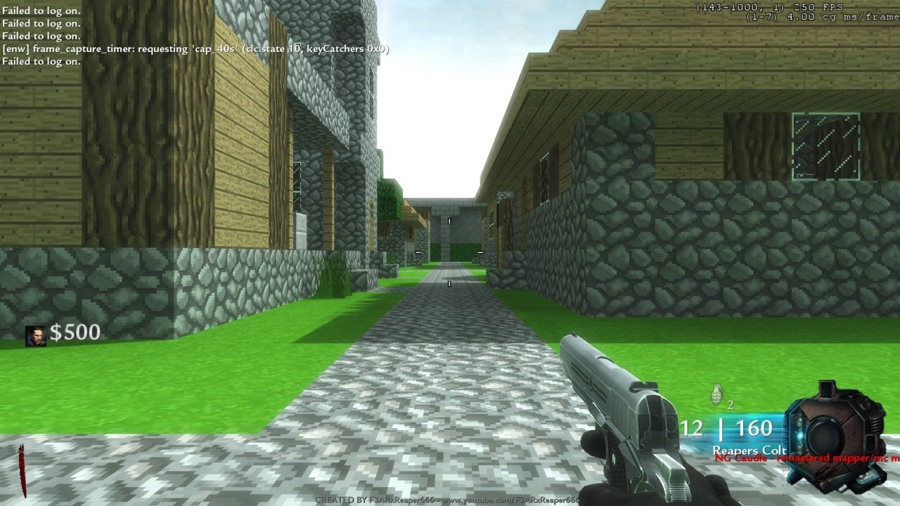

# Mod compatibility: a custom map is a mod, and the player gets exactly what the mod ships

> Lane: **client + launcher** (this file), with one line each in `web/server/lib/mapfiles.js` and
> `tools/dev/jointest.ps1`. Started 2026-09-23 01:45 UK from B's report on Minecraft Village
> Remastered (`nazi_zombie_fear_mc_2`, F3ARxReaper666 / NG Caudle): *"the weapon model seems to be
> stretching all across the screen and completely bugged"* — the first-person **Reapers Colt 16|160**
> drawn as huge stretched polygons, HUD and map otherwise fine.
>
> **The rule this file writes down:** always provide what the mod provides. Byte-identical files on
> the player's PC and on the box, every file the mod ships (not a filtered subset), the mod's own
> dvars left to the mod, and nothing of ours overriding what its scripts and menus set.

## 1. The stretched Reapers Colt — what was proved, and what was not

**Not reproduced.** The same map, the same bytes, the same server script path, B's own renderer
settings and resolution, on this PC, with a local dedicated server + client (the d2+c1 recipe,
`jointest.ps1`, off-screen, `ENW_TEST_NO_ACTIVATE=1`), draws the Reapers Colt correctly every time:



Run `mcjoinB3` (01:30 UK): `r_mode 2560x1440`, `r_multiGpu 1`, `cg_fov 65`, `com_maxfps 250`,
picmip 0, aniso 16; four shots fired (**12|160**, not 16|160). `mcjoinB4` added the rest of B's
`config.cfg` differences (`r_specular 0`, `r_distortion 0`, `r_glow_allowed 0`, `r_aaSamples 2`,
`r_picmip_manual 0`, `r_texFilterMipMode Unchanged`) — still correct. `mcjoinB5` opened the chat
overlay the way B did at 00:53:55 (`ENW_CHAT_SELFTEST=2`) — still correct
([picture](ui/mod-compat-reapers-colt-overlay-open.jpg)). Frames come from
`client-dll/components/frame_capture_timer.cpp` (new, §8), transcripts in
`ZombiesDev\logs\dedi\mcjoin*.txt`.

**Each suspect the brief named, with its evidence:**

| # | suspect | verdict | evidence |
|---|---|---|---|
| a | client loaded a different `mod.ff` than the server | **ruled out** | SHA-256 of all 10 files on B's PC (`home\localappdata\Activision\CoDWaW\mods\nazi_zombie_fear_mc_2`) = the box (`/home/waw/waw-en/mods/…`) = the archive. Only `mod.arena` differs, by the 3-byte BOM the launcher strips on purpose (`69466dd5…` → `d1551eb7…`). B's command line had `+set fs_game mods/nazi_zombie_fear_mc_2`, the box's `InitGame` says the same |
| b | an add-on IWD beside the map missing on the client | **ruled out** | both mount `trxture_pack.iwd (64 files)` and `fortress.iwd (1503 files)`; the base `main\iw_*.iwd` set mounted by B's client and by the dev client is identical (31 entries, same file counts) |
| c | `_load`/`_patch` fastfile order | **ruled out** | client and server both: `code_post_gfx`, `mod`, `ui`, `localized_common` (absent, stock), `common`, `patch`, `localized_nazi_zombie_fear_mc_2` (absent — the map ships none), `nazi_zombie_fear_mc_2_patch`, `nazi_zombie_fear_mc_2_load`, `nazi_zombie_fear_mc_2` |
| d | a `cg_`/viewmodel dvar the settings sync overwrites | **ruled out for the stretch; a real bug of its own** (§3) | the launcher sets `cg_fov 65`, which is the mod's own value; B's full renderer set does not reproduce it. The sync *does* steal `monkeytoy` from this mod |
| e | the 2 GB ceiling / partial asset loads | **not seen** | dev client working set 1.37–1.39 GB at 2560x1440 through 110 s; no `Hunk`/`out of memory` lines. Virtual size was not measured, and B's game ran longer |

**What is left, untested because tonight forbids it:** the box's own server (Wine, DLL `6fccc0e0`)
and B-only runtime events. B's client log has one tell: from **00:54:10** the frame rate falls
120 → 75 → 39 fps and stays there, at the moment `focus=no` appears (the screenshot being taken);
huge screen-covering triangles at 2560x1440 would cost exactly that. **There is no engine-side
record of B's run**: his client has written **no `console.log` for any launch since 2026-09-22
18:07** (last file: `home\mods\enw\console.log`), despite `+set logfile 2` on every command line
— so no `Could not load xmodel/xanim`, no device-lost line, nothing. **Fixing that is the first
step for the next report**; the dev client with the same DLL source does write one, so it is
something in B's install, not the engine.
*(Correction 2026-09-23 ~04:00: wrong. B's engine writes `home\mods\<bsp>\console.log` on every
launch — the fear_mc_2 one was last written at 03:42:30, the second his game died — but truncates
it on every launch, and a rewritten file keeps its 09-22 creation time, which is what made it look
stale. The DLL now keeps its own copy per process: `logs\console-<pid>.log`, `client.md`
"2026-09-23 ~04:00".)*

**What the box and a local dedi both do on this map, which is the mod's, not ours:**

```
precacheModel must be called before any wait statements in the level script
: (file 'maps/_loadout.gsc', line 200)   PrecacheModel( viewmodel );
  called from (file 'maps/_loadout.gsc', line 378)  set_player_viewmodel( "fear_viewhands_takeo");
  started from (file 'maps/_load.gsc', line 730)    self waittill( "spawned_player" );
model 'char_jap_impinf_officer_body_zomb' not precached: (file 'character/char_zomb_player_2.gsc', line 4)
precacheMenu must be called before any wait statements …  PrecacheMenu( "menu_special_features" );
```

The mod's `give_model()` re-precaches the character's viewhands at spawn. For a listen-server host
that spawns inside level init that is legal; for **any player who joins a dedicated server** it is
after the first `wait`, so the thread dies there. The four `fear_viewhands_*` models were already
precached by `set_player_specific_viewmodel()`, and the local dedi shows the hands drawn anyway —
so this is **not** proven to be the stretch, but it is the one viewmodel code path that differs
between "solo" (what the author tested) and "joined" (what we always are), and it is where a fix
would go if the box reproduces it (§7).

## 2. What a mod may ship — the contract

Everything below is data, and the player gets **all of it**, byte for byte, in
`<ENW>\home\localappdata\Activision\CoDWaW\mods\<bsp>\` (client) and `/home/waw/waw-en/mods/<bsp>/`
(box, symlinked into every instance's homepath and Wine LocalAppData — `launcher.md` 2026-09-22
evening). Nothing that can execute is ever installed on either side.

| what | where in the mod folder | loaded by | notes |
|---|---|---|---|
| `mod.ff` | root | zone loader, at startup with `code_post_gfx` | weapons, xmodels, xanims, menus, materials, sounds, scripts, localized strings |
| `<bsp>.ff`, `<bsp>_patch.ff`, `<bsp>_load.ff` | root | zone loader at map load, patch → load → map | order is the engine's, not ours |
| other `*.ff` (e.g. `gumball.ff`) | root | only if something names it as a map | Minecraft Village ships `gumball.ff`/`gumball_patch.ff`, a leftover map zone nothing loads — shipped anyway |
| `*.iwd` (map iwd + third-party add-ons) | root | FS search path, **every** `.iwd` in the folder | images, sounds, loose scripts, weapon files. An extra `.iwd` on one side only is a mismatch (§4) |
| loose `images/*.iwi` | `images/` | FS | Futurama ships 146 |
| loose `clientscripts/*.csc`, `maps/*.gsc` | subfolders | FS (whether T4 prefers them to the zone's rawfile is **unmeasured**) | Futurama ships 3 `.csc` |
| loose weapon files | `weapons/sp/<name>` (no extension) | possibly nothing with `useFastFile 1` (**unmeasured**) — shipped because the box has them | Arena ships 65 |
| `*_load.bik` | root | the load screen | we refuse load videos on a join anyway (client.md §7), but ship them |
| `mod.arena` | root | map registration | the one file we change: a UTF-8 BOM is stripped (`library.js repair`) and both hashes recorded |
| `missingasset.csv` | root | nothing (the author's build report) | shipped; it is the list of assets the release itself lacks — `Could not load xanim "ai_flamethrower_*"` on every run is that list, not us |
| `*.files` (UGX/NSIS file list) | root | nothing | the only thing not shipped; the engine never opens it |
| **never** | | | `.exe .dll .bat .cmd .ps1 .scr .com .msi .vbs .js` — refused loudly (dev-box rule 3) |

**Scripts and menus a mod ships run on both sides**: GSC on the server, CSC and menus on the client.
Dvars they set are the mod's (§3).

## 3. Dvars: what we write, and what we must leave to the mod

What the launcher puts on the command line and into `config.cfg` every launch
(`gamecfg.js baselineDvars` + `wawcfg.js WAW_DVARS`/`ACCOUNT_DVARS`): `r_fullscreen r_mode
r_displayRefresh r_aspectRatio r_noborder vid_xpos vid_ypos r_monitor r_vsync com_maxfps cg_fov
sensitivity cg_drawFPS m_filter cl_mouseAccel r_texFilterAnisoMin/Max r_picmip r_picmip_bump
r_picmip_spec r_multiGpu sm_enable cl_maxpackets snaps rate r_autopriority snd_volume` plus the
site's WaW-menu items (`r_aaSamples r_gamma r_specular … monkeytoy cg_mature cg_blood … r_dof_enable
r_glow_allowed`) and binds. After the game exits, `applyReadBack` + `readBackAccount` turn any of
those that changed into the player's saved choice.

**The bug, measured on B's account tonight.** Minecraft Village's anti-cheat
(`maps/anticheat_utility.gsc` "by Uk_ViiPeR", and its menus) runs `set monkeytoy 1;set ufo 0;…;set
sv_cheats 0`, `setClientDvars("monkeytoy","1")` every 0.1 s, and `execOnDvarIntValue "monkeytoy" 0
"quit"`. The engine archived `monkeytoy 1` into `config.cfg`; the read-back saw a changed WaW-menu
dvar and saved it as **B's** choice (`state\settings.json` → `waw: { monkeytoy: "1" }`,
`gameUpdatedAt` 23:55:01Z = the moment that game exited). The 00:53 launch has no `monkeytoy` on its
command line; the 00:55 launch ends `+set cg_drawFPS Simple +set monkeytoy 1` — **and so will every
launch after it, on every map**: the console is disabled for B everywhere until he changes it back.

**The fix (launcher, `modcompat.js`):** per map, the dvars the mod sets itself are found by scanning
its fastfiles (inflated) and loose `.cfg/.gsc/.csc/.menu/.txt` for `set[Client|Saved]Dvar[s]("x"`,
menu `"setdvar" "x"`, `exec "set x …;set y …"` and `set/seta x` lines. Those that are also ours are
**mod-owned**, cached in the map's `.enw-installed.json` as `modDvars.owned`, and the read-back after
a game on that map **drops any change to them** (`launch.js readBackSettings`, with a note naming
them). Minecraft Village: 287 dvar names set by the mod, 4 of them ours — `cg_fov`, `monkeytoy`,
`cg_mature`, `cg_blood`. Nothing about wawSettings changes: the account's own value is still written
at launch, the mod still overrides it at runtime exactly as it would in retail, and the player's
real in-game changes to everything else still stick.

**B's account still holds `monkeytoy 1`.** Not auto-repaired (a player can legitimately choose it):
B, set *Console* back in the site's Settings → Game, or delete `waw.monkeytoy` from
`%LOCALAPPDATA%\ENWZombies\state\settings.json`.

**What our DLL writes at runtime** and must keep off mod-owned dvars: `name` (name_pin),
`enw_token`, `enw_ui`, `enw_pchat` (userinfo, ours by name). None of them is a dvar any archived map
sets. The dedi side must never pass `monkeytoy 0`, `sv_cheats 1` or `con_external 1` to this mod:
its `TMChecker` reads the **server's** dvars and calls `ExitLevel(false)`.

## 4. The pre-launch check: "your files are not the server's"

`main.js ensureMapInstalled` → for an installed map, `matchServer(bsp)`:

1. ask the site for the map's file list (`/api/maps/<bsp>/files`: every file, size, SHA-256 — the
   archive's record, which is what the box was staged from and what §5 checks the box against);
2. `modcompat.checkInstalled(dir, list)`: missing file, wrong size, or wrong bytes → named. A file the
   launcher repaired (`mod.arena`) is compared with the hash we wrote. A file whose size and mtime
   equal the last proven check is trusted (first check of a 600 MB map ~1–2 s, then a stat per file);
3. a stray `.ff`/`.iwd` the server does not have is **removed** (the engine mounts every `.iwd` in
   the folder — a client-only asset set);
4. anything that differs is fetched again through the normal verified download
   (`library.installFromSite(bsp, { only })`), with a toast *"Repairing the map: N files did not
   match the server's"*; the Play waits for it.

No site (offline, dev): the check is skipped and the map is used as installed. Tests:
`launcher/test/modcompat.js` (6/6).

## 5. The 78 maps against the box (read-only, 2026-09-23 01:05 UK)

`sha256sum` of every file under `/home/waw/waw-en/mods/*/` (743 files, `nice`/`ionice`, nothing
written on the box) against the archive's `extract.json`, through the site's and the launcher's
filters: `python tools/maps/modcompat_check.py --box box_sha.txt`.

**No file anywhere had different bytes.** 57 maps have files on the box; 21 archive maps are not on
it (including `cxca` and `nazi_zombie_shore`, whose box folders hold only a `console.log` — staged
and emptied, or never filled). The differences were all **files one side never got**:

| map | before the fix | cause | after |
|---|---|---|---|
| `futurama` | box has 145 files the client never gets (143 `images/*.iwi`, 2 `clientscripts/*.csc`); client also never gets 4 more the box lacks | site filter dropped `.iwi`/`.csc` | **still differs: the box copy is missing 4 archive files** — `images/couch_side.iwi`, `images/mtl_green_tile4_tex.iwi`, `images/~weapon_desert_eagle_gold_spc~f7d5bd11.iwi`, `clientscripts/createfx/futurama_fx.csc`. Re-stage the box copy |
| `nazi_zombie_arena` | 65 `weapons/sp/*` loose weapon files box-only | site filter dropped extension-less files | match |
| `nazi_zombie_fivenights` | `stielhandgranate` (loose weapon file) box-only | same | match |
| `bank_job`, `zm_nuked`, `nazi_zombie_zhunterz` | `<bsp>_load.bik` box-only | site filter dropped `.bik` | match |
| `nazi_zombie_arena`, `futurama`, `nazi_zombie_ils`, `nazi_zombie_pd` | `*.files` box-only | installer list | ignored (never read) |
| `nazi_zombie_fear_mc_2` and 51 others | — | — | match |
| `ugxm_garage`, `shinomori` (not on the box) | `.files` / `_load.bik` never installed | same filters | `.bik` now installed |

**The fix**: `mapfiles.js ALLOWED` and `library.js ALLOWED_EXT` now include `.iwi .csc .bik .menu
.str` and extension-less files. Live only after the site restarts on this code, and the bucket needs
`node tools/s3/sync.js --only maps` (its list is `mapfiles.served()`, so it follows automatically).
Players who already installed Futurama/Arena/Five Nights get the missing files from §4's check on
their next Play.

## 6. fs_game, fs_homepath and `+exec`, per side

| | client, box join | client, Play Local | dedicated server (box) | dev harness |
|---|---|---|---|---|
| `fs_homepath` | `%LOCALAPPDATA%\ENWZombies\home` | same | `C:\zdev\homes\inst-NN` | `ZombiesDev\homes\<copy>` |
| `fs_game` | `mods/<bsp>` from the lease (`bootflow.js` `match.fs_game`) | `mods/<bsp>` | `mods/<bsp>` (`assignments.fs_game`) | `mods/<bsp>` (`-FsGame auto`) |
| mod files | `home\localappdata\Activision\CoDWaW\mods\<bsp>` (the DLL redirects LocalAppData there) | same | `waw-en/mods/<bsp>`, symlinked 3x | junctions to `archive\mods\<bsp>` |
| `+exec` | `enw_auth.cfg` (token) | same | — | — |
| `console.log` | `home\mods\<bsp>\console.log` — **written every launch, truncated every launch** (2026-09-23 correction: the "not written since 18:07" of §1 was a wrong read; the file keeps its 09-22 creation time when it is rewritten). Since `console_tap.cpp`: also `%LOCALAPPDATA%\ENWZombies\logs\console-<pid>.log`, always, per process (`client.md` 2026-09-23 ~04:00) | same | `waw-en/mods/<bsp>/console.log` (shared by all instances) | **one file shared by server and client** — `+set logfile 0` on one side to read the other |

## 7. Other incompatibilities this map shows, and what each needs

1. **Join-time precache** (§1). A mod written for a listen host precaches at spawn; on a dedicated
   server every player spawns after init. Retail would log the same error for a late joiner. If the
   box shows the stretch, the candidate fix is server-side: let `PrecacheModel`/`PrecacheMenu` of an
   **already precached** asset succeed after init (it is a lookup, not a load) — a dedi-lane change,
   not attempted tonight.
2. **The briefing menu stays open on a dev client.** Stock `_load.gsc` opens `briefing` "until all
   players have joined"; the off-screen dev client (no activation) keeps `keyCatchers 0x10`, which the
   pause lane reads as `solo_menu` and **freezes the world** (`[enw] pause: FROZEN 95 s (solo_menu)`).
   A real player closes it; a harness must (`ENW_FRAME_CAPTURE_CMDS="7:closemenu briefing"`).
3. **The mod quits on console dvars** (§3). Never hand this mod `monkeytoy 0`, `con_external 1` or
   `sv_cheats 1` on either side.
4. **Missing assets are the release's own**: 59 `Could not load xmodel`, the `ai_*` xanims and 22
   `image … is missing` errors match its `missingasset.csv` and appear identically on box, local dedi
   and client.
5. **A second launch within seconds fails `EXE_ERR_QPORT`** (B's 00:55 retry): the box still holds
   his previous slot. Referee/dedi lane.

## 8. Tools added

* `client-dll/components/frame_capture_timer.cpp` — off unless `ENW_FRAME_CAPTURE_AT="10,25,45"`
  (seconds after `clc.state` first reaches 10); asks `frame_capture.cpp` for a back-buffer `.bmp`
  each time. `ENW_FRAME_CAPTURE_CMDS="7:closemenu briefing|30:+attack|31:-attack"` runs console
  commands on the same clock (Cbuf_AddText 0x594200). No hooks, rides the frame tick.
* `tools/dev/jointest.ps1 -ClientExtraArgs @('+set','r_mode','2560x1440',…)` — client-only dvars,
  after the harness's own. (Named `ClientExtra…`: PowerShell variables are case-insensitive and
  `$clientArgs` already exists.) Also fixed: the mod-folder `console.log` path dropped the slash
  (`modsnazi_…`), so every custom-map run reported *MISSING console.log*.
* `tools/maps/modcompat_check.py` — §5's table, from the box hashes and the code's own filters.
* `launcher/src/main/modcompat.js` + `launcher/test/modcompat.js` — §3 and §4.

## 9. Unproven

* **The cause of B's stretched Colt.** Everything local is ruled out; the box server and B's own
  session are not. Next: find why B's client writes no `console.log`, then have B reproduce once with
  it on; or a box run with a dev client once leases are safe.
* **The pre-launch check against the live site**: tested with fakes and a real map folder, not
  through a signed-in launcher (the site must be on this code to serve the loose files at all).
* **Mod-owned dvars from scripts inside `.iwd`s** are not scanned (zip). No archived map is known to
  need it; a mod that does would keep the old read-back behaviour for those dvars.
